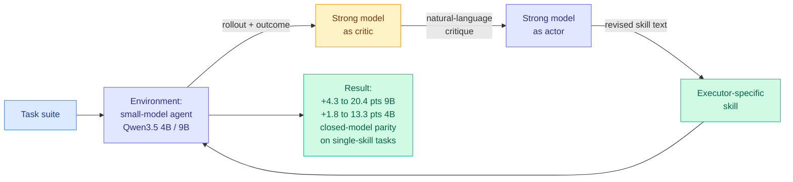

# SKILLER: Language-Level Reinforcement Learning for Reusable Skill Extraction in Small Language Models

**Source:** HuggingFace Daily Papers · arXiv [2608.10538](https://arxiv.org/abs/2608.10538) · [code](https://github.com/DANG-ai/SKILLER)
**Raw:** [raw/huggingface/2026-08-16-skiller-language-level-reinforcement-learning-for-reusable-s.md](../../raw/huggingface/2026-08-16-skiller-language-level-reinforcement-learning-for-reusable-s.md)
**Topic:** agent harness engineering, agent skills, inference cost, small models

## TL;DR

An agent **skill** is a packaged unit of procedural knowledge that constrains a model's behaviour space so a task gets done the same good way every time. Skills are the mechanism that makes harnesses like Codex and OpenClaw reliable, and today they are written for and consumed by expensive closed models. SKILLER asks whether the same constraint can be manufactured for a small open model running on a consumer GPU, which would move the cost of a skill-driven agent by an order of magnitude. Its method is unusual: a **strong model acts as both actor and critic, the small-model agent system is treated as the environment, and every reinforcement-learning signal is propagated purely as natural language** rather than as a gradient or a scalar reward. Across five benchmarks with Qwen3.5-9B and Qwen3.5-4B, SKILLER beats three open-source and one closed-source skill-generation methods, with absolute gains of **4.3 to 20.4 points for the 9B model** and **1.8 to 13.3 points for the 4B model**, and **matches strong closed-source models on single-skill tasks in SkillsBench**.

## Diagram

## The two claims worth separating

**The cost claim.** The paper is explicit that the motivation is money: strong closed models make skill-driven harnesses "prohibitively expensive" for real-world task volume, and open models on consumer GPUs are now capable enough that skill-based behavioural constraints could close the gap. This is the same substitution the efficiency literature keeps proposing and rarely delivers, so the SkillsBench parity result on single-skill tasks is the load-bearing number. Note the qualifier: **single-skill** tasks. Parity is not claimed on composition.

**The method claim.** Running the entire RL loop in natural language, with a strong model as actor and critic and the small-model agent system as the environment, means there is no reward model to train, no gradient to propagate, and no fine-tuned checkpoint at the end. The output is text. It also means the skill is **executor-specific**: a skill written for Qwen3.5-4B is written against that model's actual failure modes, which is why generic skill libraries transfer badly and why this is not simply "write better documentation."

## Relation to prior wiki pages

**This is the fourth paper in four days where the artifact carrying capability is a program or a document rather than a parameter update.** [AI4AI at Test-Time (08-13)](../inference-efficiency/2026-08-13-ai4ai-test-time-harness-transfer.md) had a strong builder model write an inference-time harness for a weak target, taking Theory-of-Mind performance from 0.49 to 0.91 with the target's weights untouched. [AutoPrune (08-16)](../inference-efficiency/2026-08-16-autoprune-llm-designed-visual-token-pruning.md) had an LLM design a visual-token pruning policy, 94.4% of tokens removed at >99% accuracy retention, training-free. [DarwinX (08-14)](2026-08-14-darwinx-harness-population-evolution.md) evolved a population of harnesses with the model frozen, +17 points average across four benchmarks. SKILLER writes skills. Four papers, one week, no mutual citation, one shared bet: **the cheapest place to put capability into a weak model is next to it, not inside it.** [Knowledge Distillation](../inference-efficiency/knowledge-distillation.md) named this on 08-13; it is now a cluster large enough that the burden of proof has flipped.

**It is the strongest small-model instance of the harness-versus-fine-tuning substitution that [08-13 and 08-14's Looking Ahead](../daily-digest/2026-08/2026-08-14.md) have been demanding a price for.** Both bullets asked for dollars of scaffold-building versus dollars of fine-tuning at equal capability gain. SKILLER supplies the capability half at the small-model tier with unusual precision (per-model, per-benchmark, against four named baselines) and, like every paper in this cluster, reports **no cost for the strong-model actor-critic loop**. The generation cost is the entire capital expenditure of the method and it is missing again.

**It contradicts nothing and quietly stresses one thing.** [AI4AI at Test-Time](../inference-efficiency/2026-08-13-ai4ai-test-time-harness-transfer.md) found weaker targets receive the largest gains, which runs opposite to [the Extrapolation Cliff (05-14)](../inference-efficiency/2026-05-14-extrapolation-cliff-on-policy-distillation.md), where gradient-based on-policy distillation collapses *above* a capability threshold. SKILLER's own numbers point the same way as AI4AI in one respect and against it in another: the 9B model gains more than the 4B model (up to 20.4 versus 13.3 points), so within this range more capable executors extract *more* from a written skill, not less. Whether the AI4AI trend reverses somewhere between these tiers is now a concrete, cheap experiment.

## Gaps

Two open models from one family, so nothing is established about whether SKILLER's skills transfer across model families or must be regenerated per executor, which matters enormously for the cost story. Parity with closed models is reported for **single-skill** tasks only, and the interesting regime for agent harnesses is multi-skill composition, where [08-13's Looking Ahead](../daily-digest/2026-08/2026-08-13.md) already noted that six papers performed six non-overlapping operations on the agent skill without one citing another. And the strong actor-critic model is doing real work here, so a fair accounting would compare SKILLER's total token spend against simply routing the hard fraction of traffic to that strong model directly, which is the baseline the paper's cost framing implies and does not run.

## Related pages

- [Agent Harness Engineering](agent-harness-engineering.md)
- [Self-Evolving Agents](self-evolving-agents.md)
- [Knowledge Distillation](../inference-efficiency/knowledge-distillation.md)
- [AI4AI at Test-Time (08-13)](../inference-efficiency/2026-08-13-ai4ai-test-time-harness-transfer.md)
