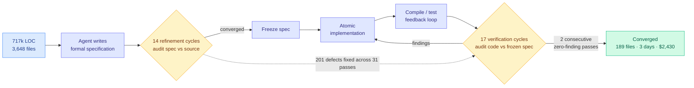

# Specification-First Convergence With an AI Coding Agent (717k-line codebase)

**Source:** HuggingFace Daily Papers · arXiv [2608.12440](https://arxiv.org/abs/2608.12440)
**Raw:** [raw/huggingface/2026-08-16-specification-first-convergence-with-an-ai-coding-agent-a-ca.md](../../raw/huggingface/2026-08-16-specification-first-convergence-with-an-ai-coding-agent-a-ca.md)
**Topic:** agent harness, verification loops, long-horizon agentic engineering

## TL;DR

A single fully instrumented case study, and the most unusual thing about it is what was deliberately removed: **no human reviewed the generated code, and no oracle existed to validate the target behaviour.** The system is a 717,725-line production TypeScript application across 3,648 files. The task was dismantling a core lifetime invariant, the guarantee that a UI panel stays open for the duration of an AI request, and replacing it with the behaviour that a streaming generation survives its panel closing and can be reattached to the same live stream on reopening with no loss or duplication. The author assessed this as effectively infeasible by incremental refactoring, the kind of change that conventionally triggers a rewrite.

The protocol is the contribution. The agent writes a **formal specification**, then runs **14 refinement cycles** auditing that specification against the source, then implements atomically, then runs a compile/test feedback loop, then runs **17 verification cycles** auditing the code against the now-frozen specification. Across those **31 audit passes, 201 defects were corrected before any human ran the program.** The convergence criterion is empirical rather than aspirational: **two consecutive verification passes returning zero findings.** Final scope: 189 files touched (31 new), 288 files and 34,770 insertions / 16,422 deletions across two commits including extraction. Across the first session and roughly thirty later ones, no bug was observed. **Three days. USD 2,430.**

## The protocol

## Key findings

- **201 defects caught across 31 audit passes, all before human execution.** The defects were found by the agent auditing its own output against a frozen artifact, which is the whole point: the specification is the oracle the task did not otherwise have.
- **Convergence is defined empirically.** Two consecutive zero-finding verification passes. That is a stopping rule you can implement, unlike "until it looks right."
- **The specification is frozen before implementation.** Refinement happens against the source code (does this spec describe reality?), verification happens against the spec (does this code satisfy it?). Separating the two directions is what prevents the agent from quietly relaxing the target when the implementation gets hard.
- **$2,430 and three days for a change the author judged infeasible incrementally.** Against a rewrite of a 717k-line application, that is not close.
- **1,500+ pages of specification and raw session logs published in French as evidence**, explicitly so the process can be inspected or fed to a language model for consistency checking.

## Relation to prior wiki pages

**This is the missing verification half of the [agent-harness-engineering](agent-harness-engineering.md) story, and it lands with a price tag.** That page carries [Agent Safety Should Be a Runtime Contract (08-13)](2026-08-13-agent-safety-runtime-contract.md), which argued the harness has an **evidential face**: no task-complete claim without checkable proof. Its complaint was structural, backed by a title-level audit of all 28,560 NeurIPS/ICML/ICLR 2023-2025 papers showing an 8x-12x imbalance between training-time and deployment-time safety publication. This case study is what that contract looks like when it is actually enforced on a real codebase, and the enforcement mechanism is the frozen specification rather than a sandbox or a permission gate.

**It also supplies the number the harness cluster keeps not reporting.** The page's spine is that harness choice swings cost-per-success 5x to 30x on the same model (arXiv 2608.01347). [AutoDesign (08-14)](2026-08-14-autodesign-meta-harness-optimization.md), which meta-optimizes a harness for long-horizon design tasks, published under $3 for 253 tool calls, while [DarwinX (08-14)](2026-08-14-darwinx-harness-population-evolution.md), which evolves a population of harnesses under a no-regression rule for about +17 points average, published **no evolution budget at all**. This paper publishes $2,430 for one architectural refactor, which is the first dollar figure in the cluster attached to a task a human engineer would recognize as a week of work. **The [08-14 Looking Ahead](../daily-digest/2026-08/2026-08-14.md) asked for dollars-per-point-of-gain on a common task family; this is a data point on a different axis (dollars per completed refactor) and still the most decision-relevant one published so far.**

**The counter-signal it walks into.** [Anthropic's Applied AI team (surfaced 08-14)](../media-zone/2026-08/2026-08-14.md) argued that a harness encodes assumptions about what the current model cannot do, and those assumptions go stale as models improve. A 31-pass audit protocol is exactly such an assumption: it exists because the agent cannot be trusted to get a 189-file refactor right in one pass. If a future model can, the 31 passes become pure cost. The protocol's saving grace is its stopping rule, which is adaptive: a better model converges in fewer passes automatically. **That makes it the first harness in the cluster whose cost shrinks on its own as the model improves**, which is the property the whole staleness objection is asking for.

## Gaps

n=1. One task, one codebase, one language, one author, no control condition, no comparison against a human team attempting the same refactor. The reported "no bug observed" across roughly thirty sessions is real evidence but it is observational, not a test suite. The spec is 1,500+ pages in French, which is publication of evidence rather than reproducibility. And a specification-first protocol works precisely because this task had a crisp invariant to dismantle and a crisp target behaviour to state; whether it survives a task whose spec cannot be written down is untested and is where most real refactors live.

## Related pages

- [agent-harness-engineering.md](agent-harness-engineering.md)
- [2026-08-13-agent-safety-runtime-contract.md](2026-08-13-agent-safety-runtime-contract.md)
- [agent-benchmarks.md](agent-benchmarks.md)
- [../hardware/compute-economics.md](../hardware/compute-economics.md)
