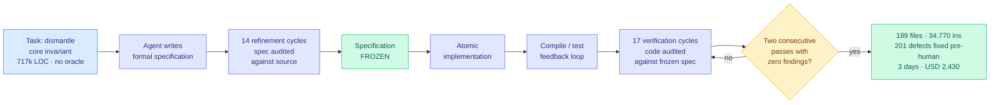

# Specification-first convergence with an AI coding agent: 717k lines, 189 files, $2,430

**Source:** HuggingFace Daily Papers · arXiv [2608.12440](https://arxiv.org/abs/2608.12440)
**Raw:** [raw/huggingface/2026-08-16-specification-first-convergence-with-an-ai-coding-agent-a-ca.md](../../raw/huggingface/2026-08-16-specification-first-convergence-with-an-ai-coding-agent-a-ca.md)
**Topic:** agent harness engineering, agentic coding, verification loops

## TL;DR

A single fully instrumented case study of an AI coding agent dismantling a **core architectural invariant** across a 717,725-line production TypeScript application (3,648 files), with **no human review of generated code** and **no pre-existing test oracle** for the target behaviour. The invariant was a lifetime guarantee that a UI panel stays open for the duration of an AI request; the target behaviour was that a streaming generation survives the panel closing and can reattach to the same live stream on reopen with no loss or duplication. The author assessed the change as effectively infeasible by incremental refactoring, the kind of thing that conventionally justifies a rewrite. The agent completed it.

The protocol is the paper. Formal specification written **by the agent**, then **14 refinement cycles** auditing that specification against the source, then atomic implementation, then a compile/test feedback loop, then **17 verification cycles** auditing the code against the now-frozen specification. Across those **31 audit passes, 201 defects were corrected before any human ran the program.** The convergence criterion was empirical rather than a fixed pass count: **two consecutive verification passes returning zero findings.**

**Outcome:** 189 files touched (31 new); with the extraction phase, two commits totalling 288 files, 34,770 insertions, 16,422 deletions. Across the first session and roughly thirty later ones, no bug observed. **Elapsed: three days. Cost: USD 2,430.** The full specification and 1,500-plus pages of raw session logs (in French) are published as evidence.

## Diagram

## What is load-bearing here, and what is not

The result that will get quoted is "agent refactors 717k-line codebase unreviewed." The result that matters is the **convergence criterion**.

Every agentic-coding protocol has to answer one question: when do you stop? Fixed iteration counts stop too early or waste budget. Human review is the thing this experiment is trying to remove. Test oracles did not exist for the target behaviour, which is why the task was hard. The protocol's answer is to make **the frozen specification the oracle** and to declare convergence only when two independent verification passes in a row find nothing. That converts an open-ended agentic task into something with a stopping rule and an audit trail, and the 201 defects caught across 31 passes are the evidence that the passes were doing real work rather than rubber-stamping.

The freeze is the other half. The specification is audited fourteen times *before* implementation and never again after, so the agent cannot quietly redefine success when the code resists. That is the direct countermeasure to the failure mode the [harness engineering](agent-harness-engineering.md) page lists as open problem 3: a confidently-wrong self-auditor breaks the loop. Here the auditor is checking against a document it is no longer allowed to edit.

What is *not* established: this is n=1, by an author who designed the protocol, on a codebase they know, in a strongly typed language where the compiler is itself a substantial verifier. Every one of those is doing work that the protocol will get credit for.

## Relation to prior wiki pages

**This is the closest thing yet to the cost figure [08-13 and 08-14's Looking Ahead](../daily-digest/2026-08/2026-08-14.md) have been demanding, and it is on the opposite end of the scale from the only other one.** Those bullets asked for dollars of scaffold work versus dollars of fine-tuning for equal capability gain. [AutoDesign (08-14)](2026-08-14-autodesign-meta-harness-optimization.md), a meta-harness optimizer that rewrites a code agent's own harness from rollout feedback, published **$3 per rollout** for 253 tool calls in 40 minutes. This paper publishes **$2,430 for three days** on one task. Those are the two published points on the harness cost axis and they are three orders of magnitude apart, which tells you the axis is real and that "what does agentic work cost" has no single answer yet. It is still not the fine-tuning comparison, because there is no fine-tuning baseline for "dismantle an architectural invariant."

**It is a specification-side counterpart to the population-search results.** [DarwinX (08-14)](2026-08-14-darwinx-harness-population-evolution.md) improves the scaffold by evolving many variants against hard verifiers, +17 points average across four benchmarks with the model frozen. This paper improves reliability by making the *verifier itself* the thing you invest in, and then iterating against it. Both are the same underlying move, spend compute on the loop rather than the weights, applied to different components.

**It is the practitioner-scale version of the Prime Intellect duration result.** [Measuring Autonomous AI Research (08-16)](2026-08-16-measuring-autonomous-ai-research.md) ran agents for up to 8.7 days on an optimizer speedrun with a hard numeric verifier and found strong execution with weak idea generation. This paper runs three days on a task with **no verifier at all** until the agent writes one, and the thing that carries it is not the model's ideas but the audit discipline around them. Read together they make an uncomfortable point about where agentic value currently comes from: the loop, not the reasoning.

**And it is the first harness in the cluster whose cost shrinks on its own as the model improves.** Anthropic's Applied AI team, in the talk surfaced on [08-14](../media-zone/2026-08/2026-08-14.md), made the sharpest standing objection to the whole harness thread: a harness encodes assumptions about what the current model cannot do, and those assumptions go stale as models improve. Their own example was a context-reset mechanism built for Sonnet 4.5's early-wrap-up behaviour that became active harm on Opus 4.5, adding latency and discarding cache. A 31-pass audit protocol *is* exactly such an assumption, since it exists because the agent cannot be trusted to get a 189-file refactor right in one pass. What saves it is that the stopping rule is adaptive rather than a fixed pass count: **a better model converges in fewer passes automatically, and the protocol collects the saving without being rewritten.** That is the property the staleness objection is implicitly asking every harness component to have, and nothing else in the cluster has it.

## Gaps

n=1, self-reported, self-designed protocol, author's own codebase, no control condition. "No bug observed" across roughly thirty later sessions is a usage claim, not a correctness claim, and the target behaviour (stream reattachment with no loss or duplication) has failure modes that surface under concurrency and network conditions ordinary usage will not reach. Strong static typing is doing unquantified work. And the 1,500 pages of evidence are in French, which is admirable transparency and a real barrier to independent audit.

## Industrial implication

The protocol is copyable today and costs nothing to try: specify first, audit the specification until it stops changing, freeze it, implement, then audit code against the frozen document until two passes come back clean. Nothing in it requires a particular model or harness. If the convergence criterion holds up on someone else's codebase, "two consecutive zero-finding passes" becomes the agentic equivalent of a green test suite for changes that have no test suite, which is exactly the class of work teams currently refuse to hand to an agent.

## Related pages

- [Agent Harness Engineering](agent-harness-engineering.md)
- [Measuring Autonomous AI Research (08-16)](2026-08-16-measuring-autonomous-ai-research.md)
- [AutoDesign (08-14)](2026-08-14-autodesign-meta-harness-optimization.md)
- [Agent Benchmarks](agent-benchmarks.md)
