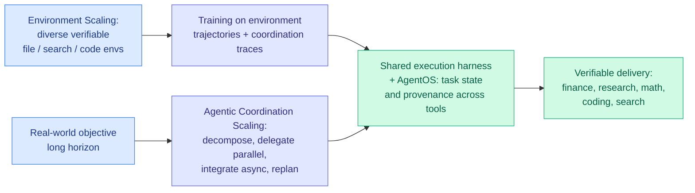

# Apodex 1.1: Scaling Agentic Intelligence for Complex Work

**Date:** 2026-08-25
**Source:** [HuggingFace Daily Papers](https://huggingface.co/papers/2608.23283) — **145 upvotes, the day's top paper** · [arXiv 2608.23283](https://arxiv.org/abs/2608.23283)
**Authors:** Apodex Team (70+ authors)
**Raw:** [raw/huggingface/2026-08-25-apodex-1-1-scaling-agentic-intelligence-for-complex-work.md](../../raw/huggingface/2026-08-25-apodex-1-1-scaling-agentic-intelligence-for-complex-work.md)

## TL;DR

Apodex 1.1 introduces **working capability**: sustained, verifiable progress toward a real-world objective. Its argument is that this is not reasoning ability with extra steps. It additionally requires sustained interaction with files, information sources and executable code, plus state maintenance, failure recovery, and verifiable delivery. The system develops it along two axes that are explicitly *not* parameter scale: **Environment Scaling** (expanding the diversity and verifiability of executable file, search and code environments) and **Agentic Coordination Scaling** (training agents to decompose work, delegate in parallel, integrate asynchronous results, and replan). The headline result: a **35B** model, plus a locally deployable 35B Mini variant, reaches the leading performance band on finance, research, math, coding and search, well below frontier parameter counts.

## The framing move

Most agent papers treat the gap between "reasons well" and "completes real work" as a capability deficit to be closed by better reasoning. Apodex reframes it as a **category difference**. Working capability is defined by properties reasoning benchmarks do not measure at all:

- **State maintenance** across long horizons and many tool calls.
- **Failure recovery** rather than failure avoidance.
- **Verifiable delivery**, meaning the output can be checked, not merely evaluated by preference.

Naming *verifiability* as constitutive is the load-bearing choice. It is what makes Environment Scaling coherent: you cannot manufacture training environments at scale unless success in them is machine-checkable. Environment Scaling is essentially **manufacturing verifiable RL environments as an industrial process**, and the diversity claim is the part that distinguishes it from just building more benchmarks.

The system side is a **shared execution harness plus "AgentOS"** that maintains task state and provenance across tools and agents. Provenance as a first-class harness component is notable and matches the taxonomy [Scaling the Harness (05-27)](2026-05-27-scaling-the-harness.md) laid out.

## Why 145 upvotes and a 35B model matter together

The headline is not the benchmark table, it is the parameter count next to it. If a 35B model reaches the frontier performance band on verifiable professional work, then **on this task class the marginal value of parameters is lower than the marginal value of environment and coordination**. That is the strongest single data point this wiki has for the harness thesis, because every prior data point came from lifting a *fixed* model with a better harness. Apodex trains the model and the environment together and lands at the frontier band from 35B.

## Where this sits against prior wiki knowledge

**It is the model-scale version of a claim the [agent harness engineering page](agent-harness-engineering.md) has built from a dozen smaller results.** That page's recorded state of knowledge is that the harness is measured on cost (a 5x to 30x swing; $3 to $2,430 per task depending on class), on capability (0.49 → 0.91 at the small-model tier, +7.7 to +17 points at the frontier), and on duration and variance. Its sharpest prior data point was [Measuring Autonomous AI Research (08-16)](2026-08-16-measuring-autonomous-ai-research.md), where **a 44-step spread between two harnesses running the same model was roughly the size of the entire gap between Opus 5 and Kimi K3.** Apodex says the same thing from the training side rather than the evaluation side.

**And it collides with that page's open problem 0.** The page has flagged as unrun: *harness optimization versus fine-tuning at matched cost.* Apodex does not resolve it, it entangles the two. Environment-trained weights and an inference-time harness are both in the deliverable and the paper does not separate them, so the wiki still cannot say how much of the 35B result is the harness. **That ablation is the single most valuable missing experiment in this paper**, and it is the exact question the page has carried since May.

**The counter-signal published the same week.** Kurate cs.AI #14 is [On the Fragility of Self-Improving Agents: Variance, Task Order, and Underspecification](https://arxiv.org/abs/2608.18066) (Ye, Li, Pruksachatkun, Zhang, Wu, ai_rating 6.0), which argues that self-improving agent gains are sensitive to variance, the order tasks arrive in, and underspecified objectives. Read against Apodex's leading-band claim, and against Bakouch's 08-16 variance note that a single run in a fixed setting has a ~50-step spread after 24 hours, the honest reading is that **harness-and-environment capability is real and its measured magnitude is not yet trustworthy.**

## Key results

- A **35B** model and a locally deployable **35B Mini** reach the leading performance band across finance, research, math, coding and search.
- Two named scaling axes that are not parameter count: Environment Scaling and Agentic Coordination Scaling.
- Provenance and cross-tool state maintenance treated as first-class harness components.
- The day's top HuggingFace paper by upvotes (145), well clear of the field.

## Gaps

- **"Leading performance band" is doing a lot of work.** Without per-benchmark deltas against named frontier systems, the claim is not checkable, which is a real problem for a result whose whole point is a comparison.
- **No harness-versus-weights ablation**, as above.
- **Reproducibility.** A 70-author system paper is hard to reproduce unless the full harness and the environment suite are released, and the abstract does not commit to that.
- **Coordination Scaling has no cost curve.** Parallel delegation and replanning spend tokens. Against the [AlphaSense finding (08-14)](../ai-industry/2026-08-14-alphasense-token-price-vs-task-cost.md) that task cost and token price can point in opposite directions, a 35B model that wins on quality could still lose on dollars per completed task if coordination overhead is large. Nothing here prices it.

## Industrial implication

If 35B-plus-harness matches frontier models on verifiable work, serving economics shift toward the harness layer and toward the **dollars-per-completed-task** metric the wiki first recorded on 08-13. A 35B Mini that runs locally is also a distribution story: it moves this class of work inside the trust boundary of anyone who cannot send professional documents to an API.

## Research angle

The decisive experiment is the ablation the paper omits: freeze the base model, apply only the harness and AgentOS; then take the environment-trained weights and run them under a plain ReAct loop. The gap between those two numbers is the answer to the harness-versus-model question the [harness page](agent-harness-engineering.md) has carried as open problem 0 since May.

Second: Environment Scaling implies a **generator of verifiable environments**. That generator, not the model, is arguably the reusable artifact, and nobody has published what it costs to build one or whether environments transfer across task families the way harnesses were shown to in [DarwinX (08-14)](2026-08-14-darwinx-harness-population-evolution.md).

## Related pages

- [Agent harness engineering](agent-harness-engineering.md)
- [Task-CoEvolve (08-25)](2026-08-25-task-coevolve-adaptive-validation-selection.md)
- [Prime Agent (08-25)](2026-08-25-prime-agent-self-improving-rlm-harness.md)
- [Scaling the Harness (05-27)](2026-05-27-scaling-the-harness.md)
- [Measuring Autonomous AI Research (08-16)](2026-08-16-measuring-autonomous-ai-research.md)
- [Daily digest 2026-08-25](../daily-digest/2026-08/2026-08-25.md)
