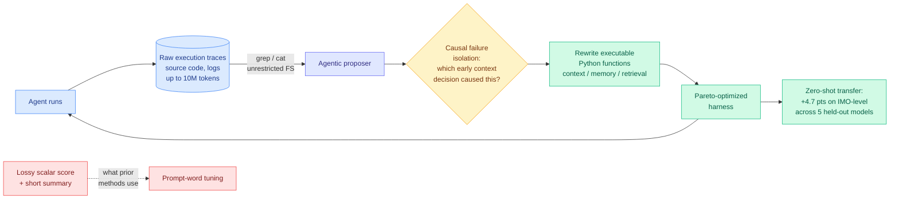

# Meta-Harness: Code-Space Harness Optimization with Raw Trace Access

**Source:** Surfaced via saved reading (X, 2026-08-18, [@marfinxx](https://x.com/marfinxx/status/2089850130321043799)) · Stanford + MIT · additionally cited as the reference baseline in the [Task-CoEvolve](2026-08-25-task-coevolve-adaptive-validation-selection.md) related-work framing (arXiv 2608.20169)

## TL;DR

Meta-Harness is an automated system that **evolves the code governing an agent's context, memory, and retrieval**, rather than tuning the prompt that instructs the model. Its central empirical claim is the one now propagating through the literature: optimizing the Python harness around a frozen LLM produces up to a **6x performance gap with zero weight updates**.

The mechanism has two parts, and both are refusals of the standard recipe. First, **full diagnostic trace access**: instead of feeding the optimizer a lossy scalar score or a short natural-language summary of what went wrong, the proposer gets unrestricted filesystem access to raw execution logs and source code across every past iteration, up to 10M trace tokens, and inspects them with `grep` and `cat` like a human debugging a system. Second, **causal failure analysis in code space**: rather than tweaking prompt wording, the system isolates confounded regressions, traces a downstream error back to the early context decision that caused it, and rewrites the executable Python function responsible.

Reported results: discovered context-management policies beat state-of-the-art agentic memory systems by **7.7 points while using 4x fewer context tokens**, and converge **10x faster** than traditional optimizers. A single discovered math-retrieval harness improved solve rates on **200 IMO-level olympiad problems by 4.7 points across five completely held-out frontier models**, zero-shot.

---

---

## Why the trace-access design is the real contribution

The 6x number gets the attention, but the interesting hypothesis is narrower and testable: **code-space optimization with raw execution-trace access beats compressed prompt tuning.** Both halves matter.

*Code space* matters because a harness bug is a program bug. "The retrieval function returns stale entries after a subagent forks" is a statement about a function, and no amount of rewording a system prompt fixes it. Prompt optimizers can only express changes in the space of instructions; a large fraction of harness failures do not live in that space.

*Raw trace access* matters because the standard optimizer interface throws away the evidence needed to attribute a failure. A scalar reward says a rollout was bad. It does not say that turn 40 failed because turn 6 evicted the wrong file from context. Recovering that link requires reading the log, which requires the log to still exist and be readable. Giving the proposer a filesystem and 10M tokens of history is a deliberately unglamorous engineering decision that turns out to be the enabling one.

This is the same conclusion the wiki's [agent harness engineering](agent-harness-engineering.md) page drew from a different direction: harnesses win by **removing model discretion and making decisions inspectable**, not by giving the model more room.

## Relation to prior wiki state

**It supplies the mechanism behind a number the wiki already had.** The concept page's empirical spine is omarsar0's preregistered benchmark ([arXiv 2608.01347](https://arxiv.org/abs/2608.01347), 08-13), which measured cost-per-success swinging 5x–30x across harnesses on a fixed model. That result said the swing exists. Meta-Harness says how to search for the good end of it automatically.

**It is the baseline today's HuggingFace paper improves on.** [Task-CoEvolve](2026-08-25-task-coevolve-adaptive-validation-selection.md) explicitly targets Meta-Harness's full-set-evaluation-every-iteration cost, cutting evaluations 80%. Reading them together gives the current state of automated harness search: Meta-Harness sets the optimizer design, Task-CoEvolve makes it affordable.

**The transfer result echoes AI4AI and AutoDesign.** [AI4AI at Test-Time (08-13)](../inference-efficiency/2026-08-13-ai4ai-test-time-harness-transfer.md) had a builder model write a harness for a weaker target, lifting four Theory-of-Mind benchmarks from 0.49 to 0.91 with the target's weights frozen. [AutoDesign (08-14)](2026-08-14-autodesign-meta-harness-optimization.md) dropped a learned DesignHarness into seven code-agent configurations and gained 12.4 points on average across all seven. Meta-Harness adds a third: +4.7 points on olympiad problems across five held-out frontier models. **Three papers in twelve days showing a discovered harness transfers to models it was never optimized against.** That threshold, three independent results making the same structural claim, is what the wiki treats as a real pattern rather than a coincidence. The implication is concrete: a harness is a portable, reusable artifact with its own value, not a per-model tuning residue.

**Token compression is the efficiency face.** 4x fewer context tokens at 7.7 points higher accuracy is a cost-optimization result, and it lands on the same axis as KV-cache and quantization work. It also mirrors what OpenAI reported on 08-19 for Codex, where harness-level retained reasoning plus context compaction moved GPT-5.6 Sol's ARC-AGI-3 score from 13.3% to 38.3% **while cutting token consumption sixfold**. Research and a frontier vendor independently reporting roughly 4x–6x token reduction from harness-layer context management, in the same week, is strong convergence.

## Gaps

The details available are from a secondary breakdown rather than the paper itself, so treat the specific figures as reported-not-verified until the arXiv entry is read directly. Beyond that, the substantive open questions:

- **No cost accounting for the search.** Full filesystem access over 10M trace tokens per proposal is not cheap. "10x faster convergence" is measured in optimizer iterations; the token bill per iteration is presumably much higher. Iterations are the wrong unit. This is the same complaint the concept page's open problem #0 makes of the whole subfield.
- **Confounded-regression isolation is asserted, not evidenced.** Causal attribution from execution traces is genuinely hard, and no ablation is described that shows the causal step beats a proposer that simply reads the logs without the isolation machinery.
- **7.7 points over "state-of-the-art agentic memory systems"** needs the baseline named to mean anything.

## Industrial implication

If harness search becomes routine, the harness itself becomes a shipped, versioned artifact with transfer value, which changes what a model provider is selling. OpenAI's Codex-as-a-platform release on 08-19 makes exactly this bet, positioning the open agent harness rather than the chat interface as the reusable asset. Meta-Harness is the research argument that the harness can also be *discovered* rather than hand-built, which is the step that would make it a commodity.

## Related

- [Agent harness engineering](agent-harness-engineering.md) — concept page
- [Task-CoEvolve](2026-08-25-task-coevolve-adaptive-validation-selection.md) · [Prime Agent](2026-08-25-prime-agent-self-improving-rlm-harness.md)
- [AutoDesign](2026-08-14-autodesign-meta-harness-optimization.md) · [DarwinX](2026-08-14-darwinx-harness-population-evolution.md) · [Ken Huang harness patterns](2026-08-14-ken-huang-harness-engineering-patterns.md)
- [AI4AI at Test-Time](../inference-efficiency/2026-08-13-ai4ai-test-time-harness-transfer.md)
