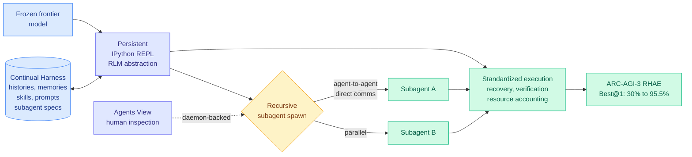

# Prime Agent: A Self-Improving RLM Harness

**Source:** HuggingFace Daily Papers (18 upvotes) · [arXiv 2608.23552](https://arxiv.org/abs/2608.23552) · [code](https://github.com/PrimeIntellect-ai/prime-agent) · raw: [`raw/huggingface/2026-08-25-prime-agent-a-self-improving-rlm-harness.md`](../../raw/huggingface/2026-08-25-prime-agent-a-self-improving-rlm-harness.md)

**Authors:** Seth Karten, Alex L. Zhang, Kevin Thomas, Sebastian Müller, Elie Bakouch, Daniel Auras, Mika Senghaas, Fares Obeid, Konstantin Dunas, Johannes Hagemann, Sami Jaghouar (Prime Intellect, Princeton, MIT)

## TL;DR

On 08-14 Prime Intellect published the measurement that harness choice, not model choice, dominates long-horizon agent outcomes: across 153 autonomous nanoGPT-speedrun runs, Kimi K3 differed by 44 steps between two harnesses, roughly the size of the entire gap to Opus 5. Prime Agent is the same group's answer to their own measurement. It is an open-source harness whose design goal is stated negatively: **prevent harness failures from becoming model failures**, so that a benchmark number measures the model's actual ceiling rather than the scaffold's floor.

The architecture rests on four pieces. A **persistent IPython REPL** follows the Recursive Language Model (RLM) abstraction, meaning the model treats context as a programmable object it can slice, grep, and recurse over rather than a fixed window it must fit inside. A **Continual Harness** persists histories, memories, skills, prompts, and subagent specifications across trajectories, so a session is not the unit of forgetting. **Recursive subagents** talk to each other directly rather than through the parent, which is what makes parallel work parallel. An **Agents View** lets a human inspect and manage daemon-backed sessions mid-flight.

The headline is ARC-AGI-3 RHAE Best@1 going from **30% to 95.5%** with no weight change, plus matching or beating native and popular harnesses on long-context coding, GPU-kernel generation, emulator construction, and autonomous nanoGPT speedruns. On Factorio, refinement produced continuous technology progression and dedicated subagents parallelized work.

---

---

## The framing that matters: von Neumann, not longer context

The paper's own metaphor is the useful one. A standalone language model is a **bounded sequential processor**: every decision depends only on weights plus whatever is in the active context. Prime Agent's claim is that long-horizon agency needs something closer to a **von Neumann architecture**, where the model is a processor with addressable state living outside its instruction stream. The REPL is the addressing mechanism; the Continual Harness is the store.

This reframes what a harness is *for*. It is not prompt scaffolding and it is not a tool-call wrapper. It is a memory hierarchy. That maps directly onto the wiki's [agent harness engineering](agent-harness-engineering.md) concept page, which named the memory substrate as one of six harness components, and it sharpens it: the substrate is not a bolt-on, it is the reason the harness exists at all.

## Relation to prior wiki state

**Direct sequel to a measurement this wiki already recorded.** [Measuring Autonomous AI Research (08-16)](2026-08-16-measuring-autonomous-ai-research.md) established that a single run has roughly a 50-step spread after 24 hours and that harness and effort setting are first-class variables. Prime Agent is Prime Intellect converting that finding into an artifact. Note the honesty of the sequencing: measure the variance, then build the thing that reduces it. Most groups do this in the opposite order and publish only the artifact.

**Confirms the harness-bound diagnostic.** The concept page's core claim, that cost-per-success swings 5x–30x on a fixed model ([omarsar0, arXiv 2608.01347](https://arxiv.org/abs/2608.01347)), predicted exactly this kind of result. A 30%→95.5% jump on ARC-AGI-3 with frozen weights is the accuracy face of the same phenomenon, and it is larger than the 0.49→0.91 transfer that [AI4AI at Test-Time (08-13)](../inference-efficiency/2026-08-13-ai4ai-test-time-harness-transfer.md) reported for a builder model writing a harness for a weaker target.

**Extends the state-outside-context mechanism.** LongHorizon-Harness ([arXiv 2608.01964](https://arxiv.org/abs/2608.01964), 08-13) introduced a Manage-Execute-Audit loop that keeps task state outside the execution context and updates it only on environment-verified facts. Prime Agent generalizes the same instinct: the REPL is state outside context, but it is programmable rather than a fixed schema, and the Continual Harness persists it across trajectories rather than within one.

**Partially closes open problem #2 on the concept page.** That problem asked for a harness that manages state externally *and* self-optimizes *and* routes through memory, built and benchmarked end-to-end. Prime Agent is the closest anyone has come. It does not fully close the item: the self-optimization is "continual" persistence rather than the code-rewriting search that [Task-CoEvolve](2026-08-25-task-coevolve-adaptive-validation-selection.md) and Meta-Harness perform.

## Key results

- ARC-AGI-3 RHAE Best@1: **30% → 95.5%**, weights untouched.
- Matches or exceeds native and popular harnesses on long-context coding, GPU-kernel generation, emulator construction, and nanoGPT speedruns.
- Factorio: refinement yields continuous technology progression; dedicated subagents enable genuinely parallel work.
- Standardizes **resource accounting**, which is the quiet contribution. You cannot compare harness costs without it.

## Gaps

The paper reports capability gains but does not put harness engineering and fine-tuning on a single cost axis for equal capability gain. That is open problem #0 on the concept page and it remains unrun. Nor does it isolate which of the four components carries the ARC-AGI-3 jump. A 65-point swing with four simultaneous changes is an ablation waiting to happen: if the REPL alone carries most of it, the Continual Harness and subagents are optional complexity.

The "prevents harness failures from becoming model failures" claim is also hard to falsify as stated. A harness that raises every model's score uniformly is measuring the ceiling better; a harness that raises some models more than others is introducing a new confound of exactly the kind the 08-16 paper warned about.

## Industrial implication

Open-source, from a group that has already published the variance data, and it standardizes resource accounting. That combination makes it a plausible default reference harness for anyone reporting long-horizon agent numbers. Expect it to show up in evaluation methodology sections within a quarter, the way vLLM became the default serving comparison.

## Related

- [Agent harness engineering](agent-harness-engineering.md) — concept page
- [Task-CoEvolve](2026-08-25-task-coevolve-adaptive-validation-selection.md) — making harness search cheaper
- [Meta-Harness](2026-08-25-meta-harness-code-space-optimization.md) — the code-space optimizer
- [Measuring Autonomous AI Research](2026-08-16-measuring-autonomous-ai-research.md) — the measurement this answers
- [Self-evolving agents](self-evolving-agents.md)
