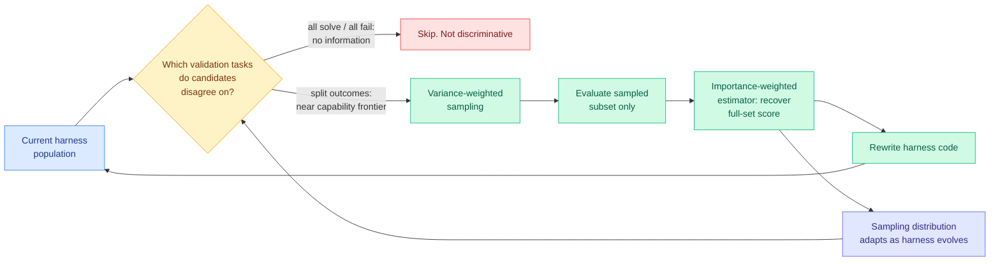

# Task-CoEvolve: Efficient Harness Optimization via Adaptive Validation Task Selection

**Date:** 2026-08-25
**Source:** [HuggingFace Daily Papers](https://huggingface.co/papers/2608.20169) (3 upvotes) · [arXiv 2608.20169](https://arxiv.org/abs/2608.20169) · [Code (promised)](https://github.com/Agent4Science-UTokyo/Task-CoEvolve)
**Authors:** Atsuyuki Miyai, Kiyoharu Aizawa, Toshihiko Yamasaki (University of Tokyo)
**Raw:** [raw/huggingface/2026-08-25-task-coevolve-efficient-harness-optimization-via-adaptive-va.md](../../raw/huggingface/2026-08-25-task-coevolve-efficient-harness-optimization-via-adaptive-va.md)

## TL;DR

Harness optimization iteratively rewrites the code around a frozen model and keeps whatever scores better on a validation set, delivering large gains with no weight updates. The unexamined cost is that **every iteration re-evaluates the full validation set**, including the many tasks that all candidate harnesses now solve or all still fail. Those tasks cost compute and carry zero information. Task-CoEvolve co-evolves the validation set alongside the harness: **variance-weighted sampling** concentrates evaluation on tasks near the capability frontier where candidate harnesses disagree, and an importance-weighted estimator recovers full-set scores from the partial evaluation so scores stay comparable across iterations even though each iteration measured a different subset. Result on online text classification and Terminal-Bench 2.1: **matches full-set search's final harness quality with 80% fewer evaluations**, and beats subset-based baselines.

## The problem, stated precisely

Harness optimization is a search loop: propose a harness edit, evaluate it, keep or discard. The evaluation is the expensive step, because each validation task means a full agent rollout with tool calls and model inference. The wiki has a published price for this: [AutoDesign (08-14)](2026-08-14-autodesign-meta-harness-optimization.md) reported $3 per rollout for 253 tool calls over 40 minutes, and [Specification-first convergence (08-16)](2026-08-16-specification-first-convergence.md) reported $2,430 for a three-day architectural refactor. Multiply a full validation set by an iteration count and harness search becomes the dominant cost.

Task-CoEvolve's observation is that the validation set's *informativeness decays as the harness improves*. Early on, most tasks discriminate between candidates. Later, the easy ones are universally solved and the hard ones universally failed, and only a shrinking frontier band still separates candidates. Spending equally on all three groups is the waste.

## Core novelty

Two pieces, and the second is what makes the first usable:

1. **Variance-weighted sampling over past outcomes.** Tasks where candidate harnesses have historically disagreed get sampled more. This is textbook active learning (information is maximal at the decision boundary) applied to harness evaluation, and the sampling distribution **adapts as the harness evolves**, so the frontier band tracks the improving harness rather than being fixed once.

2. **An importance-weighted full-set estimator.** This is the non-obvious part. If each iteration evaluates a different biased subset, raw subset scores are not comparable across iterations, and a search loop that cannot compare iteration *k* to iteration *k+1* is broken. By accounting for each task's sampling probability, Task-CoEvolve estimates the full-set score from the biased sample, restoring consistent comparison. Without this, adaptive sampling would break the very selection signal it is trying to make cheaper.

## Where this sits against prior wiki knowledge

**It gives harness optimization a cost curve, which is what the [harness engineering page](agent-harness-engineering.md) has been missing.** That page records the harness as measured on cost, capability, duration and variance, and optimizable by population search ([DarwinX (08-14)](2026-08-14-darwinx-harness-population-evolution.md), which ran harness evolution as a population under selection with a preserve-and-extend admission contract and added ~17 points in one loop) and by meta-optimization ([AutoDesign (08-14)](2026-08-14-autodesign-meta-harness-optimization.md), where a meta-harness optimizer guided a code agent to recursively rewrite its own harness). Both established that harness search *works*. Neither made it *affordable*. Task-CoEvolve is the first result on the efficiency of the search loop rather than the quality of its output.

This matters for that page's **open problem 0**, harness optimization versus fine-tuning at matched cost, which it has flagged as unrun and glaring because AutoDesign published a per-rollout price, DarwinX published no evolution budget at all, and no distillation paper published a comparable per-point cost. An 80% reduction in evaluations moves the harness side of that comparison by a large constant factor. The comparison still has not been run, but one side of it just got much cheaper, which changes the expected answer.

**Same statistical idea as [R2-OPD (08-25)](../inference-efficiency/2026-08-25-r2-opd-reasoning-progress-filtering.md), published the same day in a different subfield.** R2-OPD suppresses distillation reward where a teacher-derived ranking and an independent progress ranking disagree, using disagreement to decide **which tokens to trust**. Task-CoEvolve uses disagreement to decide **which tasks to evaluate**. Both are the active-learning principle that information concentrates where models disagree, and their independent appearance on one day in distillation and in harness evaluation is worth naming as a cross-subfield convergence rather than a coincidence. Task-CoEvolve is the more sophisticated instance: it weights by disagreement *magnitude* (variance) where R2-OPD's filter is binary.

**It also extends a pattern this wiki named on 08-14: schedule beats operator.** The [LycheeMemory V2 note](../inference-efficiency/2026-08-14-lycheememory-v2-segment-consolidation.md) recorded that as the third instance in three days, after ICBQ block order (08-12) and ReOrder-OPD prompt order (08-13), the claim being that *when* you do the operation matters as much as *what* the operation is. Task-CoEvolve is the same shape: the harness-rewrite operator is unchanged, and the gain comes entirely from changing what gets measured when.

## Key results

- **80% fewer evaluations** during optimization while matching full-set search's final harness quality.
- Consistently beats subset-based baselines (fixed subsets, random subsets).
- Demonstrated on **online text classification** and **Terminal-Bench 2.1**, the latter being the same benchmark DarwinX and AutoDesign used, so the results are comparable.

## Gaps

- **Two task types only.** Terminal-Bench 2.1 plus text classification is a narrow base for an efficiency claim that depends on the distribution of task difficulty. A benchmark whose difficulty is uniform rather than spread would show less benefit, because there would be no easy or impossible tail to skip.
- **80% is measured at one operating point.** How the saving varies with validation-set size, iteration count, and harness-population diversity is unreported, and those are the parameters a practitioner needs.
- **The estimator's variance is not discussed.** Importance weighting is unbiased but can have high variance when sampling probabilities get small, which is exactly what aggressive concentration produces. A noisy full-set estimate could cause the search to accept a worse harness. This is the paper's most likely hidden failure mode.
- **Code "will be released."**

## Industrial implication

Harness search moves from a research procedure to something a team can run on a schedule. Combined with DarwinX's transfer result (a Terminal-Bench harness transferring unchanged to SWE-bench Verified), the picture is that harnesses are portable artifacts and finding them is now roughly five times cheaper than it was, which is the condition under which a harness registry starts to make commercial sense.

## Research angle

The composition the [08-08 weekly](../daily-digest/2026-08/2026-08-08.md) asked for is now buildable: **disagreement-weighted evaluation (Task-CoEvolve) plus disagreement-filtered training (R2-OPD)** in one loop. An agentic-RL system that samples environments by candidate disagreement and filters its own reward by progress disagreement would apply one principle at both levels, and neither paper cites the other.

Separately, the estimator-variance question is a clean theory problem: what is the optimal concentration level that minimizes total cost subject to not flipping the accept/reject decision? That has a known answer form in the active-learning literature and nobody has applied it here.

## Related pages

- [Agent harness engineering](agent-harness-engineering.md)
- [DarwinX (08-14)](2026-08-14-darwinx-harness-population-evolution.md)
- [AutoDesign (08-14)](2026-08-14-autodesign-meta-harness-optimization.md)
- [Apodex 1.1 (08-25)](2026-08-25-apodex-1-1-environment-coordination-scaling.md)
- [Prime Agent (08-25)](2026-08-25-prime-agent-self-improving-rlm-harness.md)
- [R2-OPD (08-25)](../inference-efficiency/2026-08-25-r2-opd-reasoning-progress-filtering.md)
- [Daily digest 2026-08-25](../daily-digest/2026-08/2026-08-25.md)
