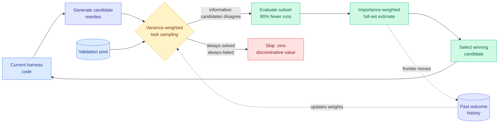

# Task-CoEvolve: Efficient Harness Optimization via Adaptive Validation Task Selection

**Source:** HuggingFace Daily Papers (3 upvotes) · [arXiv 2608.20169](https://arxiv.org/abs/2608.20169) · [code](https://github.com/Agent4Science-UTokyo/Task-CoEvolve) · raw: [`raw/huggingface/2026-08-25-task-coevolve-efficient-harness-optimization-via-adaptive-va.md`](../../raw/huggingface/2026-08-25-task-coevolve-efficient-harness-optimization-via-adaptive-va.md)

**Authors:** Atsuyuki Miyai, Kiyoharu Aizawa, Toshihiko Yamasaki (University of Tokyo)

## TL;DR

Automated harness optimization works by repeatedly rewriting the code around a frozen model and scoring each candidate on a validation set. Every existing method, [Meta-Harness](2026-08-25-meta-harness-code-space-optimization.md) included, runs the **full** validation set at **every** iteration. Task-CoEvolve's observation is that this is obviously wasteful and nobody had fixed it: tasks that every candidate solves, and tasks that every candidate fails, carry zero information about which candidate is better. They still cost a full sandbox run each.

The fix is to co-evolve the validation set with the harness. Tasks on which candidates **disagree** are the informative ones, so Task-CoEvolve uses variance-weighted sampling over past outcomes to concentrate evaluation near the harness's current capability frontier, and the sampling distribution moves as the harness improves. Because different iterations then evaluate different subsets, the paper adds an importance-weighted estimator that recovers full-set scores from the sampled subset, which is what keeps comparisons valid across iterations.

On online text classification and **Terminal-Bench 2.1**, it matches the final performance of full-set search while cutting evaluations during optimization by **80%**.

---

---

## What is actually novel

Two things, and the second is the load-bearing one.

**Adaptive selection applied to evaluation, not training.** Curriculum learning and adaptive task selection are old ideas on the *training* side. Task-CoEvolve moves them to the *evaluation* side of a search loop. That distinction matters because the objective is different: training wants tasks the learner can just barely do, evaluation wants tasks that **separate two candidates**. Those overlap but are not the same criterion, and the paper picks the right one.

**An estimator that survives a moving sample.** Sample-efficient model evaluation (tinyBenchmarks, AcTracer) estimates a *fixed* model's score from a subset. Here the thing being scored changes every iteration and the subset changes with it, so naive subset means are not comparable across iterations. Accounting for sampling probabilities is what makes the 80% saving legitimate rather than an artifact of easier subsets. Without this, the method would just be noisy early stopping.

The paper is careful about its own scope: this is **orthogonal** to reducing the number of candidates generated (DemoEvolve, ShinkaEvolve, TurboEvolve, HarnessCompass). It cuts per-candidate cost, not candidate count. The two compose.

## Relation to prior wiki state

**This is the cost half of the harness thread.** The [agent harness engineering](agent-harness-engineering.md) concept page has accumulated seven or eight results showing harness choice moves capability, from [Code as Agent Harness (05-23)](2026-05-23-code-as-agent-harness.md) through [AutoDesign (08-14)](2026-08-14-autodesign-meta-harness-optimization.md), which ran 253 tool calls in 40 minutes for under $3 per rollout. Almost all of them report what the harness buys. Task-CoEvolve is one of the first to attack what the **search** costs.

**It restates Meta-Harness's own headline as a premise.** Its framing paragraph cites the finding that harness design produces "up to a six-fold difference on the same benchmark" without touching weights, which is exactly the claim in the Stanford/MIT Meta-Harness work the reader saved this week. Today's HuggingFace paper and today's saved bookmark are the same research conversation, arriving through two independent channels.

**Partial answer to open problem #1.** The concept page's highest-value open experiment is a harness-quality metric that predicts the 5x–30x cost swing *before* you run the benchmark. Task-CoEvolve does not deliver that metric, but variance-weighted task informativeness is a step toward it: it identifies which tasks carry discriminative signal, which is the ingredient any such predictor needs.

## Key results

- Matches full-set search's final performance with **80% fewer evaluations** during optimization.
- Beats subset-based baselines (naive random subsets) consistently, on both online text classification and Terminal-Bench 2.1.
- Terminal-Bench 2.1 is the harder demonstration: long-horizon terminal tasks need dedicated sandboxes for extended periods, so evaluation genuinely is the bottleneck there, not a rounding error.

## Gaps

Only two task families, and one of them (text classification) is cheap enough that the saving does not matter. The claim rests on Terminal-Bench 2.1. There is no reported ablation separating the sampling scheme from the estimator, so it is unclear whether a simpler uncertainty-based sampler with the same estimator would do as well.

More importantly, concentrating evaluation at the capability frontier is a **known overfitting risk**: a harness selected on frontier tasks may be tuned to the boundary and not generalize to the easy tail it stopped being scored on. The paper reports matched final full-set performance, which is reassuring, but held-out task-family transfer is not shown.

## Industrial implication

Harness search is currently a rich-lab activity because the evaluation bill dominates. An 80% cut moves it toward affordable. Combined with candidate-side efficiency work, the compounding suggests automated harness optimization becomes a normal CI step rather than a research project inside a year. Watch for it appearing as a background job in agent frameworks.

## Related

- [Agent harness engineering](agent-harness-engineering.md) — concept page
- [Meta-Harness](2026-08-25-meta-harness-code-space-optimization.md) — the baseline it makes cheaper
- [Prime Agent](2026-08-25-prime-agent-self-improving-rlm-harness.md) — the harness runtime
- [AutoDesign](2026-08-14-autodesign-meta-harness-optimization.md) · [DarwinX](2026-08-14-darwinx-harness-population-evolution.md)
