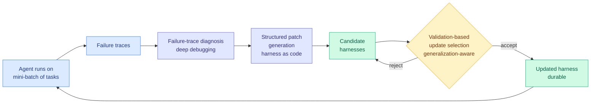

# AutoSaddler: harness optimization as offline learning from mini-batches of failure traces

**Source:** HuggingFace Daily Papers, [arXiv 2608.23041](https://arxiv.org/abs/2608.23041) (40 upvotes) · [raw](../../raw/huggingface/2026-08-26-autosaddler-automatic-harness-optimization-with-durable.md)
**Authors:** Sungho Park (POSTECH), Wonjoong Kim (KAIST), Rongyuan Tan (SUSTech), Jue Zhang (Microsoft, corresponding), Wook-Shin Han (POSTECH, corresponding), Pengfei Gao, Yongqiang Yao, Rao Fu, Elsie Nallipogu, Qingwei Lin, Saravan Rajmohan, Dongmei Zhang (Microsoft), Chanyoung Park (KAIST)

---

## TL;DR

Harnesses (the scaffolding of prompts, tool configurations and control logic wrapped around a model) reliably make agents more robust, and designing them is still manual and expensive. AutoSaddler reformulates harness improvement as an **offline learning problem** and updates the harness from mini-batches of failure signals, treating the harness as code and generating structured patches against it. Gains: **+9.0 points on GAIA2, +9.6 on SWE-Bench Pro, +10.0 on Terminal-Bench 2.0** over the corresponding base harnesses. The ablation is the part worth keeping: effective harness optimization needs **deep debugging rather than shallow reflection**, **targeted modification rather than unconstrained editing**, and **generalization-aware selection rather than trajectory-specific repair**.

---

## Mechanism

The "offline learning from mini-batches" framing is doing real work rather than decorating the method. Prior harness optimizers on this wiki are online searches: propose a variant, run it, keep it if it scores better. AutoSaddler batches failures, diagnoses across the batch, and patches once — which is why its updates are called *durable*. A repair derived from several failures at once is less likely to encode a single trajectory's accident.

Per the alphaxiv overview, the paper positions itself explicitly beyond prompt optimization (gradient-free search, textual-gradient methods, evolutionary algorithms, programming abstractions), on the grounds that the design space that matters includes tools and runtime control logic, not just prompt text.

---

## Key takeaways

- **Consistent double-digit gains on three hard, distinct benchmarks**: GAIA2 (+9.0), SWE-Bench Pro (+9.6), Terminal-Bench 2.0 (+10.0). Breadth across benchmark families matters more here than the magnitude on any one.
- **Deep debugging beats shallow reflection.** A short self-critique of what went wrong is not enough; the optimizer needs to actually work through the trace.
- **Targeted modification beats unconstrained editing.** Given free rein to rewrite the harness, the optimizer does worse. Constraint is a feature.
- **Generalization-aware selection beats trajectory-specific repair.** Fixing the failure in front of you produces a harness that does not transfer, which is the same lesson DarwinX reached by a different route.

## Gaps

Point gains against "the corresponding base harnesses" without naming them makes the baseline unpinnable, and base-harness quality is precisely the variable that determines how much headroom exists. No search cost is published, which is now the standard omission in this literature. Single-attempt scores only, so nothing about reliability under repetition. And the three ablation findings are stated as directional without the numbers that would let anyone weigh them against each other.

---

## Relation to prior wiki pages

**AutoSaddler's three ablation findings are an independent rediscovery of the admission rule [agent-harness-engineering](agent-harness-engineering.md) has now recorded three times, which promotes it from a design choice to a law of this subfield.** DarwinX (08-14, Salesforce) diagnosed every prior self-improving harness as a **single lineage**, path-dependent, letting a local win silently regress another task, and fixed it with a *preserve-and-extend contract*: admit a variant only if it extends coverage without regressing. Ken Huang's harness-engineering pattern language (08-14) stated the governance version independently and within a day: improvement is only safe when it is measured, bounded, and reversible. AutoSaddler now arrives at the same place from an ablation rather than a design principle, finding empirically that generalization-aware selection beats trajectory-specific repair and that *unconstrained* editing is worse than targeted editing. Three groups, three methodologies, one rule: **bound the edit and gate the admission, or the optimizer overfits its last failure.**

**It also sits on the affordability axis [Task-CoEvolve (08-25)](2026-08-25-task-coevolve-adaptive-validation-selection.md) opened, and on the same side.** Task-CoEvolve observed that a validation set's informativeness decays as the harness improves (eventually the easy tasks are universally solved, the hard ones universally failed, and only a shrinking frontier band separates candidates), concentrated evaluation there by variance-weighted sampling, and recovered full-set-comparable scores with an importance-weighted estimator, for **80% fewer evaluations at matched final quality**. AutoSaddler's mini-batch offline formulation is a different economy on the same problem: batch the failures so each patch is amortized over several traces rather than paying a full evaluation cycle per proposal. Neither paper cites the other and both landed within a day. Harness search getting cheaper by two independent routes in two days is the clearest sign this subfield is in its engineering phase rather than its discovery phase.

**What it does not do is touch open problem 0.** [agent-harness-engineering](agent-harness-engineering.md) has carried the same gap since it was created: nobody has put harness optimization and fine-tuning on a single cost axis for equal capability gain. AutoSaddler publishes capability gains and no budget, which is exactly the shape of the omission that keeps that problem open. It also does not touch open problem 0b, the missing pass^k curve — and [Thinkingbox (08-25)](2026-08-25-thinkingbox-stateful-reliability.md), Microsoft's 507 policy-conditioned stateful business workflows evaluated against backend terminal state, showed the strongest model dropping from 65.36% pass@1 to 25.25% pass^20. AutoSaddler is Microsoft-led and lands one day later with single-attempt numbers on three benchmarks. The company published the measurement that says single-attempt scores overstate agent reliability by 40 points, and then published a harness paper reported in single-attempt scores.

---

## Related pages

- [Agent harness engineering](agent-harness-engineering.md)
- [Recuris: recursive experiential-working memory (08-26)](2026-08-26-recuris-experiential-working-memory.md)
- [Task-CoEvolve (08-25)](2026-08-25-task-coevolve-adaptive-validation-selection.md)
- [Self-evolving agents](self-evolving-agents.md)
- [Agent memory](agent-memory.md)
