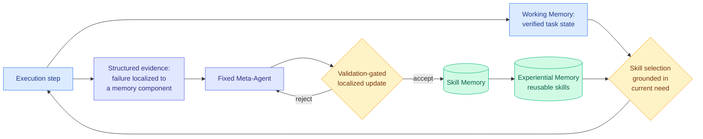

# Recuris: recursive experiential-working memory evolution for long-horizon harnesses

**Source:** HuggingFace Daily Papers, [arXiv 2608.24876](https://arxiv.org/abs/2608.24876) (15 upvotes) · [raw](../../raw/huggingface/2026-08-26-recursive-experiential-working-memory-evolution-for-long.md)
**Authors:** Zhaochen Yu (NUS, Princeton), Yingcheng Wu (Stanford), Zhenfei Yin (Oxford), Kaiyuan Chen (Stanford), Zhe Zhao (Stanford), Mengdi Wang (Princeton, corresponding), Shuicheng Yan (NUS, corresponding), Ling Yang (Princeton, corresponding)
**Code:** https://github.com/Gen-Verse/Recuris

---

## TL;DR

Recursive self-improvement breaks down on long-horizon tasks for a specific reason: as the interaction history grows it obscures the actual task state, and skill retrieval keyed on the initial instruction or the full history starts pulling irrelevant or stale skills. Recuris separates the two memories and couples them. **Working Memory** tracks verified task progress; it is what selects skills from **Experiential Memory**, so skill invocation is grounded in current need rather than in the whole transcript. The coupling has a second payoff: because execution is now checked against a maintained state, failures localize to a specific memory component, and a fixed Meta-Agent turns that evidence into localized, validation-gated updates to Skill Memory. That closes a bounded recursive loop. Results: improvement in **35 of 37 completed model-benchmark pairs** across four long-horizon benchmarks and ten models; **+17.8 points to GPT-5.6 Sol and +15.6 to Claude Opus 5 on tau-bench, taking Opus 5 to 87.9%**; +16.6 and +13.5 on Qwen3.6-27B/35B on SkillFlow; **+32.2 on the longest tasks**, with common long-horizon failures down by up to 80%.

---

## Mechanism

The alphaxiv overview sharpens what the paper is reacting against. Experiential-memory methods retrieve skills using the initial instruction or the full interaction history, both of which become unreliable as the task evolves and the history grows. Working-memory methods track state, but their updates are either rule-fixed or **self-reported by the model**, with no external verification, so they are vulnerable to omission and hallucination. The absence of a verified, compact, continuously aligned task state is what simultaneously breaks skill invocation *and* makes it impossible to convert a failure into a precise fix, because you cannot attribute a late failure to an early state error you never recorded correctly.

---

## Key takeaways

- **Frontier models are not saturated on long-horizon work.** +17.8 to GPT-5.6 Sol and +15.6 to Claude Opus 5 on tau-bench, taking Opus 5 to 87.9%. These are the strongest available models and a memory architecture still finds double-digit headroom.
- **The advantage widens with horizon length**, reaching **+32.2 points on the longest tasks**. That is the signature you want from a claim about long-horizon state management, and it is the strongest evidence the mechanism is the stated one rather than general scaffolding benefit.
- **Breadth over cherry-picking**: 35 of 37 completed model-benchmark pairs improve, across ten models and four benchmarks.
- **Common long-horizon failure modes fall by up to 80%**, which is a failure-taxonomy claim rather than a score claim and is more diagnostic than the point gains.
- **The Meta-Agent is fixed.** It never modifies itself, which is what makes the recursion bounded and stable.

## Gaps

"35 of 37 completed" implies two model-benchmark pairs did not complete and the abstract does not say which or why, which is exactly the kind of omission that matters in a breadth claim. No token or dollar cost is reported for maintaining Working Memory and running validation-gated updates, and both are per-step overheads on the longest tasks where the gains are largest. tau-bench at 87.9% is approaching the region where headroom stops being measurable. And "validation-gated" needs a validation budget to be interpretable; none is given.

---

## Relation to prior wiki pages

**Recuris is the first system on this wiki that actually composes the three pieces [agent-harness-engineering](agent-harness-engineering.md) listed as open problem 2, and that problem can now be marked mostly resolved.** The open problem read: LongHorizon-Harness's state-outside-context, HarnessOpt's self-optimization, and graph-based memory routing are separate advances, and "a harness that manages state externally *and* self-optimizes *and* routes through a memory graph has not been built or benchmarked end-to-end." Recuris is that system. Working Memory is state maintained outside the execution context, which is LongHorizon-Harness's (arXiv 2608.01964, Alibaba, 08-13) Manage-Execute-Audit contribution — keep task state outside the context and update it only on environment-verified facts so wrong self-assessments stop propagating. Experiential Memory with need-grounded retrieval is the routing layer. The Meta-Agent's validation-gated updates to Skill Memory are the self-optimization layer. All three, one system, four benchmarks, ten models.

The composition is not merely additive, which is the interesting part. The verified Working Memory is what *makes* the self-optimization precise: because state is externally checked, a failure can be attributed to a specific memory component, and that attribution is what the Meta-Agent needs to write a localized rather than a global patch. That is the same argument [Meta-Harness (08-25)](2026-08-25-meta-harness-code-space-optimization.md) made about attribution — a scalar reward can say a rollout was bad but cannot say that turn 40 failed because turn 6 evicted the wrong file, and recovering that link requires the trace to exist and be readable. Meta-Harness recovered it from 10M tokens of raw execution log with `grep`. Recuris gets it structurally from a maintained state, which is far cheaper. **Two solutions to the credit-assignment problem in harness optimization, eleven days apart: read everything, or maintain the right thing.** The second should dominate on cost, and nobody has compared them.

**It converges with [AutoSaddler (today)](2026-08-26-autosaddler-harness-optimization.md) on the admission rule, making today the fourth and fifth independent instances.** Recuris gates updates on validation and keeps them localized; AutoSaddler's ablation finds generalization-aware selection beats trajectory-specific repair and targeted modification beats unconstrained editing. Both echo DarwinX's (08-14) preserve-and-extend contract and Ken Huang's (08-14) measured-bounded-reversible rule. Five independent arrivals at the same constraint is well past this wiki's three-instance threshold.

**It also strengthens the case that the routable unit is the model-harness pair.** [agent-harness-engineering](agent-harness-engineering.md) records this as a standing gap with supporting results and zero proposals: no production router routes over harnesses, and no paper proposes it. Recuris supplies the cleanest supporting evidence yet, because it improves ten models by very different amounts (+17.8 on GPT-5.6 Sol, +15.6 on Opus 5, +16.6 and +13.5 on two Qwen sizes). Different models gain differently from the same harness, which is precisely the condition under which routing over pairs would beat routing over models. [LLM routing](../ai-routing/llm-routing.md) should now record a fourth supporting result and still no proposal.

**Open problem 0b remains untouched, again.** No pass^k curve. [Thinkingbox (08-25)](2026-08-25-thinkingbox-stateful-reliability.md) showed a 40-point pass@1-to-pass^20 collapse on stateful business workflows, and tau-bench is a stateful tool-use benchmark of the same family. Recuris reports 87.9% and does not report how often. The measurement is cheap and two consecutive days of harness papers have declined to run it.

---

## Related pages

- [Agent harness engineering](agent-harness-engineering.md)
- [Agent memory](agent-memory.md)
- [AutoSaddler (08-26)](2026-08-26-autosaddler-harness-optimization.md)
- [Meta-Harness (08-25)](2026-08-25-meta-harness-code-space-optimization.md)
- [Self-evolving agents](self-evolving-agents.md)
- [LLM routing](../ai-routing/llm-routing.md)
