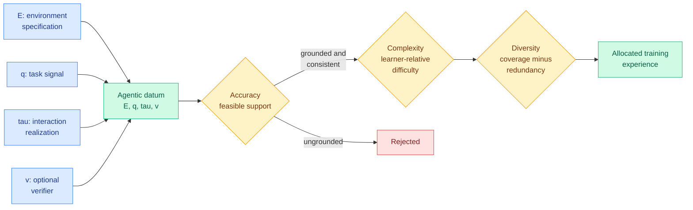

# What Makes Good Agentic Data? An ACE Lens on Data Generation for LLM Agents

**Source:** HuggingFace Daily Papers, [arXiv 2608.27260](https://arxiv.org/abs/2608.27260)
**Raw:** [raw/huggingface/2026-08-28-what-makes-good-agentic-data-an-ace-lens-on-data-generation.md](../../raw/huggingface/2026-08-28-what-makes-good-agentic-data-an-ace-lens-on-data-generation.md)

---

## TL;DR

A survey with an actual thesis, which is rare enough to be worth reading. Agent training data is now mostly generated rather than collected, and the literature on how to generate it is organized by domain (web agents, tool agents, coding agents), which hides the fact that the *generation mechanisms* are largely the same and that papers routinely conflate three distinct steps: constructing a candidate, verifying it, and selecting it. The paper does two things. First, it factorizes agentic data into one common object, **(E, q, τ, v)**: an environment specification, a task signal, an interaction realization, and an optional verifier. Second, it reframes generation as **constrained distribution design** through the **ACE lens**: **A**ccuracy establishes the feasible support of grounded, internally consistent data; within that support, **C**omplexity places learning mass relative to a *declared* learner and execution configuration; and div**E**rsity controls coverage and redundancy. Its closing line is the argument: **the challenge is not to generate more data, but to continually allocate valid, informative, non-redundant experience as agents and environments evolve.**

---

## The two ideas worth taking

**"Learner-relative complexity" is the sharp one.** Difficulty is normally treated as a property of a task. The paper insists it is a property of a task *relative to a declared learner and execution configuration*, which means the same trajectory is informative for one model-harness pair and worthless for another. That is a stronger claim than curriculum learning's usual framing, and it makes data generation dependent on the harness, not just on the model. Given that this wiki has spent a month establishing that the model-harness pair is the meaningful unit, this is the data-generation face of the same observation.

**Separating candidate construction from verification and selection** is the survey's structural contribution and its main criticism of the field. Once separated, the paper's reading of the literature is that it has shifted toward **execution-grounded accuracy** (verify by running it, not by scoring it), **learner-relative complexity**, and **diversity beyond surface variation or dataset size**.

## How this relates to prior wiki pages

**"Execution-grounded accuracy" is the same conclusion the harness thread reached from the opposite direction, and naming that convergence is the most useful thing this survey does for the wiki.** The [agent-harness-engineering page](agent-harness-engineering.md)'s sharpest mechanism claim, arrived at independently by [AI4AI (08-13)](../inference-efficiency/2026-08-13-ai4ai-test-time-harness-transfer.md) and Spark-to-Paper (08-13) and then by Gradient Flow's production survey (08-26), is that **the harness wins by taking decisions away from the model**: offload unstable reasoning into deterministic code, enforce formats, and require checkable proof rather than a claim. This survey says the data pipeline is converging on the identical principle: stop scoring generated experience with a model and start *executing* it. Two layers of the stack, same fix, no shared authors.

**"Allocate, don't accumulate" is this wiki's most-repeated idea, now stated at the dataset level.** The pattern has appeared at the token level (TIP, 04-16: roughly 10% of teacher tokens carry learning signal), the trajectory level (FiRe-OPD, 06-04: hard-filter trajectories then soft-reweight tokens), the turn level (AgentOPSD, 08-07: locate pivotal turns by disagreement), the evaluation-task level ([Task-CoEvolve, 08-25](2026-08-25-task-coevolve-adaptive-validation-selection.md): 80% fewer evaluations by concentrating on the frontier band where candidates still disagree), and today the spectral level ([Spectral Allocation](../llms-foundation-models/2026-08-28-spectral-allocation-muon.md): curvature is anisotropic, so shape the update per spectral direction). The ACE lens adds the **data-generation** level and, unusually, supplies vocabulary for all of them at once. Accuracy-Complexity-Diversity is a reasonable decomposition of what every one of those selective-allocation methods is trading off, and the wiki has not had a shared name for it.

**It also frames the counterweight to today's skill-transfer results.** [WikiSkill (08-28)](2026-08-28-wikiskill-persistent-knowledge-skill-evolution.md) finds evolved skills transfer across model families and that other models' skills can beat self-evolved ones. Learner-relative complexity predicts a limit on that: if informativeness is relative to a declared learner, then transferred experience should degrade as the target diverges from the source. WikiSkill reports the transfer working; ACE says it should not work indefinitely. Neither tests the boundary, and the boundary is the interesting quantity.

## Gaps

It is a survey, so it has no result. The honest evaluation is whether its framework does work, and the answer is partly. The (E, q, τ, v) factorization is clean and immediately useful for reading papers. The ACE lens is a good decomposition but it is **not operationalized**: there is no proposed metric for complexity relative to a declared learner, and without one, "place learning mass relative to the capability of a declared learner" is a principle rather than a procedure. The single most valuable follow-up is a cheap estimator of learner-relative informativeness, and the survey does not offer one.

Second, the optional verifier is doing a lot of quiet work. The survey observes the field shifting toward execution-grounded accuracy, which is only available in domains with executable environments. Coding, terminal work and games have verifiers; most enterprise agent work does not, and for those domains ACE's Accuracy axis collapses back onto model-based scoring, which is the thing the shift was supposed to escape. The survey notes the trend without marking how much of the agent economy it excludes.

## Industrial implication

For a team generating agent training data, the actionable content is the separation: **build candidates cheaply and in volume, verify by execution, and select against a stated learner and harness.** Most pipelines today fuse all three into one prompt-and-filter step, which makes it impossible to know whether a bad dataset was badly constructed, badly verified or badly selected. Instrumenting the three stages separately costs little and localizes the failure, which is the same argument [Recuris (08-26)](2026-08-26-recuris-experiential-working-memory.md) made about verified working state being the substrate that makes credit assignment possible.

## Related

- [agent-harness-engineering](agent-harness-engineering.md) (concept)
- [agent-benchmarks](agent-benchmarks.md) (concept)
- [self-evolving-agents](self-evolving-agents.md) (concept)
- [WikiSkill (08-28)](2026-08-28-wikiskill-persistent-knowledge-skill-evolution.md)
- [Task-CoEvolve (08-25)](2026-08-25-task-coevolve-adaptive-validation-selection.md)
