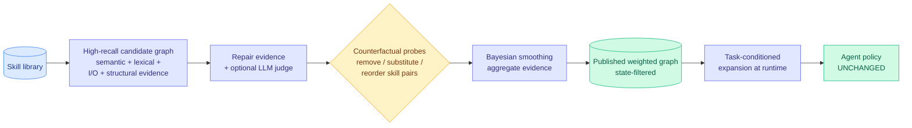

# CaSKG: Counterfactual-Causal Skill Graphs for Scalable Agent Skill Retrieval

**Source:** HuggingFace Daily Papers, [arXiv 2608.25500](https://arxiv.org/abs/2608.25500) · code at [github.com/ZhiyuanLi218/Caskg](https://github.com/ZhiyuanLi218/Caskg)
**Raw:** [raw/huggingface/2026-08-28-caskg-counterfactual-causal-skill-graphs-for-scalable-agent.md](../../raw/huggingface/2026-08-28-caskg-counterfactual-causal-skill-graphs-for-scalable-agent.md)

---

## TL;DR

A reusable skill library lets an agent carry procedural knowledge across tasks, and then immediately creates a retrieval problem with three bad options. **Full-library prompting** keeps every skill available and pays for it in context tokens on every call. **Vector retrieval** returns a compact neighbourhood but treats each skill as an independent blob of text, so it loses the fact that skill B is a prerequisite for skill C. **Graph retrieval** recovers that workflow structure, but only if the edges are trustworthy, and normally they are not, because they were inferred from surface similarity. CaSKG's contribution is to **calibrate the edges before retrieval ever runs**, using counterfactual probes: remove, substitute and reorder skill pairs, see whether it actually matters, and weight the edge by the measured effect rather than the guessed similarity.

---

## What it actually does

Build a **high-recall directed candidate graph** first, from four kinds of evidence: semantic, lexical, input/output type matching, and structural. Refine candidate scores with repair evidence and an optional LLM judge. Then run **direction-conditioned textual counterfactual probes**, which is the core move: perturb a skill pair by removing one, substituting one, or reordering them, and measure whether the outcome changes. Aggregate with **Bayesian smoothing** so a sparsely probed edge is not overconfident. Publish a state-filtered weighted graph, and expand from it at runtime conditioned on the task.

**Two engineering properties make it deployable.** The graph is built **offline**, so the counterfactual probing cost is paid once rather than per query. And it requires **no change to the downstream agent policy or task interface**, so it is a drop-in replacement for whatever retrieval a harness already uses.

## Results

Across six LLM backbones on ALFWorld ID-140 and ScienceWorld U211, CaSKG takes the highest task score in **all twelve model-benchmark combinations**. Against Graph-of-Skills (GoS), the direct baseline that also uses a skill graph but with uncalibrated edges, the six-model macro-average on ScienceWorld goes **72.62 → 80.50** and ALFWorld success goes **80.01% → 86.79%**, while **reducing mean environment steps on both benchmarks.**

The step reduction is the part that makes this an efficiency result rather than only an accuracy one. Fewer environment steps means fewer tool calls, fewer model invocations and less context growth per task. Combined with the framing against full-library prompting, the claim is **compact and executable skill retrieval at scale**, which is a context-cost argument.

## How this relates to prior wiki pages

**It names the exact reason graph memory has underdelivered, which closes a gap the wiki has had open since 08-13.** The [agent-harness-engineering page](agent-harness-engineering.md)'s open problem 4 reads: *"Graph engineering lacks the research the loop layer now has. The practitioner 'graphs make agents remember' claim is mostly ahead of measured evidence. What a graph buys over a well-run loop is not yet quantified."* CaSKG supplies the missing mechanism: a graph buys prerequisite structure, and it only buys it **if the edges are calibrated**, which prior graph retrieval did not do. That converts a vague practitioner slogan into a testable engineering requirement. The open problem is not fully closed, since CaSKG measures graph-versus-graph rather than graph-versus-well-run-loop, but the vocabulary now exists to run that comparison.

**It is the third arrival this month at "disagreement or intervention beats similarity," and the sharpest of the three.** The [knowledge-distillation page](../inference-efficiency/knowledge-distillation.md) records the pattern at three instances: [R2-OPD (08-25)](../inference-efficiency/2026-08-25-r2-opd-reasoning-progress-filtering.md) suppresses distillation reward where a teacher ranking and a progress ranking disagree; [Task-CoEvolve (08-25)](2026-08-25-task-coevolve-adaptive-validation-selection.md) concentrates harness evaluation on validation tasks where candidate harnesses disagree, cutting evaluations 80%; [TTPO (08-28)](../inference-efficiency/2026-08-28-ttpo-test-time-policy-optimization.md) routes agreeing and disagreeing rollouts to different algorithms. CaSKG is stronger than all three because it does not merely *observe* a disagreement, it **manufactures one by intervention**. Removing a skill and checking whether the outcome changes is a counterfactual, not a correlation, and the wiki flagged the shared weakness of the correlational family as *every method depends on a second estimator nobody has validated*. A counterfactual probe is not an estimator. It is expensive, and it is right.

**It supplies the retrieval layer that [Recuris (08-26)](2026-08-26-recuris-experiential-working-memory.md) and today's [WikiSkill](2026-08-28-wikiskill-persistent-knowledge-skill-evolution.md) both need and neither builds.** Recuris retrieves experiential memory *by verified working state*, which fixes retrieving against a stale instruction but says nothing about whether the edges between memories are real. WikiSkill fixes what gets *compiled into* the skill library. CaSKG fixes the edges. The three compose cleanly and no paper composes them, which is a well-posed next system.

## Gaps

**The probing cost is unpublished and it is the whole trade.** Counterfactual probes over skill pairs is quadratic in library size before pruning, and each probe is at minimum a textual perturbation plus an evaluation. The paper's defence is that this is offline, which is correct but not free: a library that changes as the agent learns new skills needs re-probing, and the systems this composes with ([WikiSkill](2026-08-28-wikiskill-persistent-knowledge-skill-evolution.md), Recuris) are specifically systems where the library grows continuously. **A calibrated graph over a static library is a solved problem; over an evolving library it is an amortization question nobody has priced.**

Second, the benchmarks are the wrong difficulty for the claim. ALFWorld and ScienceWorld are the standard embodied-text benchmarks and both are near their ceilings, with ALFWorld baselines already at 80%. Going 80.01% to 86.79% on a saturating benchmark is a real improvement in a regime where a benchmark cannot discriminate well, which is the exact objection the wiki raised on 08-25 about ARC-AGI-3 being near-saturated by two systems in one week. Terminal-Bench 2.0 or the stateful workflows in [Thinkingbox (08-25)](2026-08-25-thinkingbox-stateful-reliability.md) would test it properly.

Third, the "optional LLM judge" is a load-bearing optional component. Whether the result survives without it decides whether this is a cheap graph-calibration method or another pipeline with a frontier model in the loop, and the abstract does not say.

## Industrial implication

Anyone running an agent with more than a few dozen skills is currently choosing between paying context tokens for the whole library and accepting a vector retriever that drops prerequisites. CaSKG says there is a third option with a one-time offline cost, and the reported step reduction means it pays back in tool calls. The near-term practical use is narrower and more valuable than the paper frames it: **the counterfactual probe is also a skill-library audit.** Run it and edges with no measured effect identify skills that do not matter, which is directly the 33%-of-public-skills-make-things-worse problem the practitioner cluster reported. A method that can measure whether a skill pairing actually changes an outcome is a pruning tool for skill libraries, and that is probably its first real use.

## Related

- [agent-harness-engineering](agent-harness-engineering.md) (concept)
- [agent-memory](agent-memory.md) (concept)
- [WikiSkill (08-28)](2026-08-28-wikiskill-persistent-knowledge-skill-evolution.md)
- [Recuris (08-26)](2026-08-26-recuris-experiential-working-memory.md)
- [Task-CoEvolve (08-25)](2026-08-25-task-coevolve-adaptive-validation-selection.md)
