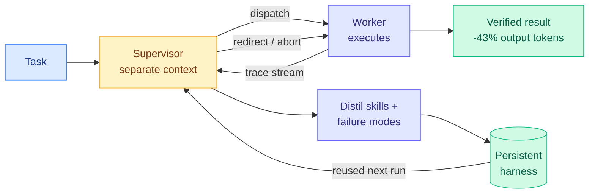

# PILOT in the Loop: Live Self-Improvement for Long-Horizon Agents

**Source:** HuggingFace Daily Papers, [arXiv 2608.26530](https://arxiv.org/abs/2608.26530)
**Raw:** [raw/huggingface/2026-08-28-pilot-in-the-loop-live-self-improvement-for-long-horizon-age.md](../../raw/huggingface/2026-08-28-pilot-in-the-loop-live-self-improvement-for-long-horizon-age.md)

---

## TL;DR

Every self-improving agent in this wiki learns *after* the run ends. PILOT's claim is that this is the wrong tense: by the time the post-mortem is written, the run that generated the lesson has already failed. PILOT splits the agent into a **supervisor** and a **worker** and gives the supervisor two powers the worker does not have: it can **redirect or abort the active worker mid-execution** (live steering), and it can **distil procedures and failure modes into reusable skills and memory while the run is still going** (live self-evolution). It ranks first in five of six configurations, beats counterpart harnesses by up to 9.8 points on Terminal-Bench 2.0, and, the number that matters most, **cuts mean output tokens by 42.9% and 47.4% while raising successful evaluations per million output tokens by 110.3% and 134.0%.**

---

## What problem it solves

Two existing architectures each fail half the problem, and PILOT's framing of that failure is the sharpest part of the paper. **Single-agent self-correction** puts task execution and trajectory assessment in one context, so the thing judging the work is the thing that produced it, sharing all of its confusions. **Subagent delegation** cleanly separates execution from oversight but the parent typically cannot reach into an active subagent, so oversight only arrives when the subagent returns, which on a long-horizon task is exactly too late. PILOT keeps the context separation and adds the missing channel: the supervisor watches the trace as it streams and can intervene.

## Why the token numbers are the real result

Read the headline accuracy result and PILOT looks like one more harness paper. Read the token result and it is something the [agent-harness-engineering concept page](agent-harness-engineering.md) has been explicitly asking for since 08-14. That page's **open problem 0** is "harness optimization versus fine-tuning at matched cost," and it records that [AutoDesign (08-14)](2026-08-14-autodesign-meta-harness-optimization.md) published $3 per rollout, [DarwinX (08-14)](2026-08-14-darwinx-harness-population-evolution.md) published no evolution budget, [AutoSaddler and Recuris (08-26)](2026-08-26-autosaddler-harness-optimization.md) published capability gains with no serving budget at all.

PILOT publishes **successful evaluations per million output tokens**, which is a cost-per-success metric on the serving side. That is the same denominator omarsar0's preregistered benchmark used when it measured the 5x-30x cost-per-success swing between harnesses (arXiv 2608.01347, 08-13), the measurement the concept page calls the empirical spine of the field. Reporting it doubled is a stronger statement than reporting +9.8 points, because it says the harness got *cheaper and better at the same time* rather than buying accuracy with tokens.

**And the mechanism explains the saving.** Aborting a doomed run early is a token refund, not a capability gain. Most of the 43% almost certainly comes from the supervisor killing trajectories that were going to fail anyway, which is why this result is complementary to rather than competing with the papers that make the successful path shorter.

## How it relates to prior wiki pages

**It is the "live" counterpart to two offline systems from two days ago, and the three now cover the design space.** [AutoSaddler (08-26)](2026-08-26-autosaddler-harness-optimization.md) formulates harness improvement as *offline* learning from mini-batches of failure traces, which makes each patch durable because it is derived from several failures at once. [Recuris (08-26)](2026-08-26-recuris-experiential-working-memory.md) maintains verified Working Memory and lets a fixed Meta-Agent write validation-gated local patches between runs. PILOT does it *during* the run. The trade is visible without being tested: offline patches generalize better because they see multiple failures, live patches arrive in time to save the current task but are derived from a single trajectory, which is precisely the "trajectory-specific repair fails to transfer" failure mode AutoSaddler's ablation isolated. **Nobody has run offline against live at matched budget**, and after today that is a well-posed and cheap experiment.

**It also inherits the concept page's settled admission rule and appears to respect it.** Five independent papers (DarwinX, Ken Huang's pattern language, Recuris, AutoSaddler twice over) converged on "bound the edit and gate the admission, or the optimizer overfits its most recent failure." PILOT's live self-evolution distils into skills and memory rather than rewriting the loop wholesale, which is a bounded edit. Whether it *gates* those skills on validation before they are reused is the detail that decides if it is inside or outside the rule, and the abstract does not say.

**It does not answer open problem 0b, and the omission is now conspicuous for a fourth consecutive harness paper.** [Thinkingbox (08-25)](2026-08-25-thinkingbox-stateful-reliability.md), Microsoft's 507 policy-conditioned stateful business workflows checked against backend terminal state, showed the strongest model falling from **65.36% pass@1 to 25.25% pass^20**. Terminal-Bench 2.0, where PILOT reports +9.8, is a stateful execution benchmark of the same family. PILOT reports first-attempt ranks. The pass^k curve for a harness-optimized agent remains unpublished, and the [08-26 digest](../daily-digest/2026-08/2026-08-26.md) predicted it would appear within 60 days.

## Gaps

The "ranks first in five of six configurations" framing hides which one it lost and by how much, on a paper whose entire content is a comparison. The self-improvement gains (+14.6 with GLM-5.1, +12.4 with Kimi-K2.6) are reported on frozen backbones, which is the right control, but the supervisor is itself a model call on every step of the worker's trace, and **the supervisor's own token cost is not in the 42.9% figure unless the paper counts it** — the abstract says "mean output tokens," and a supervisor that reads a trace and emits short steering messages produces few output tokens while consuming many input tokens. If the saving is measured on output tokens only, it flatters an architecture that shifts spend from output to input. That is the first thing to check in the full paper.

## Industrial implication

Live steering is already the shape of the product. Anthropic's own engineers, in the practitioner cluster this reader has been saving since 08-13, describe the pattern as "you're not supposed to babysit the model, put it in a graph and it catches its own mistakes." PILOT is that pattern with a benchmark and a token bill attached. The immediate consequence for anyone running unattended loops is that **the abort decision is a first-class cost lever**, and most production harnesses today have no supervisor with authority to kill a run. Expect that to be the next feature in the coding-agent products, because it is cheap to build and it shows up directly in the bill.

## Related

- [agent-harness-engineering](agent-harness-engineering.md) (concept)
- [self-evolving-agents](self-evolving-agents.md) (concept)
- [Recuris (08-26)](2026-08-26-recuris-experiential-working-memory.md)
- [AutoSaddler (08-26)](2026-08-26-autosaddler-harness-optimization.md)
- [Thinkingbox (08-25)](2026-08-25-thinkingbox-stateful-reliability.md)
- [TaoLive Harness-Aware Training (08-28)](2026-08-28-taolive-harness-aware-training.md)
