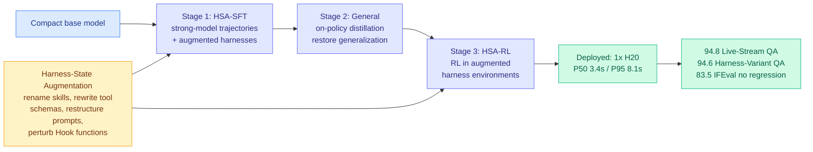

# Training Agents to Evolve with Their Harness: Harness-Aware Training (TaoLive)

**Source:** HuggingFace Daily Papers, [arXiv 2608.15763](https://arxiv.org/abs/2608.15763) · TaoLive AIGC LLM Team, Alibaba Group (Yuhan Sun project lead)
**Raw:** [raw/huggingface/2026-08-28-training-agents-to-evolve-with-their-harness-taolive-digital.md](../../raw/huggingface/2026-08-28-training-agents-to-evolve-with-their-harness-taolive-digital.md)
**Enriched with** the [alphaxiv](https://www.alphaxiv.org/abs/2608.15763) overview.

---

## TL;DR

Every harness paper in this wiki freezes the model and optimizes the scaffold. **This one freezes the scaffold's right to change and optimizes the model to tolerate it.** Alibaba runs AI digital-avatar streamers on Taobao Live, where campaign rules, compliance requirements and merchant preferences change weekly, and the harness (Skills, Hooks, prompts, tool schemas) is rewritten constantly to keep up. That creates a dilemma with a hard latency wall: a big model adapts to a rewritten harness zero-shot but is too slow for live streaming, while a compact model hits the latency budget and then **overfits to the exact harness configuration it was trained on**, so every harness update forces a retrain. Harness-Aware Training (HAT) fixes the model side. Its core trick, **Harness-State Augmentation**, applies task-preserving transformations to skill identifiers, skill content, tool schemas, prompt structures and Hook functions during training, so the model learns to *read* a harness rather than memorize one.

---

## The three stages, and why the middle one exists

**HSA-SFT** learns reasoning and tool use from strong-model trajectories across diverse environments, with harness states augmented so no single naming or schema convention becomes load-bearing. **General On-Policy Distillation** then restores general capability lost during supervised fine-tuning, which is the interesting admission: the augmented SFT stage damages the model's general instruction-following, and the fix is a distillation pass. **HSA-RL** finally hardens robustness to harness change through reinforcement learning inside augmented environments.

The middle stage is the part that connects this paper to the wiki's efficiency thread rather than only its agent thread. It is on-policy distillation used as **damage repair after a specialization pass**, which is structurally the same move [Quantization-Aware Healing (08-26)](../inference-efficiency/2026-08-26-quantization-aware-healing.md) made when it distilled a 4-bit model from the *original pre-compression* teacher instead of the degraded recovered checkpoint, on the reasoning that a damaged intermediate silently caps the student. Two papers two days apart treating distillation as the way you undo the cost of a compression or specialization step.

## The number that matters most

**Fixed-Harness SFT lowers IFEval by 7.7 points from the base model. HAT does not, and reaches 83.5.** That is the paper's cleanest result and it is a negative-transfer finding, not a capability finding: training a compact model on one fixed harness makes it *worse at following instructions in general*. If that replicates, it is a warning to every team that has fine-tuned a small model against its own production scaffold, which by now is most of them. The headline accuracies (94.8 on Live-Stream QA against a base of 80.3 and a strongest-general-LLM figure of 93.0; 94.6 on Harness-Variant QA against a base of 75.4) are strong but in-domain. The IFEval non-regression is the generalization claim.

## How it relates to prior wiki pages

**It is the first paper on the [agent-harness-engineering page](agent-harness-engineering.md) to attack open problem 0 from the model side.** That open problem, unmoved since May, reads: harness optimization versus fine-tuning at matched cost, nobody has put the two on one axis. Every entry so far chose harness work and froze the weights, from [AI4AI at Test-Time (08-13)](../inference-efficiency/2026-08-13-ai4ai-test-time-harness-transfer.md), which took a weak target from 0.49 to 0.91 on four Theory-of-Mind benchmarks without touching its weights, through [Meta-Harness (08-25)](2026-08-25-meta-harness-code-space-optimization.md) and [Recuris (08-26)](2026-08-26-recuris-experiential-working-memory.md). HAT does the opposite and it still does not settle the comparison, because it does not report a matched-cost baseline either. What it does establish is that **the two levers interact**: a model trained to be harness-robust changes what harness optimization is worth, since the whole cost of a harness rewrite was the retrain it forced.

**[Apodex 1.1 (08-25)](2026-08-25-apodex-1-1-environment-coordination-scaling.md) is its nearest relative and the contrast is instructive.** Apodex trains model and environment together and reaches the frontier performance band from 35B parameters, and the wiki's complaint was that environment-trained weights and inference-time harness are both in the deliverable and never separated. HAT has the same entanglement but declares it: the point *is* co-adaptation, and the evaluation set (Harness-Variant QA) is built to measure exactly the co-adaptation rather than to hide it. That is the better experimental design of the two.

**It supplies the production-latency data point the page lacked.** Everything on that page is benchmarked; almost nothing is deployed. HAT reports **P50 3.4s and P95 8.1s on a single NVIDIA H20**, a deliberately export-compliant China-market part, plus positive online A/B results for GMV and item-page views on a live commerce service. A harness paper reporting a P95 and a revenue metric is new.

## Gaps

The A/B result is directional only, with no effect size, which is the norm for industrial reports and still unusable for anyone deciding whether to copy the approach. There is no ablation separating HSA-SFT from HSA-RL, so how much of the harness robustness comes from augmentation during supervised training versus during RL is unknown, and those have very different costs. Harness-State Augmentation is also a hand-designed transformation family, so its coverage is the real generalization boundary: the model is robust to the kinds of harness change the authors thought to simulate, and a harness update that introduces a genuinely new component type is outside the training distribution. Nothing in the paper tests that.

Finally, this is a single vertical. Live-stream commerce QA has short turns, a bounded product catalogue and a hard latency wall, which is close to the easiest setting for a compact model. Whether HAT survives on long-horizon work, where [Thinkingbox (08-25)](2026-08-25-thinkingbox-stateful-reliability.md) showed pass^20 collapsing to 25.25%, is untested.

## Industrial implication

The bet here is that **the harness will keep changing faster than you can retrain, so buy robustness to change rather than fit to the current version.** For anyone serving a compact model behind a scaffold that product managers edit weekly, this is the more economical posture: one robustness-oriented training run amortized across many harness revisions, instead of a retrain per revision. It also predicts a product shape. If harness-robustness is trainable, model vendors can sell it as a property, and "this small model tolerates your scaffold changing" is a more defensible claim than another point of benchmark accuracy.

## Related

- [agent-harness-engineering](agent-harness-engineering.md) (concept)
- [knowledge-distillation](../inference-efficiency/knowledge-distillation.md) (concept)
- [PILOT in the Loop (08-28)](2026-08-28-pilot-live-self-improvement.md)
- [Apodex 1.1 (08-25)](2026-08-25-apodex-1-1-environment-coordination-scaling.md)
- [Quantization-Aware Healing (08-26)](../inference-efficiency/2026-08-26-quantization-aware-healing.md)
