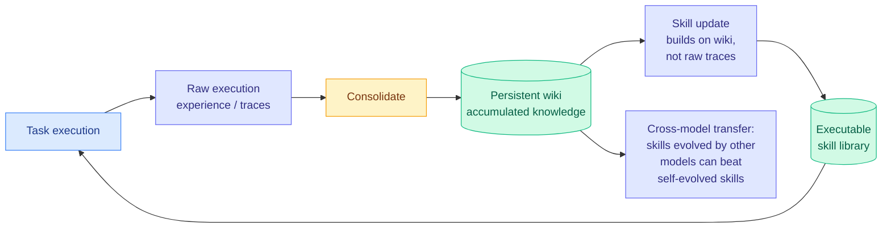

# WikiSkill: Compiling Agent Experience into Persistent Knowledge for Skill Evolution

**Source:** HuggingFace Daily Papers, [arXiv 2608.27454](https://arxiv.org/abs/2608.27454)
**Raw:** [raw/huggingface/2026-08-28-wikiskill-compiling-agent-experience-into-persistent-knowled.md](../../raw/huggingface/2026-08-28-wikiskill-compiling-agent-experience-into-persistent-knowled.md)

---

## TL;DR

Agent skills are reusable packages of procedural knowledge, and recent work discovers them automatically from an agent's own experience. WikiSkill's diagnosis of why that plateaus is precise: **the insights that guided a skill's development stay scattered across the optimization history, so the next iteration cannot reuse them.** The skill survives; the reasoning that produced it does not. WikiSkill therefore separates three things that prior systems conflate, and co-evolves the middle one: **raw execution experience**, an accumulated **knowledge base (the wiki)**, and **executable skills**. Experience is continuously consolidated into the wiki, and subsequent skill updates build on the wiki rather than on the raw traces. The ablation confirms the persistent knowledge layer is the load-bearing piece.

---

## The three findings, and the one that is genuinely surprising

**1. Skill evolution complements model scaling rather than substituting for it.** Larger models generally benefit *more* from evolved skills, and **smaller models with skills can outperform substantially larger models without them.** The first half of that is the counterintuitive part. The natural prior is that scaffolding helps weak models most and washes out at the frontier, and this paper reports the opposite gradient.

**2. Evolved skills transfer across models and across model families.** That is the fourth independent transfer result the wiki holds and it extends the boundary.

**3. Skills evolved by *other* models can outperform self-evolved skills.** This is the surprising one and it is worth stating carefully, because it has an immediate practical consequence: **the best skill library for your model may not be the one your model wrote.** If a stronger or merely different model produces better procedural knowledge for your model than it produces for itself, then skill authorship becomes a separable, purchasable step, and self-improvement loops are not obviously the optimal architecture.

## How this relates to prior wiki pages

**Finding 2 crosses the transfer threshold for a fourth time and widens it.** The [agent-harness-engineering page](agent-harness-engineering.md) records three prior instances, twelve days apart, that jointly established a discovered harness is **a portable artifact with standalone value, not per-model tuning residue**: [AI4AI at Test-Time (08-13)](../inference-efficiency/2026-08-13-ai4ai-test-time-harness-transfer.md) took a weaker target from 0.49 to 0.91 across four Theory-of-Mind benchmarks with the target frozen; [AutoDesign (08-14)](2026-08-14-autodesign-meta-harness-optimization.md)'s DesignHarness lifted seven other code-agent-model configurations from 54.99 to 67.39; [Meta-Harness (08-25)](2026-08-25-meta-harness-code-space-optimization.md)'s discovered math-retrieval harness added 4.7 points on 200 IMO-level problems across five held-out frontier models, zero-shot. WikiSkill adds transfer **across model families**, and finding 3 goes further than any of them by making cross-authored skills sometimes *better* than self-authored.

**But it sits in direct tension with the boundary the wiki drew two days ago, and the tension is real.** The [08-26 ingest](../ai-industry/2026-08-26-ramp-inspect-in-house-harness.md) concluded from Ramp's Inspect (75% of the company's merged PRs raised by its own in-house agent, past a million sessions) that **harness structure is portable, harness evidence is not**: a third-party harness cannot supply evidence about internal systems it cannot see, which is why Ramp, Block, Stripe and Shopify all built rather than bought. WikiSkill's skills are structure, so the boundary holds. The complication is finding 3: if *other models'* skills beat self-evolved ones, then the portable half of the artifact is not merely transferable but **better when sourced externally**, which strengthens the vendor side of that market split more than the 08-26 reading allowed for.

**It also completes a memory-architecture trio with today's other two papers.** [CaSKG (08-28)](2026-08-28-caskg-counterfactual-causal-skill-graphs.md) fixes skill *retrieval* by calibrating graph edges before use. [Self-evolving kernel-optimization agents (08-28)](../hardware/2026-08-28-self-evolving-kernel-optimization-agents.md) stores optimization episodes in an experience graph so a later kernel problem retrieves the transformation that worked on a structurally similar one. WikiSkill fixes skill *authorship* by consolidating experience into a durable knowledge layer first. **Three papers on one day, three different failure points in the same pipeline: what you store, how you retrieve it, and what you compile it into.** Together with [Recuris (08-26)](2026-08-26-recuris-experiential-working-memory.md), which retrieves experiential memory *by* verified working state, the field has spent one week specifying agent memory as a layered system rather than a vector store.

**Direct relevance to how this wiki itself works.** WikiSkill's architecture (raw experience → consolidated knowledge base → derived artifacts, with the knowledge base as the thing that makes iteration compound) is the same architecture as `raw/` → concept pages → digests. The ablation finding, that persistent knowledge accumulation is *critical* rather than merely helpful, is a research result about the design choice this wiki is built on.

## Gaps

The three findings are reported as consistent trends across "diverse benchmarks and models" without the per-benchmark deltas that would make them checkable, which is the same complaint the wiki made about Apodex 1.1's "leading performance band" on 08-25. Finding 1 in particular (larger models benefit more) is a claim about a *gradient* across model scale, and a gradient needs at least three points and error bars to be more than an observation.

Finding 3 has an alternative explanation the paper needs to rule out: skills evolved by a stronger model may be better simply because a stronger model writes better procedures, which would make this a distillation result rather than a claim about self-versus-other authorship. The interesting version requires a *weaker or equal* model's skills beating self-evolved ones, and the abstract does not say whether that was tested.

No cost accounting, again. Consolidating experience into a wiki is a summarization pass over accumulated traces, which is a recurring token bill that grows with history, and this is the fifth consecutive harness or skill paper in this wiki to publish capability gains with no search or maintenance budget. [Open problem 0](agent-harness-engineering.md) has now been unmoved for four months.

## Industrial implication

The purchasable-skill-library implication is the one to watch. If procedural knowledge transfers across model families and externally authored skills can beat self-authored ones, there is a product in selling curated skill libraries independent of any model, and the agent-skill marketplaces that already exist have a stronger technical case than they did last week. The counterweight is the practitioner data point from this reader's saved cluster: a Korean PhD student parsed 7,944 public Claude Code skills from GitHub and found **33% make the agent worse than no skill at all.** Transferability and quality are different problems, and WikiSkill's finding that skills travel makes the 33% figure more alarming rather than less, because a bad skill now travels too.

## Related

- [agent-harness-engineering](agent-harness-engineering.md) (concept)
- [self-evolving-agents](self-evolving-agents.md) (concept)
- [agent-memory](agent-memory.md) (concept)
- [CaSKG (08-28)](2026-08-28-caskg-counterfactual-causal-skill-graphs.md)
- [Recuris (08-26)](2026-08-26-recuris-experiential-working-memory.md)
- [Ramp's Inspect (08-26)](../ai-industry/2026-08-26-ramp-inspect-in-house-harness.md)
