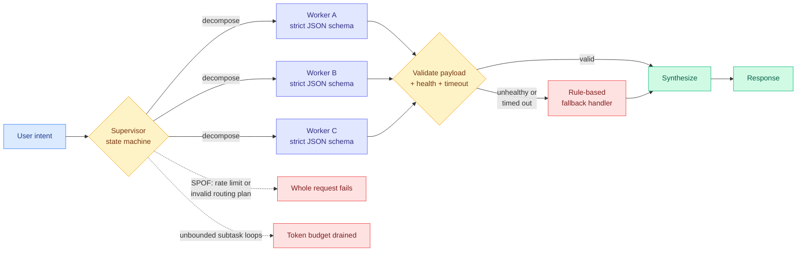

# Multi-Agent Design Patterns: Architectural Topologies, Failure Modes, and Production Hardening

**Source:** Ken Huang, Agentic AI (Substack), [full post](https://kenhuangus.substack.com/p/multi-agent-design-patterns-architectural)
**Raw:** [raw/rss/2026-08-29-agentic-ai-multi-agent-design-patterns-architectural-topologies-fa.md](../../raw/rss/2026-08-29-agentic-ai-multi-agent-design-patterns-architectural-topologies-fa.md)

---

## TL;DR

An architecture guide that catalogs seven multi-agent coordination topologies, and whose useful content is not the taxonomy but the **failure modes attached to each one**. The framing claim is that early multi-agent implementations fail not because the agents are weak but because coordination is implicit: uncoordinated agents trigger compounding error loops, exhaust token budgets, and execute unauthorized mutations. The prescribed fixes are explicit coordination topologies, bounded execution budgets, deterministic state machines, and fine-grained access control. The free portion covers the taxonomy plus Pattern 1 (Orchestrator-Worker) in depth and a comparison matrix; Patterns 2 through 7, the LangGraph and CrewAI harnesses, and the hardening runbook (OpenTelemetry GenAI tracing, circuit breakers, Intent-Based Access Control, context compaction) are behind the paywall.

---

## The Orchestrator-Worker pattern, and the two failures it owns

The pattern applies when the incoming problem cannot be statically partitioned at build time. A supervisor parses intent, decomposes into subtasks, dispatches to specialized workers, and synthesizes. The design commitment worth naming: **workers do not communicate peer-to-peer, the orchestrator is the single routing gateway.** That is a deliberate trade of expressiveness for traceability.

The production mechanics are ordinary distributed-systems discipline applied to a stack that usually skips it. Every worker exposes a strict JSON schema contract; the orchestrator validates the returned payload against expected types before proceeding; each dispatch carries a timeout (the sample harness defaults to 15 seconds) and a health check, and an unhealthy or unreachable worker triggers a **deterministic rule-based fallback** rather than stalling the request.

Two named failure modes:

1. **Supervisor single point of failure.** If the supervisor LLM hits a rate limit or emits an invalid routing plan, the whole request fails. The mitigation is dual-model redundancy plus a deterministic rule-based fallback path.
2. **Cascading token explosion.** Unbounded subtask loops drain token budgets. The mitigation is a hard maximum fan-out depth (the guide suggests N ≤ 5) and per-request token ceilings.

The comparison matrix scores all seven patterns on coordination overhead, latency, failure propagation and use case, and the stated conclusion is conservative: **Orchestrator-Worker and Fan-Out/Fan-In offer low latency and minimal error cascading and should be the starting point** before introducing multi-tier or event-driven complexity.

---

## The optimization reading

Two of the guide's three named failures are cost failures, not correctness failures. Cascading token explosion is a direct spend problem, and the fix is a budget ceiling rather than a better prompt. That matters because the multi-agent literature this wiki tracks reports capability almost exclusively. **A maximum fan-out depth is a compute rationing policy, and it is the crudest possible one:** a fixed constant, chosen offline, applied uniformly regardless of whether a branch is productive. Every result on the [test-time compute allocation page](../inference-efficiency/test-time-compute-allocation.md) is an argument that fixed uniform budgets are wasteful, most directly [Gambit (08-16)](../inference-efficiency/2026-08-16-gambit-thought-level-beam-search.md), which kills weak reasoning traces and re-branches from strong prefixes to keep hardware utilization high while cutting total token consumption by up to 68.5%. **Gambit's mechanism is the fan-out-depth cap done adaptively, and nobody has applied it to multi-agent subtask trees.** That composition is free and unbuilt.

The supervisor-SPOF mitigation is also a routing statement in disguise. "Dual-model redundancy with a deterministic rule-based fallback" is a two-tier route where the cheap tier is not a small model but *no model at all*. The [LLM routing page](../ai-routing/llm-routing.md) has plenty of model-to-model routing and no entry for routing to a deterministic path as the degraded tier, which is what every reliable production system actually does.

---

## Relation to prior wiki state

**It is the practitioner statement of a result the research feed published two days earlier.** [PILOT in the Loop (08-28)](2026-08-28-pilot-live-self-improvement.md) gives a supervisor the power to abort a running agent mid-task and reports **output tokens down 42.9% and successes per million output tokens up 110.3%**, which is the first harness result in this wiki to publish a serving-side cost-per-success number rather than an accuracy number. Huang's guide independently prescribes exactly that control surface, from the architecture side, without measurement. **The pattern and the number arrived in the same week from different directions and neither cites the other.**

**It also confirms, from production practice, the framing the [multi-agent systems page](multi-agent-systems.md) adopted on 08-13**, that coordination failures are the dominant failure class rather than security ones. Huang's three headline failures are compounding error loops, token exhaustion and unauthorized mutations. Two are coordination, and the third (unauthorized mutations) is presented as an access-control problem to be solved with Intent-Based Access Control, meaning it is a coordination failure that becomes a security incident.

**Where it is weaker than the wiki's research thread.** [A²E (08-11)](2026-08-11-harness-evolution-cluster.md) found that model-harness combinations vary substantially by task type and no single combination consistently wins, so any static "start with Orchestrator-Worker" recommendation is a prior rather than a finding. Huang's comparison matrix is authored judgment, not measurement: there are no benchmark numbers, no cost figures and no traces behind the latency and error-cascading columns. Read it as a well-organized checklist of what to instrument, not as evidence about which topology wins.

---

## Related pages

- [Multi-Agent Systems](multi-agent-systems.md)
- [Agent Harness Engineering](agent-harness-engineering.md)
- [PILOT in the Loop (08-28)](2026-08-28-pilot-live-self-improvement.md)
- [Test-Time Compute Allocation](../inference-efficiency/test-time-compute-allocation.md)
