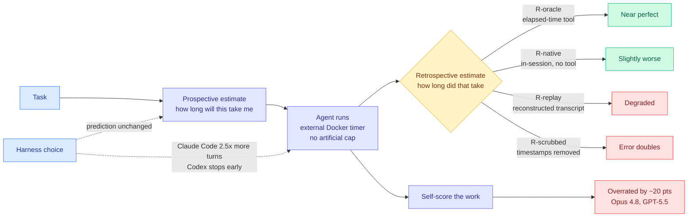

# Your Agents Are Not Time Aware

**Source:** Michael Ofengenden and Maksym Andriushchenko (MATS 10), published on LessWrong 2026-08-14, surfaced into this wiki via The Decoder on 2026-08-30.
**Links:** [LessWrong post](https://www.lesswrong.com/posts/eAbuPXbjakop5rSJx/your-agents-are-not-time-aware) · [The Decoder coverage](https://the-decoder.com/ai-agents-have-no-sense-of-time-and-are-not-aware-of-it/) · [raw](../../raw/rss/2026-08-30-the-decoder-ai-agents-have-no-sense-of-time-and-are-not-aware-of-it.md)

---

**TL;DR.** Two CLI coding agents were asked to predict how long a task would take them, then to run it, then to say afterwards how long it had actually taken. They are bad at both. Predictions cluster around ninety minutes almost regardless of the task, so the error is worst on short tasks and only becomes reasonable at the multi-hour scale. Codex over-predicts by 4x to 10x depending on the model. The same model in a different harness produces a genuinely different runtime while producing the *same* prediction, which means the prediction is not a property of the model alone. Self-scoring is similarly miscalibrated, by roughly 20 percentage points in the optimistic direction for the older models tested. Giving the agent an elapsed-time tool fixes the retrospective half almost completely.

---

---

## What was measured

Two evaluation surfaces:

- **ProgramBench** — 200 tasks requiring the agent to reimplement a program by analysing a compiled binary plus documentation.
- **AgentTime** — a purpose-built suite of **235 tasks assembled from 18 existing benchmarks** (AppWorld, OSWorld 2.0, ProgramBench and others), run in Docker containers with an **external timer** and no artificial time cap, so the measured runtime is the natural one.

Each run has three phases: a **prospective** estimate before starting, the run itself, and a **retrospective** estimate afterwards. The retrospective phase is split four ways by how much information the agent has: `R-oracle` (an elapsed-time tool available), `R-native` (in-session, no tool), `R-replay` (a fresh API call over a reconstructed transcript), and `R-scrubbed` (transcript with timestamps removed).

## Findings

**Prospective prediction is anchored, not estimated.** On ProgramBench, Opus 4.8 in Claude Code predicted 99 minutes against an actual 85, a 1.16x error that looks good until you see it beside GPT-5.5 in Codex predicting 72 minutes against an actual 17.5, a 4.12x error. On AgentTime the spread widens: **Fable 5 over-predicts 3.1x across 124 tasks, GPT-5.6 Sol over-predicts 9.9x across 136 tasks.** The mechanism is visible in the compression exponent, measured at **0.19 to 0.24**: predictions barely move as the true duration moves. Both models essentially answer "about an hour and a half" and the error is whatever the task's real duration happens to differ from that.

**The harness is a runtime variable the prediction does not see.** Holding the model fixed, **Claude Code consumes roughly 2.5x more turns than Codex**, because Claude Code keeps going until it believes the task is solved while Codex tends to stop at a time boundary regardless of task state. Two different wall-clock distributions, one prediction.

**The persona ablation is the interesting one.** Asked how long various actors would need, both models place themselves **slightly faster than a frontier AI agent** and estimate that **a human expert needs 3 to 4x longer**, growing to roughly **10x** on longer tasks. The self-model is not merely noisy, it has a consistent direction.

**Retrospection degrades with information access, and the ordering is diagnostic.** `R-oracle` is near perfect and `R-native` is only slightly worse, so an in-session agent does carry usable timing signal. `R-replay` degrades substantially and `R-scrubbed` **doubles the error**, which identifies where the signal lives: in timestamps present in the context, not in an internal sense of duration. Supporting this, transcript length correlates with runtime at **Pearson r = 0.91**, but controlling for length, in-session estimates correlate at only **r = 0.4**. The agent is largely reading length as a proxy for time.

**Self-assessment is separately miscalibrated.** Same-turn self-scoring has Opus 4.8 and GPT-5.5 overrating their work by about **20 points**. The direction is not stable across generations: evaluated in a separate turn, **Opus 5 underrates by 11 to 15 points** while GPT-5.6 Sol overrates by about 7. One reported instance has both models self-scoring near 70% on work that actually scored 7% and 14.5%.

## How this relates to prior wiki pages

**It extends the harness thread's core claim into a new dimension.** [Agent harness engineering](agent-harness-engineering.md) records that harness choice swings cost-per-success 5x to 30x on a fixed model (omarsar0, arXiv 2608.01347, 08-13) and accuracy roughly 2x ([AI4AI, 08-13](../inference-efficiency/2026-08-13-ai4ai-test-time-harness-transfer.md)). This adds a third: **harness choice swings wall-clock runtime by 2.5x in turns, and the model's own runtime prediction does not respond to it at all.** That is a sharper statement than "the harness matters," because it identifies a quantity the model is structurally unable to estimate: the model can only reason about its own token production, and runtime is set by a loop it does not observe.

**It supplies the mechanism behind an open problem this page has carried since 05-27.** Harness open problem 3 reads: *where self-simulation of the loop diverges from reality*. Two divergences are now measured with numbers, a compression exponent of 0.19-0.24 on duration and a ~20-point optimism gap on quality, and the `R-scrubbed` ablation says *why*: the agent is reading its context for timestamps rather than maintaining state. That is the same failure LongHorizon-Harness (arXiv 2608.01964, 08-13) engineered around by keeping task state **outside** the execution context and updating it only on environment-verified facts. This paper is the empirical case for that design choice.

**It is the sixth consecutive harness result to skip a pass^k curve, and here the omission bites differently.** [Thinkingbox (08-25)](2026-08-25-thinkingbox-stateful-reliability.md) measured a top model falling from 65.36% pass@1 to 25.25% pass^20 on stateful work. An agent that overrates its own output by 20 points is a plausible partial *explanation* of that collapse rather than an unrelated finding, because a harness that trusts the agent's self-report cannot detect the failures that pass^k exposes.

**It contradicts nothing but complicates [PILOT (08-28)](2026-08-28-pilot-live-self-improvement.md).** PILOT gives a supervisor the power to abort a running worker mid-execution, reporting output tokens down 42.9% and successes per million output tokens up 110.3%. Abort authority is a time-based control, and this paper says the entity being aborted has no calibrated sense of how far along it is. PILOT's supervisor reads a streamed trace rather than asking the worker, which is the right architecture given this result, and this paper is the reason that design is not merely a preference.

**It also lands on [agent benchmarks](agent-benchmarks.md).** AgentTime is a benchmark of a *property* (temporal calibration) assembled across 18 task benchmarks rather than a new task set, which is an unusual construction and a cheap one. The wiki's measurement-crisis thread (declared 08-11) has been about benchmarks measuring artifacts of their own construction; this is the complementary move, measuring one axis across many existing constructions.

## Gaps

There is no cost figure anywhere, which is now the standing complaint against this whole thread. Running 235 tasks uncapped across four retrospective conditions and several models is expensive, and the paper reports none of it. The persona ablation is a prompt-elicited belief rather than a behavioural measurement, so "the model thinks it is 3-4x faster than a human" is a statement about what it says when asked, not about how it acts. And the harness finding is two harnesses, both CLI coding agents, both on coding tasks. Whether the 2.5x turn ratio is a Claude-Code-versus-Codex fact or a stopping-policy fact that generalises is untested, and it is the difference between a curiosity and a design rule.

The fix is also under-explored. `R-oracle` being near perfect means an elapsed-time tool solves retrospection, but nobody ran the obvious follow-up: does giving the agent its own token-throughput rate fix *prospective* estimation, which is the half that actually matters for control?

## Why it matters

The practical claim is about controllability. Instructions of the form "finish this in 30 minutes" or "keep iterating for two hours" are the cheapest control surface a long-running agent has, and they are unusable against a system whose duration model is a constant. This is a governance gap with an unusually cheap fix, and the fix is a tool call.

For this wiki's cost thread it is sharper still. Every serving-cost number in [compute economics](../hardware/compute-economics.md) is denominated in tokens or dollars, and wall-clock time is the third axis: DHH's 24x dollar spread on one identical task (08-16) was explicitly a **time-for-money** trade, $550 in 45 minutes against $23 in 2.5 hours. An agent that cannot predict its own runtime cannot participate in that trade, which means budget enforcement has to live in the harness rather than in the model's judgement. That is one more decision taken away from the model, which is the mechanism this wiki's harness page argues the harness wins by.

## Related pages

- [Agent harness engineering](agent-harness-engineering.md)
- [Agent benchmarks](agent-benchmarks.md)
- [Compute economics](../hardware/compute-economics.md)
- [Test-time compute allocation](../inference-efficiency/test-time-compute-allocation.md)
