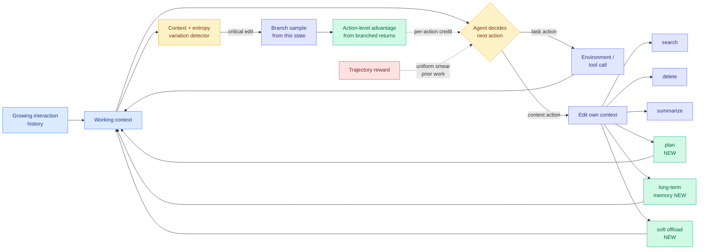

# ContextPilot: Teaching Agents Proactive Context Management via Fine-grained RL

**Source:** [arXiv 2608.28476](https://arxiv.org/abs/2608.28476) · [HuggingFace](https://huggingface.co/papers/2608.28476) · Tencent · code at [github.com/Tencent/ContextPilot](https://github.com/Tencent/ContextPilot)
**Raw:** [raw/huggingface/2026-08-31-contextpilot-teaching-agents-for-proactive-context-managemen.md](../../raw/huggingface/2026-08-31-contextpilot-teaching-agents-for-proactive-context-managemen.md)
**Date ingested:** 2026-08-31

## TL;DR

A long-horizon agent's working context (everything currently in the prompt: instructions, tool outputs, retrieved documents, prior reasoning) grows monotonically as the task runs, and that growth is the dominant cost line in agentic serving. Proactive context management, where the model itself calls tools to edit its own context, already exists. ContextPilot's claim is that it has been trained wrong. Prior work gives the model three verbs (search, delete, summarize), explores context-editing actions as if they were interchangeable with ordinary task actions, and then trains them with GRPO (Group Relative Policy Optimization, where one scalar reward for the whole trajectory becomes one advantage applied uniformly to every token). ContextPilot fixes all three: it adds planning, long-term memory and soft offloading tools, it uses context and entropy variation to detect *which* edits were the pivotal ones, and it branches from those pivots so each editing action gets an advantage estimated from the trajectories that actually passed through it. Result on long-context QA and deep search: better task performance with a **smaller** working context, across multiple base models.

## Diagram

## What it actually contributes

Three separable pieces, and they are worth separating because a reader could adopt any one of them.

**1. The toolset argument.** Search, delete and summarize are all *retrospective*: they operate on material already in the context. They give the model no way to write down an intention, no way to move something out of context but keep it addressable, and no way to compress adaptively rather than at a fixed ratio. ContextPilot adds global planning (write the plan, not the reasoning that produced it), long-term memory (persist across the context boundary), and **soft context offloading** (evict but keep retrievable). The soft-offload move is the same architectural instinct as Scroll's eviction index, surfaced the same week via DAIR.AI's weekly roundup, where evicted spans stay recoverable through compact landmarks pointing at exact event-log addresses. Two independent groups reaching for "evict but do not destroy" in the same week is the interesting part.

**2. The exploration argument.** A context-edit action and a task action have wildly different variance in their effect on the outcome. Deleting the one tool output that held the answer is catastrophic; deleting a redundant retry is free. Treating them uniformly during exploration means the sampler spends most of its budget on edits that could not have mattered.

**3. The credit-assignment argument, which is the load-bearing one.** ContextPilot identifies critical editing decisions by watching two signals: how much the context changed, and how much the policy's entropy changed. At those points it branches, sampling multiple continuations from the same state. The advantage for that specific editing action is then estimated from all branched trajectories passing through it, rather than inherited from the single trajectory-level scalar.

## Relation to prior wiki state

**This is the fourth distinct instance of one claim, and the claim is now a pattern.** [CriPO (08-03)](../llms-foundation-models/2026-08-03-cripo-rubric-rl-self-distillation.md) measured *Suppressed Criteria*, where a criterion some rollout genuinely satisfied produces no learning signal because scalar aggregation gave that rollout a non-positive aggregate advantage, and found it in over 57% of samples throughout training. Its conclusion was stated generally: GRPO assigns one advantage to a whole rollout, and any factorized reward with a locatable span lets you partially undo that. ContextPilot is that recipe applied to a new locatable span, the context-editing action. [RCCA (08-31)](../llms-foundation-models/2026-08-31-rcca-rubric-to-code-credit-assignment.md), landing the same day, applies it to code regions. [Balance-GRPO inside StepGuard (08-31)](../responsible-ai/2026-08-31-stepguard-step-level-guardrails.md) applies it to the safe/unsafe action class imbalance. Four papers, one structural claim: **the scalar advantage is a lossy approximation, and the fix is always to find the span the reward was really about.**

**It also extends the agent-memory cost thread.** [ALTK-Evolve (08-12)](2026-08-12-altk-evolve-selective-context-delivery.md) showed that shrinking per-step context delivery raised DeepSeek-V3.2's task-goal completion from 80.4% to 89.3% while cutting tokens per task from 634K to 263K, which meant the baseline was paying for context that was *actively harmful*, not merely redundant. ALTK-Evolve made delivery volume an externally-tuned parameter. ContextPilot makes it a learned policy the model runs on itself. Those are the two available answers and nobody has compared them head to head under matched token budgets.

**Against the harness thread it cuts slightly the wrong way, and that is worth flagging.** [agent-harness-engineering](agent-harness-engineering.md) records a sharp finding from AI4AI at Test-Time (08-13) and Spark-to-Paper (08-13): the harness wins by *taking decisions away from the model*, offloading unstable reasoning into deterministic code and enforcing formats. ContextPilot gives the model *more* discretion, not less, and then trains it to use that discretion well. Both cannot be the general rule. The reconciliation is probably that the harness should own decisions with checkable correctness (format, routing, verification) and the model should own decisions that are genuinely judgement calls (what in this context still matters), but no paper has drawn that line explicitly.

## Gaps

No token or dollar accounting for the RL procedure itself. Branch sampling at every detected critical edit multiplies rollout cost by the branching factor, and the paper reports the compactness of the *resulting* context without reporting what the training cost to get there. Given that the entire pitch is cost, that omission matters. The critical-edit detector is also two heuristics (context delta, entropy delta) with no ablation reported against a learned detector or against branching uniformly at random with matched compute, so it is unclear how much of the gain is "branching helps" versus "these two signals find the right places."

## Related pages

- [agent-harness-engineering](agent-harness-engineering.md)
- [agent-memory](agent-memory.md)
- [rl-for-llms](../llms-foundation-models/rl-for-llms.md)
- [RCCA: Rubric-to-Code Credit Assignment (08-31)](../llms-foundation-models/2026-08-31-rcca-rubric-to-code-credit-assignment.md)
- [Daily digest 2026-08-31](../daily-digest/2026-08/2026-08-31.md)
