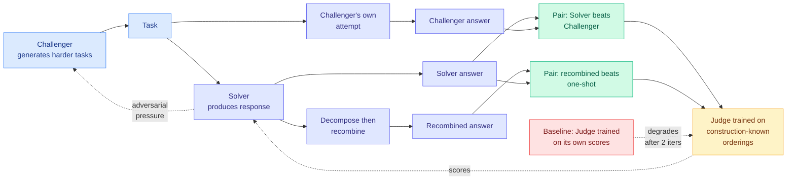

# J-Zero: Unified Challenger-Solver-Judge Co-Evolution from Zero Data

**Source:** [arXiv 2608.26582](https://arxiv.org/abs/2608.26582) · [HuggingFace](https://huggingface.co/papers/2608.26582) · KAIST (Gyouk Chu, Myeongho Jeon, Eunho Yang)
**Raw:** [raw/huggingface/2026-08-31-j-zero-unified-challenger-solver-judge-co-evolution-from-zer.md](../../raw/huggingface/2026-08-31-j-zero-unified-challenger-solver-judge-co-evolution-from-zer.md)
**Date ingested:** 2026-08-31

## TL;DR

Data-free self-evolution, where a model generates its own training tasks and improves against them with no human labels, works in *verifiable* domains because a math answer can be checked. It has not worked in unverifiable ones (summarization, open-ended writing, anything needing judgement) because the only available scorer is a learned judge, and a learned judge trained on its own outputs drifts. J-Zero's fix is a single well-chosen observation: **you do not have to ask the judge what it thinks when you already know the answer from how the response was produced.** Two orderings are known a priori by construction, not by evaluation. The Solver's answer should beat the Challenger's. A decomposed-and-recombined answer should beat a one-shot answer from the same model. Those free preference pairs train the Judge, while the Challenger and Solver co-evolve adversarially. It gains **4.2 points on verifiable and 8.0 on unverifiable domains** over baselines, and the shape of the curve is the real result: it **keeps improving through at least ten iterations, where baselines degrade after two.**

## Diagram

## Relation to prior wiki state

**This is the most direct answer yet to the failure mode [More Convincing, Not More Correct (07-26)](../llms-foundation-models/2026-07-26-self-play-reward-hacking-llm-judges.md) documented, and it answers it structurally rather than procedurally.** That paper showed self-play driving a reference-free judge's pass rate from 0.72 to 0.94 on GSM8K while true accuracy stayed pinned at **0.20**, because conditioned on a candidate answer a judge scores plausibility rather than correctness, leaving false-positive basins the policy learns to occupy. Its fix was ordering: make the judge commit its own answer *before* seeing the candidate, dropping false positives from 0.719 to 0.012. That works and it still routes the training signal through the judge's opinion. J-Zero routes around the opinion entirely for the pairs it trains on. The preference label comes from the *generation procedure*, which the policy cannot game by producing more convincing text, because the ordering was fixed before either text existed.

**The ten-iteration curve is the finding to carry, not the point gains.** Every self-evolution paper on [self-evolving-agents](self-evolving-agents.md) reports gains; the recurring, under-reported failure is that they stop, or reverse, after a couple of rounds, which is the signature of the judge drifting into the policy's basin. Baselines degrading after two iterations and J-Zero still climbing at ten is a claim about *stability under iteration*, and that is the property the field actually needs. It should be the headline metric in this literature and almost never is.

**Read against [RLSVR / SpyRL (08-03)](../llms-foundation-models/2026-08-03-rlsvr-spyrl-self-verifiable-rewards.md), the two mark different points on the same axis.** SpyRL transforms an open-ended task into a verifiable proxy environment, a *Who Is the Spy?* game whose predetermined spy identity makes the vote fully verifiable with no judge at all, which buys an exact measurement of a proxy and rests on the asserted, unproven link between identification success and output quality. J-Zero keeps the judge but grounds a subset of its training signal in construction. SpyRL removes judging and measures the wrong thing exactly; J-Zero keeps judging and measures the right thing with a partly-trustworthy instrument. Neither gets both, which remains the open position on [rl-for-llms](../llms-foundation-models/rl-for-llms.md).

## Gaps

The two known orderings are assumptions dressed as constructions, and one of them is weaker than the other. "Decomposed-and-recombined beats one-shot" is broadly supported but not universal, and it should fail on tasks where decomposition destroys global coherence, which includes much of the creative writing that motivates the unverifiable-domain framing. If the assumption is violated on part of the distribution, the Judge is trained on labels that are confidently wrong there, and nothing in the design detects it. Ten iterations is better than anything on this page and it is still short of a scaling claim; the honest question is whether the curve is asymptotic or eventually turns, and only a longer run answers it. Baselines are not named in the abstract, so the 4.2 and 8.0 point gains are unanchored until the full paper is read.

## Related pages

- [self-evolving-agents](self-evolving-agents.md)
- [rl-for-llms](../llms-foundation-models/rl-for-llms.md)
- [More Convincing, Not More Correct (07-26)](../llms-foundation-models/2026-07-26-self-play-reward-hacking-llm-judges.md)
- [Daily digest 2026-08-31](../daily-digest/2026-08/2026-08-31.md)
