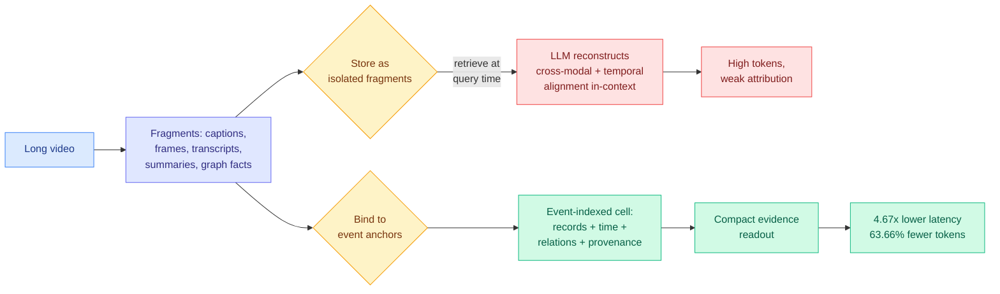

# EM²Mem: Event-Centric Multimodal Memory for Large Language Models

**Source:** HuggingFace Daily Papers, 2026-09-02
**Paper:** [arXiv 2609.00551](https://arxiv.org/abs/2609.00551)
**Code:** to be integrated into [zjunlp/LightMem](https://github.com/zjunlp/LightMem)
**Raw:** [raw/huggingface/2026-09-02-em-2mem-event-centric-multimodal-memory-for-large-language-m.md](../../raw/huggingface/2026-09-02-em-2mem-event-centric-multimodal-memory-for-large-language-m.md)

## TL;DR

Multimodal memory systems for long-video question answering store captions, frames, transcripts, summaries and graph facts as separate retrievable fragments. Those fragments are searchable but not **generation-ready**: the language model has to reconstruct cross-modal and temporal alignments at inference time, exactly when context is tightest and attribution is hardest. EM²Mem moves that work to memory-construction time. It binds heterogeneous evidence to **event anchors**, so each memory cell aligns multimodal records, temporal context, graph-linked relations, semantic facts and provenance around one grounded event. The efficiency numbers are the reason this matters beyond the video-QA benchmark: **per-query latency down 4.67x and total inference tokens down 63.66%**, alongside accuracy gains of 2.0, 2.4 and 3.7 points on three long-video QA benchmarks and a 7.0-point improvement in strict event-level Top-5 evidence recall.

## The core idea

The distinction the paper draws is between **searchable** and **generation-ready**. A vector store that returns the right five caption chunks has done retrieval correctly and still handed the model a reassembly job: which caption goes with which frame, which frame came before which, and which claim is attributable to which source. EM²Mem's answer is that the alignment is cheaper to compute once, at write time, when the whole video is available and there is no context budget, than to recompute per query at read time when there is. The event anchor is the join key that makes that possible: rather than indexing by modality (all captions here, all frames there), it indexes by **what happened**, and hangs every modality's view of that event off the same anchor.

## Key takeaways

- **Accuracy:** +2.0, +2.4 and +3.7 average points over the strongest memory baseline across three long-video QA benchmarks.
- **Evidence quality:** +7.0 points on strict event-level Top-5 evidence recall, which is the metric that actually measures whether the right evidence was found rather than whether the answer was guessed.
- **Cost:** 4.67x lower per-query latency and **63.66% fewer total inference tokens**. The token figure is the load-bearing one, because it is a direct serving-bill reduction rather than a benchmark point.
- The gains in accuracy and the gains in cost come from the same mechanism, which is unusual. Most memory work trades one for the other.

## How this relates to prior wiki pages

**It is the third independent arrival this wiki has recorded at "do the expensive work outside the loop, not inside it," and the first to publish both halves of the ledger.** The [08-29 digest](../daily-digest/2026-08/2026-08-29.md) named that split explicitly: CritICL (08-29) moved reasoning supervision into an offline critique repository so inference does one generation; the ACE lens (08-28) argued agentic data generation is a continual allocation problem decided before training; Ken Huang's multi-agent guide capped fan-out at a constant chosen offline. All three moved work out of the loop. EM²Mem does the same thing at the memory layer, moving alignment from read time to write time, and it is the first of them to report **both** the accuracy gain and the token saving, which is what makes it checkable rather than merely plausible.

**It does not solve the retrieval blind spot, and it is worth being precise about why.** [InMind (07-29)](2026-07-29-inmind-implicit-association-blind-spot.md) measured that retrieval-based memory only surfaces a fact when the fact resembles the query, so a stored tree-nut allergy never fires on a macaron request because the bridging knowledge is invisible to the retriever. Six vector, graph and agentic systems reached at most 14.4% on indirect queries against 84.0% when the memory was simply placed in context. EM²Mem improves *how well retrieved evidence is packaged*, which is a different axis from *whether the right evidence is retrieved at all*. Its 7.0-point recall gain is on event-level Top-5 recall, not on indirect association. The InMind headroom of roughly 70 points is untouched.

**It converges with today's Safin-1 from the opposite side of the model boundary.** [Safin-1 (09-02)](../ai-routing/2026-09-02-safin-1-march-memory-anchor-routing.md) maintains **memory anchors inside the architecture** and retrieves through content-conditioned routing, so the model's native computation holds the structured state. EM²Mem builds memory anchors **outside** the model, in the harness, at construction time. Same word, same instinct, two different layers, published the same day, neither citing the other. That is a genuine convergence and the pair is the sharper story than either paper alone: the field decided this week that memory should be anchored when written rather than reconstructed when read.

**Tier 1 intersection.** The 63.66% token reduction puts this on the same axis as [kv-cache.md](../inference-efficiency/kv-cache.md) and [test-time-compute-allocation.md](../inference-efficiency/test-time-compute-allocation.md) rather than purely on the agent-memory axis. Fewer inference tokens on a long-video query is fewer tokens through the memory-bound decode phase that [the roofline chapter (09-02)](../hardware/2026-09-02-physics-of-llm-inference-roofline.md) shows accounts for 99.66% of per-step time on a 70B model.

## Gaps

Everything is measured on long-video QA, so it is unknown whether event anchoring transfers to domains without a natural temporal event structure. Text-only agent sessions, codebases and document corpora have no obvious equivalent of an "event," and the paper does not claim one. The construction-time cost is not reported: moving alignment from read time to write time is only a win if writes are amortized over many reads, and there is no figure for how many queries per video it takes to break even. The 4.67x latency figure is per query and does not include indexing. And the baselines are memory systems rather than a long-context model given the whole transcript, which is the comparison InMind showed matters most.

## Related

- [agent-memory](agent-memory.md) — the concept page this updates
- [InMind: the implicit-association blind spot (07-29)](2026-07-29-inmind-implicit-association-blind-spot.md) — the retrieval failure this does not fix
- [Safin-1 / MARCH (09-02)](../ai-routing/2026-09-02-safin-1-march-memory-anchor-routing.md) — the same anchoring move inside the weights
- [The Physics of LLM Inference (09-02)](../hardware/2026-09-02-physics-of-llm-inference-roofline.md) — why a 63.66% token cut is a hardware-level saving
