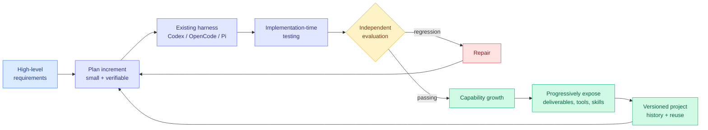

# Harness-of-Harness: Multi-Day Autonomous Software Development with Continual Improvement

**Source:** HuggingFace Daily Papers, 2026-09-02
**Paper:** [arXiv 2609.01481](https://arxiv.org/abs/2609.01481)
**Code:** [github.com/Flesymeb/HarnessOfHarness](https://github.com/Flesymeb/HarnessOfHarness) · [project page](https://flesymeb.github.io/HarnessOfHarness/)
**Raw:** [raw/huggingface/2026-09-02-harness-of-harness-multi-day-autonomous-software-development.md](../../raw/huggingface/2026-09-02-harness-of-harness-multi-day-autonomous-software-development.md)

## TL;DR

Harness-of-Harness (HoH) is a layer that sits **on top of existing coding-agent harnesses** and organizes their executions into iterative planning-coding-testing loops, so a coding agent keeps improving one software system across days rather than completing one bounded task. Across three harness-model pairs (Codex with GPT-5.5, OpenCode with DeepSeek-V4-Pro, Pi with MiniMax-M3) and three benchmarks (GameCraft-Bench, FrontierSWE, ProgramBench), HoH beats the corresponding standalone harness by an average relative **52.25%** and a maximum **82.86%** after three iterations. In a multi-day deployment of more than 70 iterations it autonomously built a first-person shooter with a coherent storyline, implemented core mechanics, playable experience, polished visuals and integrated audio.

## The five design commitments

The abstract lists what HoH does to sustain improvement across loops, and the list is more interesting than the benchmark deltas because each item is a stated position on a contested question:

1. **Balance repair with capability growth.** Pure repair loops converge on a working but featureless system; pure growth loops accumulate breakage.
2. **Scope development into small, verifiable increments.**
3. **Separate implementation-time testing from independent evaluation.** The agent's own tests do not get to certify the agent's own work.
4. **Constrain verifiable outputs rather than prescribing agent workflows.**
5. **Progressively expose deliverables, role-specific tools and skills; encourage reuse rather than recreation; maintain versioned project histories.**

## How this relates to prior wiki pages

**Commitment 4 is a direct answer to the open question [agent-harness-engineering.md](agent-harness-engineering.md) posed on 08-31 and called "the right next position paper."** That entry recorded a genuine contradiction in the wiki's own evidence. On one side, [AI4AI at Test-Time (08-13)](../inference-efficiency/2026-08-13-ai4ai-test-time-harness-transfer.md), where a strong builder model writes an inference-time harness for a weaker target and average performance goes from 0.49 to 0.91 with the target's weights untouched, plus [Spark-to-Paper (08-13)](2026-08-13-spark-to-paper-composable-research-skills.md), whose integrity stack lifted fabrication detection from 14% to 92%, both concluded that **the harness wins by taking decisions away from the model**: offload unstable reasoning into deterministic code, route per question type, enforce formats. On the other side, [ContextPilot (08-31)](2026-08-31-contextpilot-proactive-context-management.md) hands the model *more* discretion over its own context and trains that discretion with localized reinforcement learning. The page said both cannot be the general rule, proposed a reconciliation nobody had stated (the harness should own decisions with checkable correctness, the model should own genuine judgement calls), and noted that no paper had drawn the line.

HoH draws it. "Constrain verifiable outputs rather than prescribing agent workflows" is precisely that division: the harness owns the **checkable** part (what the artifact must satisfy) and leaves the **judgement** part (how to get there) to the model. It arrives as a design commitment rather than as an argued position paper, and it arrives with a 52.25% average relative gain across three different harness-model pairs, which is the transfer evidence the claim needs. **This is the sharpest prediction resolution on this page in weeks.**

**Commitment 3 operationalizes the evidential face of the 08-13 safety statement.** [Agent Safety Should Be a Runtime Contract (08-13)](2026-08-13-agent-safety-runtime-contract.md) argued the harness is where safety belongs, with a preventive face (sandboxes, permission gates, trajectory monitors) and an **evidential** face: no task-complete claim without checkable proof. Separating implementation-time testing from independent evaluation is that evidential face as an architecture rather than a principle, and it is the direct fix for the measurement problem [agent-harness-engineering.md](agent-harness-engineering.md) flagged on 08-26, where Microsoft's Thinkingbox showed the strongest model falling from 65.36% pass@1 to 25.25% pass^20 on stateful workflows while a harness paper published the next day still reported single-attempt scores.

**It is the natural successor to HarnessOpt-Bench and the meta-harness line.** The page's timeline has HarnessOpt-Bench (08-07) making "can a model optimize its own harness" measurable, and [AutoDesign (08-14)](2026-08-14-autodesign-meta-harness-optimization.md) showing one discovered harness lifting seven different model-agent configurations. HoH is a step up in scope: not a harness that optimizes a harness for one task, but a harness that runs *other* harnesses over a multi-day horizon while the artifact under construction grows. That 70-iteration FPS deployment is the longest autonomous software-development run recorded in this wiki.

**And it does not close open problem 0b.** The page's longest-standing complaint is that no harness result publishes **the cost of the mechanism itself**. HoH is the eighth consecutive instance. Three iterations of a planning-coding-testing loop wrapped around an existing harness multiplies that harness's token spend by some factor the paper does not state, and 70+ iterations multiplies it a great deal more. A 52.25% relative capability gain for an unstated multiple of the cost is not a comparable number, and when the field's pitch is that the harness is where the cost lever lives, that omission is itself the finding. **The routing consequence is direct:** [llm-routing.md](../ai-routing/llm-routing.md) has for two months wanted to route over model-harness pairs and been blocked partly because harnesses do not publish comparable cost-per-success, and a meta-harness makes that accounting harder, not easier.

## Gaps

The benchmarks are three, the harness-model pairs are three, and the headline multi-day artifact is a game, which is a domain where "playable and polished" is judged rather than verified. No cost accounting, as above. "Average relative gain of 52.25 percent" over standalone harnesses is a ratio of scores whose base rates are not in the abstract, so a large relative gain on a low base is indistinguishable here from a large absolute gain. Independent evaluation is separated from implementation-time testing, which is the right design, but the abstract does not say who writes the independent evaluator, and if the same model writes both then the separation is procedural rather than real.

## Related

- [agent-harness-engineering](agent-harness-engineering.md) — the concept page whose 08-31 open question this answers
- [ContextPilot (08-31)](2026-08-31-contextpilot-proactive-context-management.md) — the model-discretion side of the tension
- [AI4AI at Test-Time (08-13)](../inference-efficiency/2026-08-13-ai4ai-test-time-harness-transfer.md) — the take-decisions-away side
- [Agent safety as a runtime contract (08-13)](2026-08-13-agent-safety-runtime-contract.md) — the evidential face
- [self-evolving-agents](self-evolving-agents.md)
