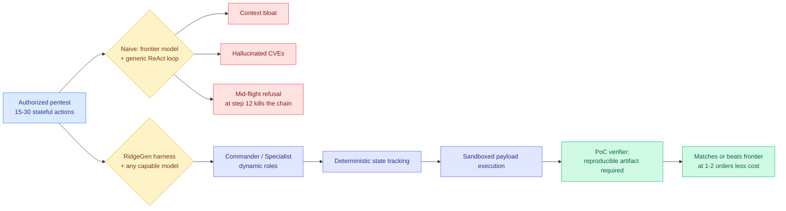

# The Harness Advantage in Autonomous Red Teaming (Ken Huang / Ridge Security)

**TL;DR.** An argumentative essay with an eight-model benchmark attached, and it is the first thing in this wiki's harness thread to publish **dollar cost and token cost per successful run side by side**. The thesis: an autonomous agent's offensive-security capability depends primarily on its orchestration harness, state-machine memory and deterministic tool-execution environment, not on the raw parameter scale or leaderboard position of its model. The supporting argument names a mechanism the wiki has not recorded before, the **over-refusal tax**: heavy alignment training (RLHF, DPO, Constitutional AI rule-sets, refusal-steering classifiers) makes frontier models fail *authorized* security work in three specific ways, and one of them is fatal to long-horizon agents. The benchmark, run on Ridge Security's RidgeGen harness across 8 models, 12 runs per model and 4 enterprise targets, finds that a "good enough" open-weights model in a purpose-built harness matches or beats raw frontier models on exploit depth, completion rate and reproducibility, while **Claude Opus 4.6 costs one to two orders of magnitude more per successful run than the open-weights tier.**

**Source:** [Ken Huang, Agentic AI Substack](https://kenhuangus.substack.com/p/the-harness-advantage-in-autonomous) · surfaced via Gmail starred · [raw](../../raw/gmail/2026-09-03-starred.md)

---

## The argument

Offensive security is not a single-shot autocomplete task. It is a stateful adversarial feedback loop: reconnaissance, dynamic hypothesis testing, payload syntax adaptation, multi-hop pivoting, and proof-of-concept validation. Point a frontier model at a generic ReAct loop with "penetration test this enterprise target" and Huang's claim is that failure is close to invariable, in a specific and diagnosable set of ways: context-window bloat, hallucinated CVE claims, broken shell interactions, and repetitive retry loops.

**The over-refusal tax is the part of this that is new to the wiki and generalizes past security.** Alignment fine-tuning that is genuinely necessary to stop misuse by lay users produces false-positive refusals during authorized defensive work, with three consequences:

1. **Catastrophic mid-flight bailouts.** An autonomous attack chain needs 15 to 30 sequential stateful actions. A refusal at step 12 collapses the whole campaign. **This is the load-bearing point, and it is a general property of long-horizon agents, not a security quirk:** per-step refusal probability compounds over trajectory length, so the longer the horizon, the more alignment behaves like a reliability failure rather than a safety feature.
2. **Hallucinated exploitation.** Steered away from offensive vocabulary, models invent theoretical non-reproducible vulnerabilities, or assert a vulnerability without validating it against the live target.
3. **Exponential token waste.** Generic harnesses respond to refusals with repetitive re-prompting or jailbreak heuristics, burning millions of prompt tokens for zero confirmed exploits.

Huang's proposed operating point is a **"Goldilocks Zone"**: raw frontier API means high latency, severe over-refusal, high compute overhead and third-party data-boundary exposure; unharnessed open-source means low refusal rates but derailment through context saturation, lost state across deep pivots, and unvalidated script output; the sweet spot is **any capable model plus a specialized harness** with Commander/Specialist role assignment, deterministic state tracking, sandboxed payload execution, and evidence-backed verifiers that require a reproducible artifact before a finding is recorded.

## The benchmark, and why it matters more than the essay

8 leading foundation and open-source models, **12 full runs each across 4 enterprise host, web and API targets** (VAmPI, Metasploitable3, Juice Shop, and one more), pooled over three repeats per cell. Three figures carry the result:

- **Coverage** (Figure 2): cumulative ground-truth coverage by model and target. VAmPI falls to most models; **Metasploitable3 and Juice Shop resist even the strongest**, so target hardness dominates model choice.
- **Cost** (Figure 3): average USD per successful run, described as "the sharpest divider in the benchmark." **Claude Opus 4.6 costs one to two orders of magnitude more per run than the open-weights tier**, and the gap widens on the two web targets, where longer agent trajectories multiply the per-token premium. The authors note the open-weights dollar figures reflect managed cloud API rates (AWS Bedrock and native endpoints) for standardized billing telemetry, and that self-hosted marginal inference cost is effectively zero, which makes the reported gap a conservative one.
- **Token consumption** (Figure 4): **token volume and dollar cost do not track each other.** GPT-OSS-120b and DeepSeek v3.2 burn heavy token counts cheaply; Claude Opus 4.6 spends comparatively few tokens at a high unit price. Reading Figures 3 and 4 together separates how verbose a model is from how much it charges.

A "good enough" open-weights reasoning model (DeepSeek v3.2, GPT-OSS-120b, GLM-5) in the RidgeGen harness consistently matches or outperforms raw frontier models on discovered exploit depth, completion rate, operational efficiency and reproducibility.

## How this relates to prior wiki pages

**It closes open problem 0b from the practitioner side on the same day HarnessDev closes it from the research side.** [agent-harness-engineering.md](agent-harness-engineering.md) has recorded eight consecutive harness results that published no cost for their own mechanism, calling that the finding rather than an oversight, because the field's central pitch is that the harness is where the cost lever lives. Today it gets two answers at once: [HarnessDev (09-03)](2026-09-03-harnessdev-harness-creation-evolution.md) makes execution-token cost a scoring axis in a benchmark, and this piece publishes **cost per succeeded run and tokens per succeeded run as separate matrices**. The separation is the methodological contribution. Token count and dollar cost being decorrelated means **every single-number cost claim in the harness literature is ambiguous**, and this wiki should treat "cheaper" as unparsed until both are given.

**It supplies the missing unit for the routing blocker in [llm-routing.md](../ai-routing/llm-routing.md).** That page has wanted to route over model-harness pairs since early July, blocked partly because harnesses publish no comparable cost-per-success. Cost per succeeded run, per model, per target, is precisely that unit. And the finding that the cheap model in a good harness matches the expensive one raw is the empirical case for cost-aware routing at its strongest: not a 20% saving, but **one to two orders of magnitude**, which dwarfs every routing gain on that page.

**It confirms the 5x-30x claim and extends its range.** [agent-harness-engineering.md](agent-harness-engineering.md)'s empirical spine is omarsar0's preregistered benchmark (arXiv 2608.01347, 08-13), where moving the same model and task between two harnesses swings **cost-per-success by 5x to 30x**. This benchmark varies the model with the harness fixed and finds a 1-2 order-of-magnitude spread in cost per success. Both say cost-per-success is the metric and that it moves by more than an order of magnitude on non-weight decisions.

**Its verifier requirement is the evidential face of the runtime contract, implemented.** [Agent Safety Should Be a Runtime Contract (08-13)](2026-08-13-agent-safety-runtime-contract.md) argued the harness carries a preventive face (sandboxes, permission gates, trajectory monitors) and an **evidential** face: no task-complete claim without checkable proof. RidgeGen's PoC verifier, which refuses to record a finding without a reproducible artifact, is exactly that, and the anti-hallucination motivation is the same. **It also lands on the resolution [agent-harness-engineering.md](agent-harness-engineering.md) reached on 09-02** via [Harness-of-Harness](2026-09-02-harness-of-harness.md): constrain verifiable outputs rather than prescribing workflows. A reproducible exploit artifact is the definitive checkable output, and "how you got there" stays the model's.

**The over-refusal tax is a genuinely new item, and it belongs on two pages.** It is an alignment finding as much as a harness finding: [responsible-ai.md](../responsible-ai/responsible-ai.md) has no entry for the compounding-refusal-over-horizon effect, and it is a real cost of safety training that shows up only in long-horizon agentic deployment, which is exactly where the industry is heading. **It also intersects this week's industry news precisely.** Anthropic's Fable 5.1 release (09-02) reported loosening overzealous guardrails, cutting false-positive triggers by **60% in cyber and 85% in biology** while still blocking exploit creation. That is a frontier lab shipping a fix for the tax this essay measured, in the same week, which makes the essay's central complaint partly self-resolving and worth re-benchmarking against 5.1.

## Gaps

- **The vendor is a co-author of its own benchmark.** Ridge Security makes RidgeGen and RidgeBot, and the harness that wins is theirs. The methodology (12 runs, 4 targets, pooled repeats, separate cost and token matrices) is better than most vendor benchmarks, but no independent replication exists and the harness comparison is one harness against "generic ReAct," not against Claude Code or OpenCode.
- **No harness-held-fixed-model-varied *and* model-held-fixed-harness-varied grid.** The claim is that harness beats model, but the design varies models inside one harness. Proving the ordering needs both axes.
- **Model versions are a moving target.** Claude Opus 4.6 is not the current frontier, and Fable 5.1's 60% cut in cyber false-positives directly attacks the measured failure mode. The refusal numbers may already be stale.
- **Coverage is against ground truth on deliberately vulnerable targets.** VAmPI, Metasploitable3 and Juice Shop are training-adjacent, well-documented benchmark boxes, and how much of the coverage is retrieval of published walkthroughs versus genuine discovery is unaddressed.
- **Self-hosting cost is set to zero.** Marginal inference cost is not total cost, and amortized GPU capital plus operations is what an enterprise actually compares against an API bill.

## Industrial implication

For any team building autonomous security tooling the recommendation is concrete and cost-backed: **run a capable open-weights model inside a purpose-built harness with deterministic state and artifact verifiers, rather than pointing a frontier API at a generic loop.** The wider lesson generalizes past security to every long-horizon agent: **per-step refusal probability compounds over trajectory length, so alignment behaviour is a reliability parameter of agentic systems, not just a safety property**, and it should be measured as one. Expect enterprise procurement to start asking for refusal rates on authorized workloads the way it asks for latency percentiles.

## Related

- [agent-harness-engineering.md](agent-harness-engineering.md) — concept page, open problem 0b and the 5x-30x spine
- [HarnessDev (09-03)](2026-09-03-harnessdev-harness-creation-evolution.md) — the research-side cost axis, same day
- [Agent Safety Should Be a Runtime Contract (08-13)](2026-08-13-agent-safety-runtime-contract.md) — the evidential face
- [Harness-of-Harness (09-02)](2026-09-02-harness-of-harness.md) · [llm-routing.md](../ai-routing/llm-routing.md) · [responsible-ai.md](../responsible-ai/responsible-ai.md)
