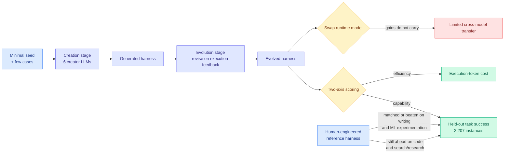

# HarnessDev: Can LLMs Create and Evolve Their Own Agent Harness?

**TL;DR.** Every agent benchmark to date evaluates a model's task output under a harness somebody else built. HarnessDev moves the unit of evaluation to **the runnable infrastructure itself**. Two stages: in **Creation** the agent starts from a minimal seed plus a handful of cases and builds a complete execution system; in **Evolution** it takes its own created harness and revises it iteratively against downstream execution feedback. Each resulting harness is then scored on two axes, **capability** (task success on held-out benchmarks) and **efficiency** (execution-token cost). Creation results span six creator LLMs, four domains and five downstream benchmarks over **2,207 unique downstream instances**, with hidden evaluation tasks withheld during development. The findings are unflattering and useful: generated harnesses stay **substantially behind mature human-engineered references on code and on search/research**, while **matching or exceeding** them on writing and machine-learning experimentation, with **large variation in execution cost**. Evolution produces gains that are **unstable and only partially transfer** to held-out tasks. And with the runtime model held fixed, the gains depend strongly on which model executes the harness, so **harness improvements do not transfer across models.**

**Source:** [HuggingFace Daily Papers](https://huggingface.co/papers/2609.01437) · [arXiv 2609.01437](https://arxiv.org/abs/2609.01437) · ByteDance Seed, SUTD, Georgia Tech, M-A-P, TokenWave.AI · [raw](../../raw/huggingface/2026-09-03-harnessdev-can-llms-create-and-evolve-their-own-agent-harnes.md)

---

## Why the benchmark exists

The premise is one this wiki has been building toward for four months: **capability lives in the harness, not just the weights.** SWE-bench, GAIA, WebArena and τ-bench all fix the execution infrastructure and vary the model, which treats the harness as part of the apparatus rather than as an artifact under study. The authors point at the industry role that makes the omission obvious, the forward-deployed engineer whose whole job is building and maintaining the external infrastructure that turns a general model into a working system, and isolate the third layer of that work: creating and maintaining the execution system itself.

They also make a sharp argument for why this is not just code generation. **Editing the harness edits the model's own execution substrate**, changing how it observes, plans and recovers on every future task. Improving it therefore requires diagnosing structural bottlenecks and committing reusable capability gains, which is a different skill from writing a correct function. Against the neighbouring benchmarks (Meta-Agent Challenge, HarnessOpt-Bench, Evo-Bench, plus the ADAS/AFlow/MASS/EvoAgentX line), HarnessDev's distinguishing choices are: connecting from-scratch creation to evolution in one study, **separating creator from executor model**, **measuring execution cost**, testing **transfer across executors**, and tracking held-out generalization along the whole evolutionary trajectory.

## Key results

- **Human-engineered harnesses still win where the domain is mature.** Generated harnesses stay substantially behind reference harnesses on code and on search/research. These are the two domains with the most human engineering effort invested, which is the natural reading: the gap tracks accumulated human effort, not intrinsic difficulty.
- **Generated harnesses match or exceed references on writing and ML experimentation.** The frontier of "let the model build it" is domain-dependent, and it has already crossed in the domains where nobody built a strong reference.
- **Large variation in execution cost** across generated harnesses. Two harnesses with comparable success can differ substantially in token spend, which means capability-only leaderboards were hiding the more decision-relevant axis.
- **Evolution gains are unstable and transfer only partially to held-out tasks.** Self-improvement against downstream feedback overfits the feedback.
- **Gains depend strongly on the executing model.** With the runtime model fixed, harness improvements do not carry across models. A harness is tuned to its executor.

## How this relates to prior wiki pages

**This is the result that finally closes open problem 0b, and it is the reason to read the paper.** [agent-harness-engineering.md](agent-harness-engineering.md) has recorded, for **eight consecutive harness results**, that none published the cost of its own mechanism: not Prime Agent, Scroll, JIT-Agent or [ContextPilot (08-31)](2026-08-31-contextpilot-proactive-context-management.md), and worst of all not [Harness-of-Harness (09-02)](2026-09-02-harness-of-harness.md), which wrapped 70-plus planning-coding-testing iterations around existing harnesses and reported a **52.25% average relative gain** with no denominator. That page's standing complaint was blunt: when the field's central pitch is that the harness is where the cost lever lives, omitting cost is the finding. **HarnessDev makes execution-token cost a first-class scoring axis by construction.** It does not retroactively price HoH, but it establishes that the two-axis format is available and, from here, its absence is a choice.

**It also unblocks, partially, a two-month blocker in [llm-routing.md](../ai-routing/llm-routing.md).** That page has wanted to route over **model-harness pairs** since early July and has been stuck partly because harnesses publish no comparable cost-per-success. HarnessDev supplies exactly the paired capability-and-cost measurement that routing needs. But its cross-model transfer result cuts the other way and is the more important finding for routing: **if harness gains are executor-specific, then a model-harness pair is the atomic unit and you cannot decompose the routing decision into "pick a model" then "pick a harness."** The search space is the product, not the sum. That is a harder routing problem than the page assumed, and it is now evidenced rather than suspected.

**Its Evolution instability is the counterweight to this week's strongest self-improvement claim.** [Harness-of-Harness (09-02)](2026-09-02-harness-of-harness.md) reported 52.25% average relative gain (82.86% maximum) after three iterations, holding across three harness-model pairs, which the wiki read as transfer evidence separating a design principle from a tuned configuration. HarnessDev finds evolution gains **unstable and only partially transferring to held-out tasks**. These are not directly contradictory, since HoH iterated three times with a meta-harness and HarnessDev evolves a self-created harness, but they are in real tension on the central question of whether harness self-improvement generalizes. **The distinguishing variable is plausibly HoH's design commitment four, constrain verifiable outputs rather than prescribing agent workflows**, which [agent-harness-engineering.md](agent-harness-engineering.md) identified on 09-02 as the resolution to its own long-standing contradiction. If HarnessDev's evolved harnesses prescribed workflows instead of constraining outputs, the instability is predicted. Nobody has run that ablation and it is the cleanest available test of the wiki's own reconciliation.

**Held-out discipline answers the measurement failure flagged on 08-26.** That entry recorded Microsoft's Thinkingbox (08-25) showing the strongest model falling from **65.36% pass@1 to 25.25% pass^20** on stateful workflows, while a harness paper published the next day still reported single-attempt scores. HarnessDev withholds hidden evaluation tasks during development and tracks held-out generalization along the trajectory, which is the structural fix rather than a promise to be careful.

**Same-day companion.** [Repo-To-Skill / DisCo (09-03)](2026-09-03-repo-to-skill-disco.md) holds the harness fixed and adds distilled operational knowledge, reporting **+134.3% on MLE-bench**. HarnessDev holds knowledge fixed and varies the harness. Read together they partition the non-weight capability surface into infrastructure and know-how, and the much larger measured gain sits on the know-how side, which is not the answer the harness thesis would have predicted.

## Gaps

- **No absolute numbers in the abstract.** "Substantially behind" and "matching or exceeding" are directions without magnitudes. The wiki's [08-31 Skill Lift](agent-harness-engineering.md) entry set the standard here: a large relative gain on a low base reads identically to a large absolute one.
- **The reference harnesses are unnamed.** Whether "mature human-engineered reference" means Claude Code and OpenCode or something assembled for the paper decides how strong the comparison is.
- **Six creator LLMs, unnamed in the abstract**, and no per-model breakdown, so the question of whether harness-building tracks general capability or is a separable skill is unanswered.
- **Cost is measured as execution tokens, not the cost of creation and evolution.** The token spend of the search that produced the harness is a real capital cost, and pricing only the resulting harness's runtime is the narrower accounting.
- **"Limited transfer across models" is not quantified**, and it is the paper's most consequential claim.

## Industrial implication

The honest read for anyone deciding whether to let a model build their agent infrastructure: **do it where no good reference exists, keep the human-engineered harness where one does.** Code and search are exactly the domains most enterprises would start with, and they are the two where generated harnesses lose. The cross-model result has a sharper operational consequence: **a harness tuned against one model is not portable when you switch models**, so the "model gateways make switching costless" argument that has taken hold in practitioner writing this month is measurably incomplete. The switching cost did not disappear, it moved from the model into the harness, and this paper is the first to measure that it did not transfer.

## Related

- [agent-harness-engineering.md](agent-harness-engineering.md) — concept page, open problem 0b
- [Harness-of-Harness (09-02)](2026-09-02-harness-of-harness.md) — the meta-harness with the unstated cost
- [Repo-To-Skill / DisCo (09-03)](2026-09-03-repo-to-skill-disco.md) — same day, the know-how axis instead
- [The Harness Advantage in Autonomous Red Teaming (09-03)](2026-09-03-harness-advantage-red-teaming.md) — the practitioner benchmark with the cost numbers
- [ContextPilot (08-31)](2026-08-31-contextpilot-proactive-context-management.md) · [llm-routing.md](../ai-routing/llm-routing.md)
