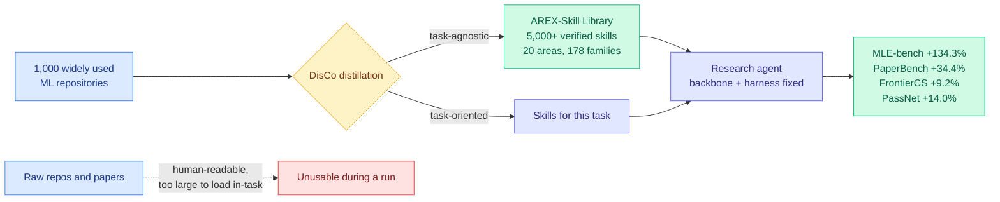

# Repo-To-Skill: Distilling GitHub Repositories Into AI4AI Skills (DisCo)

**TL;DR.** Research agents pair a model backbone with a harness for planning, execution, memory and verification, and this paper argues both together still leave the decisive layer outside the agent: **operational knowledge**, the know-how that separates knowing a method from making it work. That knowledge exists, in repositories and papers, but written for humans and far too large to load during a task. **DisCo** is a research agent that distills it into compact verified skills, in two modes: **task-agnostic**, condensing widely used repositories into reusable skills ahead of time, and **task-oriented**, producing the specific skills a concrete task needs. Run across the open ecosystem, the task-agnostic mode produced the **AREX-Skill Library: 5,000+ verified skills distilled from 1,000 widely used ML repositories, organized into 20 areas and 178 capability families.** With the GPT-5.5 backbone, the research harness and the downstream execution budget all held fixed, the skill-equipped agent scores **+134.3% on MLE-bench, +34.4% on PaperBench, +9.2% on FrontierCS and +14.0% on PassNet** against the identical agent without skills.

**Source:** [HuggingFace Daily Papers](https://huggingface.co/papers/2609.02749) · [arXiv 2609.02749](https://arxiv.org/abs/2609.02749) · [raw](../../raw/huggingface/2026-09-03-repo-to-skill-distilling-github-repositories-into-ai4ai-skil.md)

---

## The claim

The architecture story for research agents has been backbone plus harness. This paper inserts a third term and argues it dominates. **Operational knowledge is the accumulated practice of making a method actually work**: which preprocessing a benchmark expects, which hyperparameters matter, which failure mode a library produces when misconfigured, what the repo's README does not say. It is not absent from the field, it is just stored in a format an agent cannot consume mid-task, because a 40,000-line repository does not fit in a working context and reading it is not the task.

Distillation moves it into a consumable format once, so it is reused rather than rediscovered on every run. The two modes matter differently: task-agnostic distillation is an **infrastructure investment** that builds a library ahead of demand, and task-oriented distillation is **on-demand acquisition** for whatever the current task needs. The AREX-Skill Library is the artifact of the first, and its shape (20 areas, 178 capability families, 5,000+ skills, all verified) is a claim that ML operational knowledge is enumerable at that granularity.

The experimental design is the part that makes the numbers credible. **Backbone, harness and downstream execution budget are all held fixed.** So the gains cannot be attributed to a better model, better scaffolding, or more compute at test time. The paper is explicit about this: the gains come from adding distilled operating context under a fixed setup.

## Key results

- **MLE-bench +134.3%.** More than doubling performance on ML engineering tasks by adding retrieved know-how, with the model and harness unchanged, is the largest fixed-setup capability gain in this wiki's harness thread.
- **PaperBench +34.4%**, on reproducing published papers, which is the task most directly about operational knowledge.
- **FrontierCS +9.2%** and **PassNet +14.0%.** The spread from 134.3% down to 9.2% is informative: skills help most where the bottleneck is knowing-how, and least where it is genuine reasoning difficulty.
- **AREX-Skill Library: 5,000+ verified skills from 1,000 repositories.** Verification is doing real work here, given what the wiki knows about unverified skill libraries (see below).

## How this relates to prior wiki pages

**It is the direct scale-up of the mechanism [AI4AI at Test-Time (08-13)](../inference-efficiency/2026-08-13-ai4ai-test-time-harness-transfer.md) established, and the name is not a coincidence.** That paper had a strong builder model write an inference-time harness for a weaker target, refined against a 5% validation split, and moved average target performance on four Theory-of-Mind benchmarks from **0.49 to 0.91 with the target's weights never touched**. It named the category AI4AI. Repo-To-Skill distills AI4AI *skills* rather than harnesses, and shifts the source of the transferred capability from a builder model's synthesis to the field's existing repositories. **The mechanism analysis in [agent-harness-engineering.md](agent-harness-engineering.md) said AI4AI's gains came from offloading unstable reasoning into deterministic code, routing per question type, and strict format enforcement, all of which remove model discretion rather than adding model effort.** A verified skill is that same move, packaged and reused: it substitutes a checked procedure for an improvised one.

**It gives the harness thesis its sharpest internal challenge, and its same-day companion sets up the comparison.** [HarnessDev (09-03)](2026-09-03-harnessdev-harness-creation-evolution.md) varies the harness with knowledge fixed and finds model-generated harnesses still behind human references on code and search. Repo-To-Skill varies the knowledge with harness fixed and reports **+134.3%**. Two papers on the same day partitioning the non-weight capability surface, and **the much larger measured gain is on the knowledge side, not the infrastructure side.** [agent-harness-engineering.md](agent-harness-engineering.md) has argued since 05-27 that system scaling rather than model scaling is the next bottleneck, and named six harness components including a skill-routing layer. This is evidence that within the harness, the skill layer is where the leverage concentrated, and that the loop machinery the practitioner literature spent 2026-08 on may be the smaller lever.

**It answers the demand [Skill Lift (08-31)](agent-harness-engineering.md) created and partially satisfies its methodology.** NVIDIA's Skill Lift measured that the structural scanner enterprises gate shared skill libraries on correlates with LLM-judge skill quality at a **Spearman rho of 0.14**, meaning passing the gate tells you a skill is well formatted and essentially nothing else. Its replacement was a paired-run design, same task and model and sandbox and scorer, run with and without the skill. Repo-To-Skill's headline comparison is exactly that paired design at benchmark scale, with the same agent run with and without skills. **What it does not do is report per-skill lift**, so the library's 5,000 skills have an aggregate effect and no distribution. Skill Lift's whole point was that the distribution is where the surprises live, and it found that a third of skills can make an agent worse.

**Cost is measured on the wrong side, and this is the eighth-plus instance of the pattern.** The downstream execution budget is held fixed, which is good experimental hygiene and also means the reported gains are per-unit-of-execution-cost. But **distilling 5,000 skills from 1,000 repositories is a large one-time token spend that is not priced**, and the retrieval cost of selecting skills into a working context on every task is not either. [agent-harness-engineering.md](agent-harness-engineering.md)'s open problem 0b is about exactly this. HarnessDev, published the same day, makes execution cost a scoring axis; Repo-To-Skill holds it fixed but omits the capital cost of the library.

## Gaps

- **No per-skill lift distribution.** With Skill Lift's finding that a third of production skills degrade agent performance, an aggregate +134.3% across a 5,000-skill library invites the question of how many of those skills are actively harmful and are being masked by the winners.
- **Distillation cost unpriced.** 1,000 repositories condensed into 5,000 verified skills is a substantial compute investment with no stated figure, and it is the number that decides whether a team can replicate this or must consume someone else's library.
- **"Verified" is unspecified in the abstract.** Verified against what: executes without error, reproduces a documented result, passes a written test? The word carries most of the paper's quality claim.
- **One backbone.** All results use GPT-5.5. Given that HarnessDev found harness gains do not transfer across executor models, whether skill libraries transfer across backbones is the obvious question and is untested here.
- **Selection is invisible.** With 5,000 skills available, choosing which to load is a retrieval problem, and retrieval quality is plausibly where the method lives or dies. The abstract does not describe the mechanism.

## Industrial implication

The actionable claim is that **a shared verified skill library is a larger capability lever than harness tuning, at least for research-and-engineering workloads, and it is a build-once-amortize-forever asset rather than a per-project cost.** That favours whoever accumulates the library, which is a distribution and moat story more than a research one: 5,000 verified skills over 1,000 repositories is the kind of asset that gets consumed as a dependency, and the AREX name suggests it is meant to be. For a team deciding where to spend this quarter, this paper plus HarnessDev say: **stop re-engineering the loop, start harvesting your own repositories into checked skills, and measure per-skill lift with paired runs rather than trusting a scanner.**

## Related

- [AI4AI at Test-Time (08-13)](../inference-efficiency/2026-08-13-ai4ai-test-time-harness-transfer.md) — the mechanism at small scale
- [HarnessDev (09-03)](2026-09-03-harnessdev-harness-creation-evolution.md) — the infrastructure axis, same day
- [agent-harness-engineering.md](agent-harness-engineering.md) — concept page, skill-routing layer and open problem 0b
- [self-evolving-agents.md](self-evolving-agents.md) — concept page
