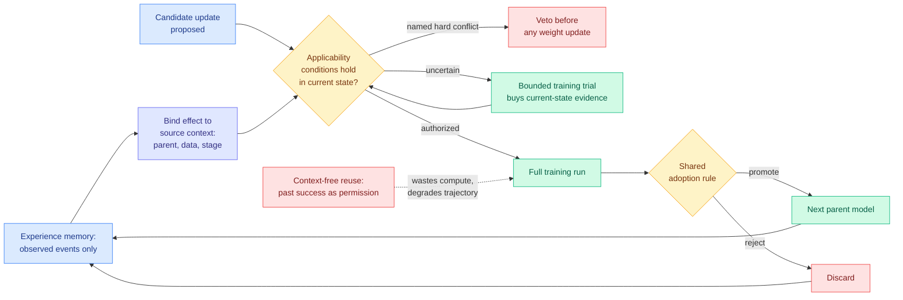

# Knowing When Not to Reuse: Conditional Experience Transfer in Autonomous LLM Post-Training (BCIT)

**Source:** HuggingFace Daily Papers · [arxiv 2608.26730](https://arxiv.org/abs/2608.26730)
**Raw:** [raw/huggingface/2026-09-04-knowing-when-not-to-reuse-conditional-experience-transfer.md](../../raw/huggingface/2026-09-04-knowing-when-not-to-reuse-conditional-experience-transfer.md)

## TL;DR

Autonomous post-training systems propose model updates, train candidates, read evaluation feedback, and use it to propose the next round. As the log of past updates grows, a problem appears that nobody has been treating as a problem: **which past evidence is still actionable now that subsequent training has changed the parent model?** An update's effect depends jointly on its parent checkpoint, its data, and the training stage it was applied at. Treating "this worked last time" as context-free permission wastes compute on a training run that will not reproduce, and if the resulting child is promoted anyway, it corrupts the trajectory that follows. The paper names this **conditional experience transfer** and proposes **Boundary-Calibrated Intervention Transfer (BCIT)**, which authorizes reuse **before** any weight-changing training happens. BCIT binds each observed effect to the context it was observed in, checks applicability conditions against the current state, **vetoes candidates with named hard conflicts**, and where the conditions are genuinely uncertain, buys evidence with a **bounded training trial** rather than a full run. Candidates that do complete training still face a shared adoption rule, and only *observed* events extend memory, so the store never accumulates inferred claims. On one 4B model adapted across finance reasoning, text-to-SQL and function calling, candidate updates show heterogeneous target and retention effects across contexts, and under matched candidates, evidence and compute, **BCIT authorizes fewer harmful updates and reaches higher equal-budget final-model quality** than the alternatives evaluated.

## The problem statement is the contribution

The method is a gate with four moves. The reason to read it is the framing, which names something the self-improvement literature has been quietly assuming away.

Every experience-reuse system on [self-evolving-agents.md](self-evolving-agents.md) stores what worked and retrieves it later. All of them treat a stored success as **timeless**: the retrieval key is semantic similarity to the current situation, and the implicit assumption is that if the situation resembles the one where the trick worked, the trick still works. **In post-training that assumption is false in a specific and measurable way, because the thing that changed is not the situation, it is the model doing the learning.** An update that expanded a 4B model's function-calling ability at step 200 may do nothing, or actively harm retention, applied to the same model at step 2000 after two intervening promotions.

The consequence BCIT is built around is asymmetric, and this is the sharp part. A wasted training run costs compute, which is recoverable. A **promoted** bad child costs the trajectory, because every subsequent update is now conditioned on a worse parent, and the damage compounds across generations. That asymmetry is what justifies a pre-training veto rather than a post-hoc filter: you cannot cheaply undo a promotion, so the decision has to happen before the spend.

The **bounded training trial** is the design's most transferable piece. It buys a small amount of current-state evidence instead of either trusting stale evidence or paying for a full run, which makes it a costly-inspection policy in the same family as [Pandora's Router (08-25)](../ai-routing/2026-08-25-pandoras-router-costly-value-estimation.md), where the inspection cost is a partial rollout. And "**only observed events extend memory**" is a discipline the skill-library literature does not have: the store holds measurements, never inferences, so it cannot drift by accumulating its own conclusions.

## Relation to prior wiki state

**This is the first paper on [self-evolving-agents.md](self-evolving-agents.md) to attack the reuse *decision* rather than the reuse *artifact*.** That page's entire cluster performs operations on the stored experience: [SkillZip (08-12)](2026-08-12-skillzip-skill-compression.md) compresses it under a typed minimum-description-length objective, [ALTK-Evolve (08-12)](2026-08-12-altk-evolve-selective-context-delivery.md) delivers a per-task subset of it (263K tokens against 634K at 89.3% against 80.4% completion), [WikiSkill (08-28)](2026-08-28-wikiskill-persistent-knowledge-skill-evolution.md) persists it across evolution cycles, [CASKG (08-28)](2026-08-28-caskg-counterfactual-causal-skill-graphs.md) builds counterfactual causal structure over it. Every one of them improves what is in the store or how much of it gets delivered. **None of them asks whether a retrieved item is still valid.** BCIT says validity is conditional on state, and that a store of unconditioned successes is a store of claims with expired preconditions.

**It supplies a mechanism for the page's oldest unexplained result, and it is now the fourth competing explanation.** Evo-Bench's early saturation, where autonomous harness evolution plateaus after a few cycles, has three prior candidate causes on that page: [Mendel Gödel Machine (08-12)](2026-08-12-mendel-godel-machine.md)'s single-trajectory variance argument (edits mostly correct noise), [AutoWorldModel-Bench (08-13)](2026-08-13-autoworldmodel-bench.md)'s evidence that the plateau is about self-editing evidence rather than research ability (agents improved an external artifact in 63 of 64 sessions), and today's [Environment Evolution (09-04)](2026-09-04-environment-evolution-terminal-agents.md) argument that a loop conditioned on its own observed failures starves as failures become rare. BCIT adds a fourth: **the loop plateaus because it keeps re-applying experience whose preconditions no longer hold, so a growing fraction of each cycle's compute goes to updates that cannot reproduce.** That is a distinct claim from all three and it makes a different prediction: gate the reuse and the plateau should move, without changing the edit operator, the evidence source, or the curriculum. **Four hypotheses, one phenomenon, and BCIT's is the only one with a proposed intervention that has been measured against matched compute.**

**Read against today's [One-Example OPD (09-04)](../inference-efficiency/2026-09-04-one-example-on-policy-distillation.md), the two are opposite conclusions about where post-training compute is wasted, and both are probably right.** That paper found on-policy distillation is **data-overfed but algorithm-starved**: one query reaches 71.5% state coverage, sixteen semantically distinct queries reach 98.9% and match full-data training, and alignment slows at the same rate regardless of data supply, so curation effort is being spent on a non-binding constraint. BCIT finds autonomous post-training wastes compute in a different place, on training runs authorized by stale evidence. **One says stop curating the data, the other says start gating the updates. Together they relocate the entire waste budget of a post-training pipeline from the dataset to the decision layer**, which is a coherent and somewhat uncomfortable joint message: the expensive human work (dataset curation) is not where the loss is, and the loss is in an accounting step nobody built.

**And it is the tenth agentic result in a row where cost is the axis of the argument.** The difference is that this one actually reports the equal-budget comparison, which is the discipline [llm-routing.md](../ai-routing/llm-routing.md) has been asking for since [the AlphaSense study (08-14)](../ai-industry/2026-08-14-alphasense-token-price-vs-task-cost.md) established that per-token pricing ranks models backwards. **BCIT's headline is a matched-compute quality comparison, not a capability delta with an unstated bill.** That is the right shape and it should be the default.

## Gaps

**One 4B model.** Three task domains is decent breadth, one model at one scale is not. The claim is about how experience validity degrades as a model changes, and a 4B model adapted for three tasks is the shallowest version of the trajectory the argument concerns. Whether the effect grows or shrinks at frontier scale, where autonomous post-training is actually run and where the compute stakes justify the machinery, is unaddressed.

**"Named hard conflicts" is the veto's whole precision, and where the names come from is unstated in the abstract.** If the conflict taxonomy is hand-authored, the method's generality is bounded by that authoring effort and it is a curation cost moved rather than removed. If it is inferred, the inference is itself a claim that could be stale.

**No cost is reported for the bounded training trials.** The trial is how BCIT resolves uncertainty, so its cost is the price of the whole mechanism, and the equal-budget framing means the trials are being paid for out of the same budget as the training. The number that matters, trial spend as a fraction of total budget, is not in the abstract.

**Heterogeneous effects are reported as a finding, not characterized as a distribution.** "Candidate updates exhibit heterogeneous target and retention effects across the evaluated contexts" is the empirical claim the whole paper rests on. How heterogeneous, along which context dimension (parent, data, or stage), and whether the heterogeneity is predictable are the questions that decide whether a gate can be learned rather than specified.

## Related

- [self-evolving-agents.md](self-evolving-agents.md) — concept page
- [Environment Evolution (09-04)](2026-09-04-environment-evolution-terminal-agents.md) — a different account of the same plateau
- [One-Example OPD (09-04)](../inference-efficiency/2026-09-04-one-example-on-policy-distillation.md) — the other half of the post-training waste question
- [Mendel Gödel Machine (08-12)](2026-08-12-mendel-godel-machine.md) · [SkillZip (08-12)](2026-08-12-skillzip-skill-compression.md) · [CASKG (08-28)](2026-08-28-caskg-counterfactual-causal-skill-graphs.md)
- [Pandora's Router (08-25)](../ai-routing/2026-08-25-pandoras-router-costly-value-estimation.md) — costly inspection as a policy
