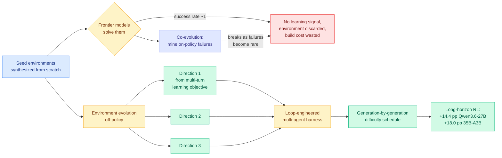

# Environment Evolution for Terminal Agents

**Source:** HuggingFace Daily Papers · [arxiv 2609.04128](https://arxiv.org/abs/2609.04128) · Hunyuan Team, Tencent (Zhiyuan Fan, Tinghao Yu, Yuanjun Cai et al.)
**Raw:** [raw/huggingface/2026-09-04-environment-evolution-for-terminal-agents.md](../../raw/huggingface/2026-09-04-environment-evolution-for-terminal-agents.md)

## TL;DR

Environments synthesized from scratch are becoming useless as training signal, and the reason is that the models got better. When a frontier model solves an environment nearly every time, reinforcement learning gets no gradient from it, so the environment is discarded and the money spent building it is wasted. The existing fix, **agent-environment co-evolution**, watches the model fail during on-policy rollouts and builds new environments targeting the observed weaknesses. This paper argues that fix inherits the rollout model's limits: as the agent improves, failures become rare, so the signal that drives synthesis dries up exactly when you need it most, and the generated environments are shaped by one model's specific weaknesses rather than by general difficulty. **Environment evolution** instead raises difficulty **off-policy**, deriving three difficulty-increasing directions from the multi-turn learning objective itself and scheduling evolved environments generation by generation across training. The evolution is implemented through a loop-engineered multi-agent harness. Rollout experiments with Hy4 preview, Claude Opus 5 and GPT-5.6 Sol confirm each generation is genuinely harder. Long-horizon RL on the resulting corpus improves **Qwen3.6-27B by 14.4 points and Qwen3.6-35B-A3B by 18.0 points on Terminal-Bench 2.1**.

## What makes the off-policy argument load-bearing

The co-evolution critique is sharper than it first reads, and it is a general fact about curriculum learning driven by observed failure. A curriculum that samples from the model's current error distribution has a supply problem built into its success: the better the model gets, the fewer errors there are to mine, and the ones remaining are increasingly idiosyncratic. So the curriculum's information rate falls precisely along the trajectory where you want it to rise. Worse, the environments it produces encode **this** model's weaknesses, which is why co-evolved curricula transfer poorly to a different policy.

Deriving difficulty directions from the **multi-turn learning objective** instead of from observed failures decouples the two. Difficulty becomes a property of the environment's structure that can be dialed up without asking any model anything, which is what makes the generation-by-generation schedule possible: you can pre-build generation 5 before the model has finished learning generation 2. The validation is the right one. Rather than assume the evolved environments are harder, the authors measure rollout success across three strong and architecturally unrelated agents (Hy4 preview, Claude Opus 5, GPT-5.6 Sol) and show difficulty rises monotonically for all of them. **A difficulty axis that holds across three unrelated frontier models is a much stronger object than one calibrated to a single rollout policy**, and it is the paper's most reusable contribution independent of the RL result.

The uncomfortable detail is that the evolution mechanism itself is "a loop-engineered multi-agent harness," which means the environments that train the agent are produced by an agent loop, and the quality of the curriculum is bounded by the quality of that harness. The paper does not report what that harness costs.

## Relation to prior wiki state

**Same day, same diagnosis, opposite half of the problem.** [Terminal-Universe (09-04)](2026-09-04-terminal-universe-trajectories-to-environments.md) says environments are scarce because building them is expensive, and recovers 37.3k of them for free by replaying the file operations recorded inside existing agent trajectories. This paper says environments are scarce because the ones you have are too easy. **Supply and difficulty. Two Chinese industrial labs, one HuggingFace board, neither citing the other, and the compose is trivial: recover 37.3k workspaces with Terminal-Universe, then run them through environment evolution to keep them at the learnable frontier as the model improves.** That composition is the clearest unclaimed experiment on this page today.

**It confirms and mechanizes the axis [Apodex 1.1 (08-25)](2026-08-25-apodex-1-1-environment-coordination-scaling.md) named.** Apodex argued that a 35B model reaches the leading band by scaling **Environment Scaling** and Agentic Coordination Scaling instead of parameters, and this page filed that as a claim about where capability comes from. Two papers today operationalize it, and the 14.4 and 18.0 point gains here are on 27B and 35B models, the same scale band as Apodex's 35B. **Three papers within eleven days placing capability in the environment rather than the parameter count is past this wiki's three-paper threshold for declaring a pattern.** State it: for terminal agents at the 27B-35B scale, the environment corpus is now the leading capability variable in the published record, and it is the one that is cheapest to improve.

**It resolves half of an open question on [self-evolving-agents.md](self-evolving-agents.md), and the direction is unexpected.** That page's largest open result is Evo-Bench's unexplained **early saturation**, where autonomous harness evolution plateaus after a few cycles, and [Mendel Gödel Machine (08-12)](2026-08-12-mendel-godel-machine.md) proposed that single-trajectory conditioning is too high-variance so edits mostly correct noise. Environment evolution says something different about a structurally identical loop: **an evolution loop conditioned on the current policy's observed failures runs out of signal by construction, and the fix is to stop conditioning on the policy.** If that transfers to harness evolution, then Evo-Bench's plateau is not a variance problem and not a ceiling on research ability, it is the curriculum starving itself. **That is a third hypothesis for the page's oldest open result, it is testable, and it predicts a specific fix: derive harness-edit directions from the objective rather than from observed failures.**

**It also lands on [Task-CoEvolve (08-25)](2026-08-25-task-coevolve-adaptive-validation-selection.md) from the other side of the same coin.** Task-CoEvolve co-evolves the *validation* set with the harness, concentrating evaluation on tasks where candidate harnesses disagree, and matched full-set search quality with 80% fewer evaluations. Both papers are about keeping a task pool at the frontier where it carries information. Task-CoEvolve does it by *selecting* from a fixed pool for evaluation efficiency; this paper does it by *generating* a pool for training signal. **Variance-weighted selection and objective-derived generation are the two answers to "keep the tasks informative," and the pairing suggests the missing method: variance-weighted scheduling over evolved generations, so training samples the generation where the current policy is most uncertain.**

## Gaps

**The three evolution directions are the contribution and the abstract does not name them.** Whether they generalize past terminal environments to browser, GUI or tool-calling settings depends entirely on how tightly they are tied to the terminal's multi-turn structure, and that cannot be assessed from the abstract alone.

**No cost accounting for the evolution harness.** This is the ninth consecutive result in this wiki's agentic cluster to report capability gain while omitting the cost of its own mechanism, and here the omission is more consequential than usual, because the whole motivating complaint is that from-scratch environment construction wastes money when the environment turns out too easy. **A method justified on wasted-build-cost grounds owes a build-cost number.**

**Two models, one family, one benchmark.** Qwen3.6-27B and Qwen3.6-35B-A3B on Terminal-Bench 2.1. The rollout difficulty validation is admirably cross-model; the *training* result is not, so whether an off-policy curriculum transfers across policy families, which is the central claim against co-evolution, is demonstrated for difficulty and assumed for learning.

**No comparison against co-evolution under matched compute.** The argument is that off-policy beats on-policy curricula as the model strengthens. The decisive experiment is both curricula, same seed environments, same compute, measured late in training when co-evolution's failure supply should be thinnest. It is not reported.

## Related

- [Terminal-Universe (09-04)](2026-09-04-terminal-universe-trajectories-to-environments.md) — the supply half
- [Apodex 1.1 (08-25)](2026-08-25-apodex-1-1-environment-coordination-scaling.md) — environment scaling as a capability axis
- [Task-CoEvolve (08-25)](2026-08-25-task-coevolve-adaptive-validation-selection.md) · [Mendel Gödel Machine (08-12)](2026-08-12-mendel-godel-machine.md)
- [self-evolving-agents.md](self-evolving-agents.md) · [agent-harness-engineering.md](agent-harness-engineering.md)
- [BCIT (09-04)](2026-09-04-bcit-conditional-experience-transfer.md) — the other side of wasted post-training compute
