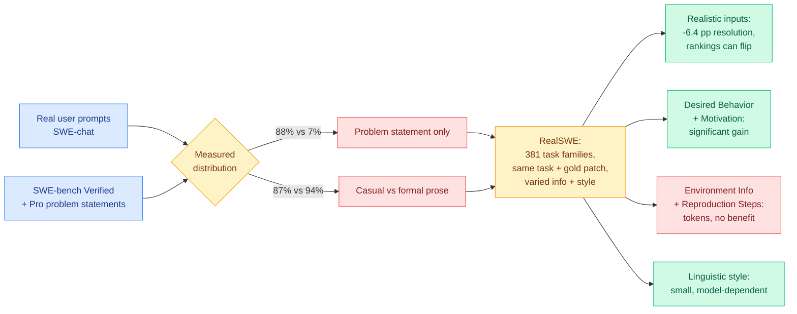

# RealSWE: A Compositional Evaluation of Coding Agents under Realistic User Requests

**Source:** HuggingFace Daily Papers · [arxiv 2608.27831](https://arxiv.org/abs/2608.27831)
**Raw:** [raw/huggingface/2026-09-04-realswe-a-compositional-evaluation-of-coding-agents-under.md](../../raw/huggingface/2026-09-04-realswe-a-compositional-evaluation-of-coding-agents-under.md)

## TL;DR

Every SWE-bench-family benchmark is built from curated GitHub issues, which are long, structured, information-rich and written in formal prose by developers who expected to be read by other developers. Real users of coding agents write nothing like that. RealSWE measures the gap with a six-category information taxonomy and four dimensions of linguistic style, applied to real user prompts from SWE-chat alongside problem statements from SWE-bench Verified and Pro. The distribution mismatch is not marginal, it is close to total: **requests carrying only a problem statement, alone or with limited additional context, are 88% of real prompts and 7% of benchmark problems**, and **87% of real prompts are casually written against 94% of benchmark problems being formal**. The benchmark then holds the task and the gold patch fixed while varying only information composition and style: **381 multi-variant task families** derived from Verified and Pro. Across seven contemporary models, realistic inputs cut resolution rates by **6.4 percentage points on average and can change model rankings**. The controlled analysis is the part with a directly actionable finding: **stating Desired Behavior and Motivation significantly improves performance, while Environment Information and Reproduction Steps merely add tokens with no measurable benefit.** Linguistic style has only small, model-dependent effects.

## The finding that is worth acting on tomorrow

Two of the six information categories are free lunch and two are pure cost. **Desired Behavior** (what the correct end state looks like) and **Motivation** (why the user wants it) significantly improve resolution, and both are among the things real prompts most often omit. **Environment Information** and **Reproduction Steps** add tokens and buy nothing measurable, and both are the things careful bug-report etiquette trains humans to supply first.

That inverts standard practice on both ends. For a user, the guidance is: skip the environment dump, skip the numbered reproduction, say what you want the code to do afterwards and why. For a harness builder, the guidance is sharper, because a harness that auto-collects environment details and reproduction traces before invoking the model is spending prefill on categories this paper measures as inert. On the [inference-physics accounting](../hardware/2026-09-02-physics-of-llm-inference-roofline.md), where prefill is the compute-bound phase and every token in the prompt is paid for at the input rate, **an information category with a measured zero benefit is a pure cost line, and two of six are in that bucket.**

The compositional design is what licenses these claims. Variants inside a family share the same underlying task and the same gold patch, so a resolution difference is attributable to the information present rather than to task difficulty. That is a stronger evaluation contract than the ablate-the-prompt studies this conclusion would otherwise rest on.

## Relation to prior wiki state

**This is the fifth benchmark-validity failure on [agent-benchmarks.md](agent-benchmarks.md), and the first one located in the input distribution rather than in the scoring.** The four earlier instances found benchmarks measuring artifacts of their own construction, and the page's later entries found aggregate scores concealing the axis that decides deployability: [Thinkingbox (08-25)](2026-08-25-thinkingbox-stateful-reliability.md) separated headline accuracy from reliability across attempts (65.36% pass@1 collapsing to 25.25% pass^20 on stateful workflows), and [E-Commerce Bench (09-02)](2026-09-02-ecommerce-bench-long-horizon-business-operation.md) separated profit from integrity and found them anti-correlated inside one model, with the top earner ranking 16th of 18 on fraud avoidance. **RealSWE adds a third decomposition and a different kind: not what the score conceals, but what the input distribution assumed.** The pattern statement on that page can now be tightened. Every one of these failures is an unstated conditioning variable, and the page has found three distinct ones: attempt count, objective dimension, and now prompt composition.

**It gives [the evaluation-license census (08-29)](../responsible-ai/2026-08-29-evaluation-license-claim-replay-census.md) a concrete instance of its most survivable claim type failing.** That paper separated exact-value claims, winner claims, complete orderings and pairwise relations, censused all 124 mechanically eligible Inspect Evals units and found 110 stop before deterministic inference is possible, while noting that winner and pairwise claims are the more robust kind. RealSWE reports that **realistic inputs can change model rankings**. That is a winner claim breaking under a shift in the input distribution rather than under scoring instability. **The identified set for "model A beats model B on SWE-bench" is wider than the census's framework captures, because the framework conditions on the eval's own prompts and RealSWE's point is that those prompts are the assumption.**

**And it explains a cost result on [agent-harness-engineering.md](agent-harness-engineering.md) that has been sitting there unexplained.** [ALTK-Evolve (08-12)](2026-08-12-altk-evolve-selective-context-delivery.md) found DeepSeek-V3.2 reaching 89.3% task-goal completion at 263K tokens per task against a baseline's 80.4% at 634K, both axes moving the right way at once, which meant the baseline was paying for context that was actively harmful rather than merely redundant. RealSWE measures the same phenomenon at the level of information *category* and names which categories are inert. **Two independent results now say agent context contains large, identifiable, removable blocks that cost tokens and buy nothing, and RealSWE is the first to label them.** The unclaimed experiment is direct: strip Environment Information and Reproduction Steps from a harness's auto-collected context and measure resolution and tokens together.

**The awkward implication for [Terminal-Universe (09-04)](2026-09-04-terminal-universe-trajectories-to-environments.md), today's other coding-agent paper.** Terminal-Universe recovers 37.3k training environments from logged agent trajectories, and those trajectories were produced by agents driven by benchmark-style prompts. RealSWE says benchmark-style prompts are 7% of the real distribution. **A training corpus mined from benchmark-driven trajectories inherits the benchmark's prompt distribution, so the 11.9-point Terminal-Bench gain may not survive contact with the 88% case.** Neither paper can see this; together they make it a specific and cheap question.

## Gaps

**One provenance for the real-prompt side.** SWE-chat is a single source of real user requests, and the 88%/87% figures are the paper's entire empirical basis for what "realistic" means. A second independent prompt corpus, from a different product with a different user population, would either replicate the distribution or reveal it as product-specific.

**Seven models, resolution rate only.** No token cost per variant is reported, which is the number that would turn the inert-category finding into a priced recommendation. The paper establishes that Environment Information and Reproduction Steps "merely add tokens without measurable benefit" and does not say how many tokens.

**The gold patch is held fixed by design, which is also the design's limit.** Real casual requests are often genuinely underspecified, meaning more than one patch would satisfy the user. Holding one gold patch fixed while removing the information that disambiguated it measures degradation against a single reference, not the harder and more realistic question of whether the agent should have asked a clarifying question. [PACE (09-04)](../responsible-ai/2026-09-04-pace-hidden-conflicts-user-requests.md), on the same board today, is about exactly that failure mode from the other direction.

**No interaction with the harness.** Every number is for a model given a prompt. Real coding agents run inside harnesses that gather context, and the whole point of the inert-category finding is that harnesses gather the inert categories. Measuring the same 381 families through two different harnesses is the experiment that would make this actionable for anyone shipping an agent.

## Related

- [agent-benchmarks.md](agent-benchmarks.md) — concept page
- [Thinkingbox (08-25)](2026-08-25-thinkingbox-stateful-reliability.md) · [E-Commerce Bench (09-02)](2026-09-02-ecommerce-bench-long-horizon-business-operation.md)
- [ALTK-Evolve (08-12)](2026-08-12-altk-evolve-selective-context-delivery.md) — selective context delivery
- [Terminal-Universe (09-04)](2026-09-04-terminal-universe-trajectories-to-environments.md)
- [The Physics of LLM Inference (09-02)](../hardware/2026-09-02-physics-of-llm-inference-roofline.md) — why an inert prompt category is a real cost
