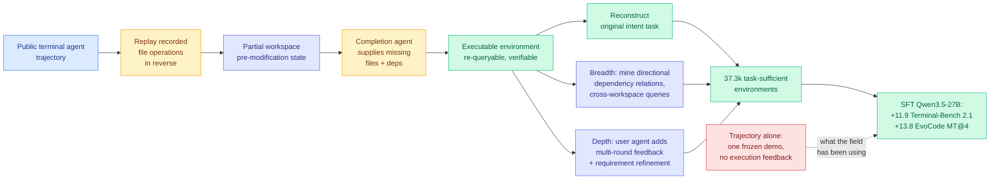

# Terminal-Universe: Turning Agent Trajectories into Scalable Terminal Environments

**Source:** HuggingFace Daily Papers · [arxiv 2609.04148](https://arxiv.org/abs/2609.04148)
**Raw:** [raw/huggingface/2026-09-04-terminal-universe-turning-agent-trajectories-into-scalable.md](../../raw/huggingface/2026-09-04-terminal-universe-turning-agent-trajectories-into-scalable.md)

## TL;DR

Terminal agent post-training needs **environments** (executable workspaces that can be re-queried into many verifiable tasks and that return real execution feedback), not **trajectories** (a single frozen demonstration that can be imitated once and never probed again). The field has an enormous surplus of the second and a shortage of the first. Terminal-Universe's observation is that the surplus already contains the shortage: **the tool-execution history recorded inside a trajectory exposes the structure and contents of the environment it ran in**, so the environment can be reconstructed from the trajectory rather than synthesized from scratch. The method replays the recorded file operations in reverse to restore each file to its pre-modification state, yielding a partial workspace, then a completion agent supplies the missing files and dependencies. On that recovered workspace it both reconstructs the original intent task and synthesizes entirely new ones, scaled along **breadth** (cross-workspace queries built from mined directional dependency relations between related environments) and **depth** (a user agent turns a single-turn query into a multi-round session with iterative feedback and requirement refinement). Applied to public terminal-agent trajectories it produces **37.3k task-sufficient environments**. Supervised fine-tuning of Qwen3.5-27B on that corpus improves **Terminal-Bench 2.1 single-round by 11.9 points** and **EvoCode-Bench v2 MT@4 multi-round by 13.8 points**.

## The reframing worth isolating

The paper's first paragraph does the work: **an environment can be re-queried into many verifiable tasks and provides execution feedback, whereas a trajectory is a single frozen demonstration.** Stated that plainly, the asymmetry is obvious, and it explains why the terminal-agent literature keeps building expensive from-scratch environment pipelines while sitting on terabytes of logged agent runs.

The technical insight underneath is that a trajectory is **an incomplete but authentic recording of its own environment**. Every `cat`, `ls`, `sed`, `git diff` and test invocation in the tool history leaks a piece of the filesystem: which files existed, what they contained before the edit, what the dependency graph looked like, what the test harness expected. Inverting the file operations recovers the pre-modification state exactly for every file the agent touched, and touching files is what terminal agents mostly do. The completion agent is only needed for the parts the trajectory never observed, which makes the synthetic fraction of each environment small and the authentic fraction large. That ratio is the reason this should generalize better than from-scratch synthesis, and the paper does not quantify it, which is the most useful missing number.

The breadth axis is the second good idea. Mining **directional dependency relations between related environments** and synthesizing queries that span multiple codebases reproduces something real developers do constantly and that essentially no agent benchmark contains: change library A, discover the break in consumer B. Single-repository benchmarks structurally cannot test it.

## Relation to prior wiki state

**This is the second paper in one day arguing that the environment is the scarce input, and the two are complements rather than rivals.** [Environment Evolution for Terminal Agents (09-04)](2026-09-04-environment-evolution-terminal-agents.md) (Tencent Hunyuan) attacks the *difficulty* of environments: frontier models solve from-scratch synthesized environments too reliably, the learning signal goes to zero, and the environment gets discarded. Terminal-Universe attacks the *supply*: environments are scarce because building them is expensive. **Terminal-Universe manufactures environments cheaply; Environment Evolution makes them harder generation by generation. Run the first and you have 37.3k workspaces; run the second and they stay useful as the model improves.** Neither paper cites the other and nobody has composed them, which is the obvious next experiment and the cheap one, because Terminal-Universe's output is exactly Environment Evolution's input.

**It supplies the missing pipeline for a claim [Apodex 1.1 (08-25)](2026-08-25-apodex-1-1-environment-coordination-scaling.md) made and did not operationalize publicly.** Apodex's headline was that a 35B model reaches the leading performance band by scaling **Environment Scaling** (diversity and verifiability of executable file, search and code environments) and Agentic Coordination Scaling rather than parameters. The paper named environment scaling as one of its two axes; it did not publish a reproducible way to get the environments. Terminal-Universe is a reproducible way, from an input (logged trajectories) that any lab running a coding agent already has in volume. **If environment scaling is really the axis, this is the paper that makes it accessible to groups without Apodex's environment-engineering budget.**

**It also inverts the direction of a thread on [self-evolving-agents.md](self-evolving-agents.md).** That page's skill-library cluster runs trajectory → skill: distil what worked into a reusable prose artifact injected at inference. [Repo-to-Skill DISCO (09-03)](2026-09-03-repo-to-skill-disco.md) does it from repositories. Terminal-Universe runs trajectory → **environment**, which is the same source material compiled into a training-time asset rather than an inference-time one. The two extractions are not exclusive and the comparison is interesting on cost grounds: a skill is injected on every step forever, an environment is consumed during training and then free. **On the [SkillZip (08-12)](2026-08-12-skillzip-skill-compression.md) accounting, where the recurring half of the bill is the injected artifact, converting a trajectory into an environment is the cheaper amortization of the same information.**

**Against [agent-benchmarks.md](agent-benchmarks.md)'s measurement-crisis thread, this is a risk rather than a fix.** That page has recorded four benchmark-validity failures where a trusted benchmark was substantially measuring an artifact of its own construction. Terminal-Universe generates 37.3k environments from trajectories, then evaluates the resulting model on Terminal-Bench 2.1, and those public trajectories were themselves largely produced by agents run on Terminal-Bench-family tasks. **The training distribution and the evaluation distribution share an ancestor, and the paper does not report a held-out-provenance split.** An 11.9-point gain measured this way is consistent both with real capability transfer and with reconstructing the test environment's own idiom.

## Gaps

**No leakage control, as above.** The single experiment that would settle it is cheap: train on environments recovered from trajectories of provenance A, evaluate on a benchmark with provenance B, report the gap against the same-provenance number.

**The authentic-versus-synthesized ratio is unreported.** How much of a recovered workspace comes from replaying real file operations and how much from the completion agent's guesses is the number that determines whether this is "environments for free" or "from-scratch synthesis with a better prior."

**Task-sufficient is doing unmeasured work.** 37.3k is the headline, and the filter that admits an environment into that count is the whole quality story. There is no reported distribution of environment complexity, no verifier reliability measurement, and no estimate of how many of the 37.3k carry a task any current model actually fails.

**SFT only.** The paper's argument for environments over trajectories is that environments support RL, since they return execution feedback and can be re-queried. The experiments are supervised fine-tuning on a static corpus, which is the trajectory-shaped use of an environment-shaped asset. The RL result the framing implies is not run here; [Environment Evolution](2026-09-04-environment-evolution-terminal-agents.md) runs it on a different corpus.

## Related

- [Environment Evolution for Terminal Agents (09-04)](2026-09-04-environment-evolution-terminal-agents.md) — same-day counterpart on difficulty
- [Apodex 1.1 (08-25)](2026-08-25-apodex-1-1-environment-coordination-scaling.md) — environment scaling as a capability axis
- [Task-CoEvolve (08-25)](2026-08-25-task-coevolve-adaptive-validation-selection.md) — co-evolving the evaluation set rather than the training set
- [self-evolving-agents.md](self-evolving-agents.md) · [agent-benchmarks.md](agent-benchmarks.md)
- [RealSWE (09-04)](2026-09-04-realswe-realistic-user-requests.md) — the other half of the benchmark-realism question
