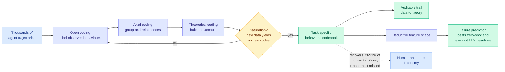

# AutoTraceGT: Using Grounded Theory for Agent Behavior Analysis at Scale

**arxiv:** [2608.30391](https://arxiv.org/abs/2608.30391) · **Source:** [HuggingFace Daily Papers 2026-09-05](../../raw/huggingface/2026-09-05-using-grounded-theory-for-agent-behavior-analysis-at-scale.md)

## TL;DR

Understanding what an agent actually does requires reading trajectories, and there are thousands of them, each long and each in an unfamiliar task domain. The two available options are both bad. A pre-built failure classifier only finds the failure modes someone already knew to name, which is exactly the wrong tool when the point is to discover what you did not expect. Reading them by hand does not scale past a few dozen.

AutoTraceGT imports the method the social sciences built for precisely this problem sixty years ago. **Grounded theory** is a qualitative research procedure with three coding stages, open (label what you see), axial (group labels into categories and relate them), and theoretical (build the categories into an account), plus a **saturation criterion** that tells you when to stop, namely when new data stops producing new codes. It also leaves an auditable trail from raw data to final theory, which is the property a learned classifier structurally cannot offer.

The system is a multi-agent pipeline that runs those three coding stages iteratively until saturation, producing a **behavioral taxonomy tailored to each task** rather than a fixed schema imposed on it. Across **six trajectory corpora**, the generated codebooks recover **73 to 91 percent of the failure modes in human-annotated taxonomies** and surface additional patterns those taxonomies miss, and the emergent narrative aligns with prior expert accounts. Used as a **deductive feature space**, the codebook then outperforms zero-shot and few-shot LLM baselines on downstream failure prediction, which is the part that makes it an engineering tool rather than a qualitative-research curiosity: the taxonomy is not just readable, it is predictive.

## Mechanism

## Key findings

- **73 to 91 percent recovery of human-annotated failure modes across six corpora**, plus additional patterns the human taxonomies do not contain. The hand-built taxonomy is not the ceiling.
- **The saturation criterion supplies a principled stopping rule**, which is what separates this from "ask a model to summarise a thousand traces" and is the reason the coverage number is meaningful rather than budget-determined.
- **The codebook works as a deductive feature space**, beating zero-shot and few-shot LLM failure prediction. The taxonomy carries predictive signal, not only descriptive signal.
- **The audit trail from data to theory is preserved**, so each code can be traced back to the trajectories that produced it.

## Relation to prior wiki state

**This is the third result today in which a classical, off-the-shelf method matches or beats the purpose-built modern machinery, and the fourth in two days.** [Select, Compress, Reinvest (09-05)](../inference-efficiency/2026-09-05-select-compress-reinvest-visual-tokens.md) found that Orthogonal Matching Pursuit, an unmodified sparse-approximation algorithm from the early 1990s, matches every purpose-built long-video frame selector it was compared against. [Random Attention (09-04)](../inference-efficiency/2026-09-04-random-attention-kv-eviction.md) deleted the KV cache scorer entirely and matched the strongest prior evictor at 32 to 43 percent higher throughput. [One-shot on-policy distillation (09-04)](../inference-efficiency/2026-09-04-one-example-on-policy-distillation.md) showed a single training query recovers most of full-data gain. AutoTraceGT is the qualitative-analysis instance of the same shape: **the discipline of the classical procedure is doing most of the work that the purpose-built learned layer was credited with.**

**It is the analysis tool the [agent benchmarks](agent-benchmarks.md) page's central complaint has been asking for.** That page's pattern statement, sharpened on 09-04, is that **any benchmark reporting one number is conditioning on something it has not stated**, and it has now found three distinct unstated conditioning variables: attempt count (Thinkingbox, 08-25, where the strongest model fell from 65.36 percent pass@1 to 25.25 percent pass^20 on stateful workflows), objective dimension (E-Commerce Bench, 09-02, where the top earner ranked 16th of 18 on fraud avoidance), and prompt composition (RealSWE, 09-04, where realistic inputs cost 6.4 points and can flip model rankings). **Each of those was found by a human noticing a specific decomposition and building an eval for it.** AutoTraceGT is a candidate for finding the fourth one automatically, because open coding does not know in advance which axis it is looking for. Whether it actually surfaces an unstated conditioning variable rather than a taxonomy of surface behaviours is the test, and nobody has run it against these three benchmarks.

**It also gives [Terminal-Universe (09-04)](2026-09-04-terminal-universe-trajectories-to-environments.md) its missing provenance check.** That paper recovers 37.3k training environments from logged agent trajectories for an 11.9-point Terminal-Bench 2.1 gain, and the caveat the agent-benchmarks page attached is that those trajectories were produced by benchmark-style prompts, which RealSWE measures as 7 percent of the real distribution, with no held-out-provenance split reported. A codebook induced over both corpora would show whether trajectories from real and benchmark prompts saturate into the same behavioural categories, which is a direct measurement of the concern.

## Gaps

Grounded theory in its original form depends on the analyst's theoretical sensitivity, and the paper replaces the analyst with a model, so the codebook inherits whatever that model finds salient. Recovering 73 to 91 percent of a human taxonomy is the headline, but the missing 9 to 27 percent is not characterised, and if the misses are systematically the subtle failures then the tool is strongest exactly where it is least needed. Saturation is a stopping criterion relative to the sampling, so a corpus with a rare failure mode can saturate before ever showing it. And "surfaces additional patterns the human taxonomies miss" is asserted; without an independent adjudication of whether those additional codes are real phenomena or artefacts, that half of the claim is the weaker half.

## Industrial implication

Anyone running agents in production has a trajectory log they do not read. This is a tractable path to reading it: the output is a task-specific behavioural taxonomy with an audit trail, which is the artifact an incident review or a compliance conversation actually needs, and the same codebook then serves as features for a failure predictor. The realistic near-term use is post-incident analysis of long-horizon agent runs, where the alternative today is an engineer scrolling through traces.

## Related pages

- [Agent Evaluation & Benchmarks](agent-benchmarks.md)
- [Multi-Agent Systems](multi-agent-systems.md)
- [Agent Harness Engineering](agent-harness-engineering.md)
- [Daily digest 2026-09-05](../daily-digest/2026-09/2026-09-05.md)
