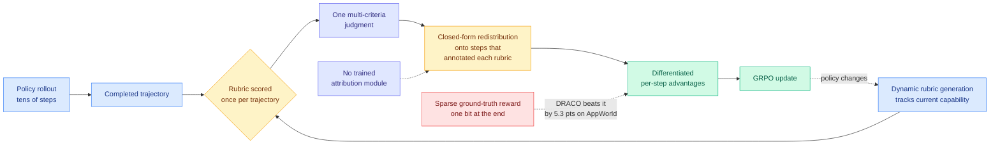

# DRACO: Fine-Grained Credit Assignment with Dynamic Rubrics for Long-Horizon Agent Training

**arxiv:** [2609.04094](https://arxiv.org/abs/2609.04094) · **Source:** [HuggingFace Daily Papers 2026-09-05](../../raw/huggingface/2026-09-05-draco-fine-grained-credit-assignment-with-dynamic-rubrics-fo.md) · **Authors:** Shubham Gandhi, Saurabh Goyal, Kiran Kate, Yara Rizk (IBM) · **Code:** [github.com/IBM/draco](https://github.com/IBM/draco)

## TL;DR

RLVR (reinforcement learning with verifiable rewards, where a programmatic checker decides whether the agent succeeded) works well exactly where someone has written the checker. Most long-horizon agent domains have none, which puts you in the **outcome-blind setting**: you can watch the agent act for forty steps and you have no ground truth about whether it won. The standard substitute is a multi-criteria rubric, judged once at the end of the trajectory. That gives you one scalar for tens of steps, which is a poor signal for the same reason a single grade on a forty-page report tells you nothing about which page went wrong.

DRACO (Distributing Rubric-based Advantage for Credit Optimization) does three things. It **generates the rubrics dynamically during training** so the criteria track the policy's evolving capability rather than being frozen at the level of a model that no longer exists. It **scores those rubrics once per completed trajectory**, keeping the judging cost at one call. And it **redistributes that judgment over the steps responsible for the annotated rubrics**, producing differentiated per-step advantages inside GRPO (group relative policy optimization, where a batch of rollouts for the same prompt is scored and each rollout's advantage is its reward relative to the group mean). The redistribution is **closed-form and introduces no trained attribution module**, which is the design decision that makes the result cheap enough to matter.

The headline number is the one that should be argued about. On **AppWorld**, DRACO gains **15.9 points over the base model** and **5.3 points over GRPO trained with a sparse ground-truth reward**, despite using no verifier at all. Beating the version of yourself that had access to real ground truth is a strong claim, and it means the argument is not "rubrics are an acceptable fallback when you lack a checker" but "a densely addressable approximate signal beats a sparse exact one." On out-of-domain **Tau-Bench**, it gains **5.3 points over the base model even without a frontier judge**, beating both ground-truth-reward training and other rubric-based settings.

## Mechanism

## Key findings

- **+15.9 points over base and +5.3 over verifier-trained GRPO on AppWorld**, with no verifier used by DRACO itself. The approximate dense signal beats the exact sparse one.
- **+5.3 points over base on out-of-domain Tau-Bench without a frontier judge**, beating both ground-truth-reward training and competing rubric-based training setups. The gain is not judge-model-dependent.
- **The redistribution is closed-form.** No learned attribution head, no extra network to train and serve, no second failure mode to debug.
- **Rubrics are regenerated during training**, so the evaluation criteria do not go stale as the policy improves past them. This is the difference between a curriculum and a fixed exam.

## Relation to prior wiki state

**DRACO is the fifth instantiation of a claim the wiki declared a pattern on 08-31, and it is the first one that beats ground truth rather than approximating it.** The general form on [rl-for-llms](../llms-foundation-models/rl-for-llms.md) is: **the value of a reward signal is not its accuracy but its addressability.** [CriPO (08-03)](../llms-foundation-models/2026-08-03-cripo-rubric-rl-self-distillation.md) argued the general case, that GRPO assigning one advantage to a whole rollout is a credit-assignment approximation rather than a neutral design choice, and measured the damage as *Suppressed Criteria* present in over 57 percent of samples at 1.8 per sample. Three papers on 08-31 each localised the advantage to a different span: [RCCA](../llms-foundation-models/2026-08-31-rcca-rubric-to-code-credit-assignment.md) to a code region using the evaluator's own textual attribution, [ContextPilot](2026-08-31-contextpilot-proactive-context-management.md) to a single context-editing action found by context-delta and entropy-delta, and [StepGuard](../responsible-ai/2026-08-31-stepguard-step-level-guardrails.md) to the safe-versus-unsafe action class. **DRACO's span is the step set responsible for an annotated rubric criterion**, which is a fifth partition of the same objective.

**Two of the page's open questions get answers.** The page asked *where does localization stop working*, noting that every instance so far chose a structurally bounded span and that nobody had published on a task whose correctness is a global property. DRACO does not answer that, but it moves the boundary: AppWorld trajectories run tens of steps and the rubric criteria are not textually anchored to a code region the way RCCA's are, so the span is looser than any prior instance and the method still works. The page also asked whether these compose, observing that four fixes at four partitions all claimed orthogonality and none were stacked. DRACO does not stack either, and it is now five.

**The sharper contribution is to the outcome-blind question, which the wiki has approached from the judge side and never from the credit side.** [J-Zero (08-31)](2026-08-31-j-zero-challenger-solver-judge.md) fixed the judge by training only on preference pairs whose ordering is fixed by the generation procedure rather than by the judge's own scores, routing around the failure [More Convincing, Not More Correct (07-26)](../llms-foundation-models/2026-07-26-self-play-reward-hacking-llm-judges.md) documented, where self-play drove a judge's pass rate from 0.72 to 0.94 while true accuracy stayed pinned at 0.20. Both of those make the *judgment* trustworthy. DRACO takes an untrusted judgment and makes it *addressable*, and its AppWorld result argues that addressability is worth more than the 5.3 points that trustworthiness buys, at least on that benchmark. **Whether a trustworthy judgment that is also addressable compounds is the obvious next experiment, and J-Zero plus DRACO is a two-line composition nobody has run.**

**It also sits directly against today's other RL result.** [Locked at the Entrance (09-05)](../llms-foundation-models/2026-09-05-locked-at-the-entrance-rlvr-breadth.md) finds that RLVR contracts solution coverage by up to 67 percent, concentrated at the trajectory's first move. DRACO is a denser-reward method, and denser rewards generally sharpen faster. **Nobody reports coverage or pass@k for a rubric-redistribution method**, so it is entirely open whether DRACO's 15.9 points come with a worse coverage bill than the sparse-reward baseline it beats. That measurement costs one extra eval and would be the most useful thing anyone adds to this paper.

## Gaps

Two benchmarks, one of them out-of-domain, and no reported cost accounting: the rubric generation runs during training and the judging runs once per trajectory, but the paper's framing does not price those against the sparse-reward baseline's near-zero reward cost, so "beats ground-truth-reward GRPO" is a quality claim without an attached budget. The closed-form redistribution presumes the rubric annotation identifies which steps are responsible, and the reliability of that annotation is the load-bearing assumption; a mis-attributed criterion is a mislabelled advantage on a specific step, which is a worse failure than a diffuse one. No diversity or coverage metrics are reported. And AppWorld has a ground-truth reward available, which is how the comparison is possible at all, so the headline result is measured in a domain that is not actually outcome-blind.

## Industrial implication

The practical read is that **you do not need to build the checker first.** Most enterprise agent domains, which is IBM's constituency here, have no programmatic success signal and were therefore stuck at supervised fine-tuning. If a dynamically generated rubric plus closed-form redistribution reaches and passes what a real verifier buys, the barrier to running RL on an internal agent workflow drops from "write an environment with a checker" to "write a rubric and let it evolve." That is a large change in who can run agent RL at all, and it is the kind of claim that will be tested quickly because the code is public.

## Related pages

- [RL for LLMs](../llms-foundation-models/rl-for-llms.md)
- [Agent Evaluation & Benchmarks](agent-benchmarks.md)
- [Multi-Agent Systems](multi-agent-systems.md)
- [Daily digest 2026-09-05](../daily-digest/2026-09/2026-09-05.md)
