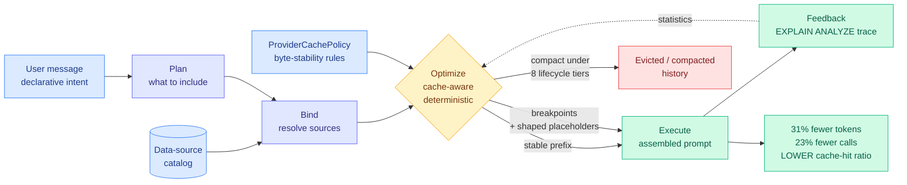

# ContextPipe: Database-Inspired Context Assembly for Long-Horizon Agents

**Source:** Kurate cs.AI leaderboard #15 (surfaced, not scored) · [arXiv 2609.00749](https://arxiv.org/abs/2609.00749) · MatrixOrigin (Peng Xu, Zuyu Zhang, Yuze Sun, Feng Tian, Long Wang) with Chen Zhang (Tsinghua)
**Raw:** [raw/kurate/2026-09-06-cs-ai.md](../../raw/kurate/2026-09-06-cs-ai.md)

## TL;DR

Every production agent has a function that decides what goes into the next prompt, in what order, and what gets thrown away when the window fills. In practice that function is not one function. It is a prompt builder, a compaction routine, a set of cache-break workarounds, and a per-provider shim, written by four different people at four different times and never audited as a unit. ContextPipe's claim is that this scattered logic has an exact analogue that was solved forty years ago: **context assembly is structurally isomorphic to query execution in a relational database.** Both take a declarative intent (a user message, a SQL query) and resolve it against a structured catalog (session state, a schema), under a hard resource budget (the context window, memory and I/O), over a tiered cache (the prompt prefix cache, the buffer pool), and both need to be explainable after the fact (`EXPLAIN ANALYZE`). So ContextPipe builds the database machinery: a five-phase pipeline (Plan, Bind, Optimize, Execute, Feedback), a data-source catalog, a deterministic cache-aware optimizer, and a real `EXPLAIN ANALYZE` trace per request. On the SWE-bench Pro Qutebrowser subset against an append-only baseline it cuts **total token volume by 31%, LLM calls by 23%, and response time by 9%. It does this while achieving a *lower* KV cache-hit ratio.** That last clause is the reason this page exists.

## What the mechanism actually is

The five phases are not decoration. **Plan** turns the incoming turn into a declarative statement of what the prompt needs. **Bind** resolves that against a structured catalog of data sources, which is the piece production systems universally lack: today the set of things that *could* go into a prompt is implicit in whatever the prompt builder happens to call. **Optimize** is the load-bearing phase and it is deterministic rather than learned, choosing the byte layout of the prompt: where stable content goes, where cache breakpoints go, and where shaped placeholders go, all against a configurable `ProviderCachePolicy` so the same agent can target Anthropic's and OpenAI's different caching rules without a shim. **Execute** issues the call. **Feedback** emits an `EXPLAIN ANALYZE` trace and updates statistics that the optimizer reads next time.

Compaction is folded into the optimizer rather than left as a reactive threshold. The paper reports **eight lifecycle tiers** and predictive, percentile-based pressure, which is a real departure from the MemGPT-style pattern of paging when a watermark is crossed. And `ForkPrefix` handles the multi-agent case explicitly: when a parent agent spawns children, the children share the parent's cached prefix rather than each rebuilding it.

The three properties the paper sells are **auditable, replayable, failure-isolated**. Those are database words and they are the actual contribution. A context bug today is unreproducible because the prompt was assembled by imperative code over mutable session state. A context bug in ContextPipe has a plan you can print.

## The result that matters, and why it is uncomfortable

31% fewer tokens, 23% fewer calls, 9% faster, **at a lower KV cache-hit ratio.**

The wiki has been recording the opposite discipline for three weeks. On [2026-08-14](../inference-efficiency/2026-08-14-deepseek-harness-kv-cache-economics.md), DeepSeek repriced cache-hit tokens to roughly 6x their prior cost and simultaneously open-sourced Harness v0.1, whose organizing commitment is that **previously written history is never altered**: when something must change, the harness appends a statement describing the modification rather than editing the prefix, because an in-place edit invalidates every cached token downstream. That entry is on the [KV cache page](../inference-efficiency/kv-cache.md) under the heading "the cache becomes a billing surface," and its practical instruction was: protect the prefix.

ContextPipe reorders and compacts. It breaks prefixes deliberately. And it still wins on the bill, because it is optimizing a different objective. **Cache-hit ratio is a ratio; the bill is a product.** A cache-hit ratio is hits over total tokens sent, and ContextPipe reduces the denominator by 31%. You can lose the ratio and still send far less money through the API, because the tokens you never assembled cost nothing at any cache tier.

**This is a genuine tension and neither paper is wrong.** DeepSeek's rule is correct for a workload whose context is going to be sent anyway (an agent re-reading the same files every turn, where the only question is whether the prefix survives). ContextPipe's rule is correct for a workload where a real fraction of the accumulated history did not need to be sent at all. The two are optimal in different regimes and **nobody has published the crossover point.** That is the concrete missing experiment.

## Key results

- **31% reduction in total token volume, 23% fewer LLM calls, 9% lower response time** against an append-only context construction policy, on the SWE-bench Pro Qutebrowser subset.
- **A lower KV cache-hit ratio than the baseline**, reported by the authors as an explicit cost of the approach rather than hidden.
- **Eight lifecycle tiers with predictive percentile-based pressure**, replacing reactive threshold paging.
- **`ForkPrefix` for multi-agent cache sharing**, which is the first mechanism in this wiki addressing prefix reuse across a parent and its spawned children rather than within one session.

## How this relates to prior wiki pages

**It is the missing systems layer under [agent harness engineering](agent-harness-engineering.md).** That page's 09-02 entry records [Harness-of-Harness](2026-09-02-harness-of-harness.md) settling the harness thesis as "constrain verifiable outputs, not agent workflows." ContextPipe is orthogonal in exactly the way that framing wants: it sits inside any loop (ReAct, Reflexion, LangChain, AutoGen) as a request-assembly layer and does not touch the loop's topology. It is a harness component that constrains a verifiable output, the assembled prompt, and leaves the agent's decisions alone.

**It supplies a partial answer to that page's open problem 6, budget enforcement.** The 08-30 entry closed with the observation that every cost result on the harness page is denominated in tokens or dollars while no harness in the wiki publishes an enforced ceiling, and that an agent which cannot predict its own runtime cannot participate in a time-for-money trade. ContextPipe enforces a hard token budget externally, deterministically, per request, and prints the plan. That is a token ceiling, not a wall-clock ceiling, so the problem is half-closed.

**It is the assembly-side counterpart to [Declarative Attention (09-03)](../inference-efficiency/2026-09-03-declarative-attention.md).** DA lets the model declare which part of an already-resident context it needs, cutting attended tokens 52.0% on Gemma-4-31B for 1.27pp of accuracy. ContextPipe decides which part of the available material becomes context in the first place. **One reduces the read over a fixed cache; the other reduces what enters the cache.** They compose trivially and neither cites the other, which makes composition the cheap experiment: DA's saving is a fraction of what ContextPipe already shrank by 31%.

**And it belongs to the pattern the wiki has been tracking all week.** [Select, Compress, Reinvest (09-05)](../inference-efficiency/2026-09-05-select-compress-reinvest-visual-tokens.md) found that compression pays nothing until the freed budget is reinvested, and recorded that as the seventh decision on the [test-time compute allocation page](../inference-efficiency/test-time-compute-allocation.md). ContextPipe banks its saving as a lower bill and reinvests nothing. **By SCR's finding, that leaves two to three points of quality on the table, and ContextPipe never runs the ablation.** The reinvestment question is now open in a second modality.

## Gaps

- **"Preliminary evaluation," one benchmark subset.** The Qutebrowser subset of SWE-bench Pro is a single repository. Nothing here establishes that the 31% survives a different codebase, let alone a non-coding agent.
- **No cost accounting for the optimizer itself.** Planning, binding, optimizing and emitting an `EXPLAIN ANALYZE` trace on every single API call is work. The paper reports the saving and not the price, which is the same omission the harness page has logged against six consecutive papers.
- **The cache-hit crossover is unmeasured.** The result is one point on a curve. At what context length, cache-price ratio and history-redundancy level does append-only beat plan-and-compact? That is a two-axis sweep and it decides which discipline a given production system should adopt.
- **The database analogy carries an admitted hole.** Query optimizers work because they can estimate cardinality. ContextPipe cannot quantify information value per token, so the "optimizer" is a deterministic policy engine with statistics rather than a cost-based optimizer in the database sense. The paper says so; the analogy is a source of structure, not of guarantees.
- **`ForkPrefix` is described, not measured.** Multi-agent prefix sharing is where the largest cache savings should live, and there is no multi-agent number.

## Related pages

- [agent-harness-engineering.md](agent-harness-engineering.md) · [agent-memory.md](agent-memory.md) · [multi-agent-systems.md](multi-agent-systems.md)
- [KV cache](../inference-efficiency/kv-cache.md) · [test-time compute allocation](../inference-efficiency/test-time-compute-allocation.md)
- [DeepSeek Harness v0.1 and cache-hit repricing (08-14)](../inference-efficiency/2026-08-14-deepseek-harness-kv-cache-economics.md) · [Declarative Attention (09-03)](../inference-efficiency/2026-09-03-declarative-attention.md) · [Four cache layers (08-29)](../inference-efficiency/2026-08-29-four-cache-layers-kv-prefix-prompt-semantic.md)
