# Towards Self-Driving Codebases (Cursor): what actually breaks when you run thousands of agents

**Source:** X home feed → [cursor.com/blog/self-driving-codebases](https://cursor.com/blog/self-driving-codebases) · Wilson Lin, Cursor
**Raw:** [`raw/twitter/feed/2026-09-09-morning-ranked.json`](../../raw/twitter/feed/) (article content captured with the post, gitignored)

## TL;DR

Cursor built an agent harness to orchestrate many thousands of coding agents and ran it continuously for **one week**, during which the agents made the vast majority of commits to a research project (a web browser engine). The value of the writeup is not the milestone, it is that it is an unusually honest **failure log of harness design**, and every failure is a distributed-systems failure rather than a model failure.

The line that circulated, and the one worth keeping: **workers are unaware of the larger system. They do not communicate with any other planner or worker. They work on their own copy of the repo, and when done they write a single handoff that the system submits to the planner that requested the task.**

## The failure sequence

```mermaid
flowchart LR
  V1[Single agent<br/>+ long plan] -->|loses track,<br/>false success| V2[Manual parallel agents<br/>on a dependency graph]
  V2 -->|no feedback,<br/>no shared view| V3[Self-coordination via<br/>shared state file]
  V3 -->|lock abuse,<br/>20 agents to 1-3x throughput| V4[Roles: planner /<br/>executor / worker / judge]
  V4 -->|bottlenecked by<br/>slowest worker, too rigid| V5[Continuous executor<br/>no upfront full plan]
  classDef input fill:#dbeafe,stroke:#3b82f6,color:#1e3a8a
  classDef warn fill:#fee2e2,stroke:#ef4444,color:#7f1d1d
  classDef output fill:#d1fae5,stroke:#10b981,color:#065f46
  class V1,V2 input
  class V3 warn
  class V4,V5 output
```

**Self-coordination through a shared file failed hardest, and specifically.** Agents held locks too long, forgot to release them, tried to lock or unlock when illegal, and did not understand the significance of holding a lock. More prompting did not help. Contention was severe enough that **20 agents ran at the throughput of 1 to 3**, with most time spent waiting. An explicit wait-on-another-agent tool was given and rarely used. Lockless optimistic concurrency reduced overhead without eliminating confusion.

**The subtler failure is behavioral, not mechanical.** With no structure between agents, **no agent took on big complex tasks**. They avoided contention and conflict, opting for smaller and safer changes rather than taking responsibility for the project. Absent ownership, a population of capable agents converges on timidity.

**Roles fixed it.** A planner lays out the approach and deliverables. A single **executor** owns the plan end to end and is the sole lead. Workers take spawned tasks, giving linear throughput scaling. An independent **judge** runs after the executor to decide whether it finished and whether another iteration should run. The residual problem is that upfront planning makes the system rigid and it becomes bottlenecked by the slowest worker, which is what pushed them toward a continuous executor.

**Observability was the tool that found all of this.** All agent messages, system actions and command outputs logged with timestamps, replayable, and piped back into Cursor to find patterns across large volumes. They found the git-restore contention that way.

## How this relates to prior wiki pages

**It is a direct field test of the [agent harness engineering page](agent-harness-engineering.md)'s "transcript is the wrong carrier" thesis, and it agrees.** That page crossed a pattern threshold on 09-07 with five results in two days arguing the raw transcript is the wrong thing to carry between steps: ContextPipe plans the prompt rather than appending (31% fewer tokens), SKILL.state replaces history with structured state, Harness-of-Harness passes an evidence bundle, [Iris (09-07)](2026-09-07-iris-search-agents.md) finds the context policy outweighs the model gap, and [the Handoff Tax (09-07)](../ai-routing/2026-09-07-handoff-tax-model-switching.md) finds a raw transcript across a model boundary is actively harmful. **Cursor's worker writes one handoff and knows nothing about the system.** That is the same design rule discovered independently under production pressure, and it is the cheapest possible version of it.

**It contradicts the shared-blackboard pattern that most multi-agent frameworks still ship.** The [multi-agent systems page](multi-agent-systems.md) records repeated proposals for shared scratchpads and coordination state. Cursor tried exactly that first and measured a 7-to-20x throughput loss to lock contention. **That is the strongest negative result on shared mutable coordination state this wiki holds**, and it comes with a mechanism: the agents do not model the cost of holding a lock, and prompting does not install that model.

**It supplies the missing operational context for the day's Navier-Stokes story.** The 10,000-agent coordination question that dominated the feed on 09-09 was answered by people pointing at this post: the coordination trick is that there is no coordination between workers, only isolated repos and single handoffs upward.

## Gaps

- One project, one codebase, one team's harness. The browser engine is a good stress test and a single data point.
- No cost accounting. "Spend 10x more compute for 10x more throughput" is the stated ambition; the writeup does not report whether that ratio held.
- Commit correctness and synchronization overhead are named as sections; the free reading here does not give quantitative results for either.
- Model-dependence is real and admitted: the harness was rebuilt around OpenAI models after GPT-5.1/5.2 showed better instruction-following for long-running agents. How much of the design survives a model swap is untested.

## Related

- [Agent Harness Engineering](agent-harness-engineering.md) (concept page)
- [Multi-Agent Systems](multi-agent-systems.md) (concept page)
- [The Handoff Tax (09-07)](../ai-routing/2026-09-07-handoff-tax-model-switching.md)
- [Iris: search agents (09-07)](2026-09-07-iris-search-agents.md)
