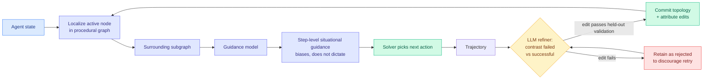

# Procedural Graphs: Self-Evolving Execution Structures for LLM Agents

**Source:** HuggingFace Daily Papers · [arXiv 2609.09153](https://arxiv.org/abs/2609.09153)
**Raw:** [`raw/huggingface/2026-09-09-procedural-graphs-self-evolving-execution-structures-for-llm.md`](../../raw/huggingface/2026-09-09-procedural-graphs-self-evolving-execution-structures-for-llm.md)

## TL;DR

A knowledge graph stores facts as (entity, relation, entity) triplets and answers **what-is** questions. This paper proposes the **Procedural Graph**, which stores (procedure, relation, procedure) triplets and answers **what-to-do** questions. The motivation is that most agents choose actions by unconstrained generation over an accumulating history, which leaves the procedural knowledge (what to do, in what order, under which conditions) implicit and therefore lost as trajectories lengthen. Symptoms: the agent loses the objective, calls tools out of order, and repeats unproductive actions.

At each step the framework **localizes the agent's active node** in the graph and a guidance model turns the surrounding subgraph into step-level situational guidance that **biases the solver's next action without dictating it**. The graph is self-evolving: an LLM refiner contrasts failed trajectories against successful ones and edits topology and attributes, committing only edits that preserve or improve held-out validation performance, while **retaining rejected edits to discourage repetition**. Starting from a minimal skeleton the loop builds graphs that match or surpass hand-designed ones, and it can repair a flawed expert prior.

## Mechanism

Two design details are the paper's real contribution. **Guidance biases rather than dictates**, so the graph is a prior over actions rather than a state machine, which is what lets a wrong graph be survivable. And **rejected edits are kept**, so the refiner has a record of what it already tried and failed, which is the cheapest form of not repeating yourself.

## How this relates to prior wiki pages

**It is the fourth distinct proposal in a month for what an agent's loop should carry, and the first to carry a structure over *actions* rather than over *state or context*.** The [agent harness engineering page](agent-harness-engineering.md) records the others: SKILL.state replaces conversation history with mutable structured state, ContextPipe plans the prompt like a relational query, Harness-of-Harness passes an evidence bundle, and [KVMem (09-08)](../inference-efficiency/2026-09-08-kvmem-kv-context-virtualization.md) keeps everything as paged KV. All four are about **what the agent knows**. The Procedural Graph is about **what the agent is supposed to do next**, which is a genuinely separate axis and composes with any of them.

**It answers a validation-gating question the [self-evolving agents page](self-evolving-agents.md) has open.** That page's standing concern is that self-improvement loops optimize what they can see and drift, a concern [today's loop-as-asset essay](2026-09-09-loop-as-asset-bounded-self-improvement.md) states as an operating rule: the more autonomy the loop has, the more evaluation must sit outside its reach. The Procedural Graph puts a **held-out validation gate on every commit**, which is that rule implemented. This is the pattern to hold the next self-evolving proposal to.

**Against [Recuris (08-26)](2026-08-26-recuris-experiential-working-memory.md)**, which composed verified working state, need-grounded skill retrieval and validation-gated self-optimization into one system, the Procedural Graph is the narrower and more legible piece: one artifact, one edit rule, one gate. Whether an explicit graph beats Recuris-style retrieved skills at the same budget is untested and is the obvious comparison.

## Gaps

- **No ablation isolating the graph from the guidance model.** A guidance model that reads the recent trajectory and emits situational advice, with no graph at all, is the control and it is not reported here.
- "Match or surpass hand-designed graphs" is the headline for the self-evolution loop, but the cost of running the refiner against the cost of a human writing the graph once is not accounted for.
- Localization of the active node is load-bearing and its error rate is unreported. Mislocalization means guidance from the wrong subgraph.
- The benchmarks are described as multiple datasets, task types and LLMs, without long-horizon agentic environments named, which is exactly where the stated failure modes (losing the objective, tool misordering) are worst.

## Related

- [Agent Harness Engineering](agent-harness-engineering.md) (concept page)
- [Self-Evolving Agents](self-evolving-agents.md) (concept page)
- [Recuris: experiential working memory (08-26)](2026-08-26-recuris-experiential-working-memory.md)
- [Your AI model is a rental, but the loop is an asset (09-09)](2026-09-09-loop-as-asset-bounded-self-improvement.md)
