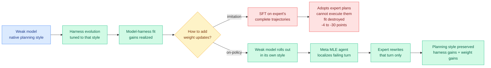

# Co-Evolving Harnesses and Models: imitation breaks the fit the harness was built around

**Source:** HuggingFace Daily Papers, cross-source confirmed via social (@omarsar0, @dair_ai, @sarahookr) · Salesforce AI · [Paper](https://arxiv.org/abs/2609.09134) · [raw](../../raw/huggingface/2026-09-10-co-evolving-harnesses-and-models-on-policy-correction-helps.md)

## TL;DR

Salesforce evolved an agent harness (the system prompt, tool set, execution hooks and context-management scaffolding around a model) around a *weak* model on seven enterprise agent tasks, then did the thing everyone does next: fine-tuned the weak model on a strong expert's complete trajectories collected under that same evolved harness. **Performance regressed on all seven tasks, by 4 to 30 points, across both Qwen3-Coder and Gemma 4.** The same fine-tuning procedure *helps* under the un-evolved harness. The diagnosis is the interesting part: imitation does transfer knowledge and does increase scaffold usage, but it makes the weak model adopt the expert's planning strategy without the competence to execute it, and **the harness was evolved around the weak model's native planning style, so the weight update destroys the model-harness fit that the harness update just bought.** Their fix is on-policy expert correction: let the weak model roll out, have a meta-level agent localize the single failing turn, and ask the expert to rewrite **only that turn**.

## The mechanism

## Key findings

- **Harness evolution around a weak model works, and the resulting harness transfers *upward*.** A stronger expert dropped into the harness evolved for the weaker model uses it *more* effectively than the weak model does. That gap is what suggested expert supervision could close the remainder, and it is why the negative result that follows is genuinely surprising rather than an obvious blunder.
- **Complete-trajectory imitation regresses on 7 of 7 tasks, 4 to 30 points, on two different model families.** Not a noisy result on one benchmark. The effect is directional and consistent.
- **The same SFT helps under the un-evolved harness.** This is the control that makes the story a contention result rather than a "SFT is bad" result. The harm is created *by* the harness having been specialized.
- **Mechanism: imitation raises scaffold usage but disrupts model-harness fit.** The weak model learns the expert's planning strategy, executes it badly, and no longer matches the scaffolding that was co-designed around how it naturally plans.
- **On-policy expert correction recovers both gains.** A meta-level MLE agent automates localization of the failing turn inside the weak model's own rollout; the expert rewrites that turn alone. Planning style is preserved, so the harness stays fitted, and the weight update still injects expert competence where the rollout actually broke.

## How this relates to prior wiki pages

**It is the first paper on [agent-harness-engineering.md](agent-harness-engineering.md) where the harness and the weights actively fight each other.** Every prior entry on that page treats the harness as a free-standing lever: [Iris (09-07)](2026-09-07-iris-search-agents.md) found the inference-time context policy outweighs most reported model differences, and the [09-09 trading fleet record](2026-09-09-llm-trading-agents-production.md) found agent fixed effects absorb 60% of behavioural variance while the user's strategy prose predicts nothing. Those say the harness dominates. This says something sharper: **once a harness has been fitted to a model, the model is no longer free to move.** The page's thesis that the harness is the primary object of design acquires a cost, which is that harness specialization creates a lock-in on the weights.

**It sharpens the trajectory question that [the Handoff Tax (09-07)](../ai-routing/2026-09-07-handoff-tax-model-switching.md) and [NeoHorse-1 (09-09)](../ai-routing/2026-09-09-neohorse-1-routing-harness-rsi.md) left in tension.** The Handoff Tax found that dropping a weaker model's trajectory on escalation and passing only artifacts lifts recovery from 47% to 64% on Claude and 36% to 84% on GPT, so a foreign trajectory is bad *context*. NeoHorse-1 found that a router's own interleaved trajectories are excellent *training data*, lifting a 4B model most of the way to a 9B base. Yesterday's digest summarized this as "a trajectory is bad context and good training data." **Today's paper cuts the second half in two: your own trajectory is good training data, and someone else's trajectory is bad training data too, at least once your scaffolding has been shaped around you.** The corrected statement is that trajectories are only valuable on-policy, in both roles.

**It converges with [OPRD (09-09)](../inference-efficiency/2026-09-09-oprd-on-policy-reverse-distillation.md) and [TIP](../inference-efficiency/knowledge-distillation.md) on the same underlying claim from three different layers.** OPRD, which accelerates a strong student using a weak teacher's delta (RL expert minus base) rather than the teacher's outputs, argues you should transfer the *direction of improvement* and not the teacher's behavior. TIP, which found most teacher-generated tokens carry no learning signal and roughly 10% suffice, argues you should transfer only the tokens that matter. This paper argues you should transfer only the *turn* that broke. **Three papers, three granularities (direction, token, turn), one claim: wholesale imitation of a stronger model is the wasteful default, and the win comes from locating the minimal delta.** That is the third instance, which by this wiki's threshold makes it a pattern rather than a coincidence.

## Gaps

Seven enterprise tasks from one company, with the task suite not independently held out, so the "all seven regress" figure is strong on consistency and weak on external validity. Only LoRA-style lightweight fine-tuning is tested, so whether full fine-tuning or RL post-training shows the same contention is unknown, and it matters because the proposed mechanism (planning-style drift) should be dose-dependent. The meta-level MLE agent that localizes the failing turn is itself an expert-model cost that the paper does not price against the cheaper alternative of just running the expert. And there is no ablation that measures "model-harness fit" directly; the fit story is inferred from the behavioural change rather than instrumented, which leaves open the simpler explanation that the expert's trajectories are just off-distribution in a way that has nothing to do with the harness.

## Industrial implication

For anyone running a small model behind a specialized scaffold, and that is the standard cost-reduction play, this changes the order of operations. **Harness evolution and fine-tuning are not independent budget lines you can spend in either order.** Evolve the harness, then only ever train on the model's own rollouts with expert edits localized to the failure, never on expert transcripts. In a quarter this should show up as agent platforms shipping "correction" data collection instead of "demonstration" data collection, which is a meaningfully different logging and labeling product. The uncomfortable corollary for the vendor side: a harness tuned tightly to one model is an asset that depreciates the moment you want to swap the model underneath it, which is exactly the coupling a routing layer is supposed to avoid.

## Related

- [agent-harness-engineering](agent-harness-engineering.md) — the concept page this updates
- [self-evolving-agents](self-evolving-agents.md) — automated harness evolution lineage
- [knowledge-distillation](../inference-efficiency/knowledge-distillation.md) — TIP, OPRD, the minimal-delta pattern
- [Handoff Tax (09-07)](../ai-routing/2026-09-07-handoff-tax-model-switching.md) — trajectories as bad context
- [NeoHorse-1 (09-09)](../ai-routing/2026-09-09-neohorse-1-routing-harness-rsi.md) — trajectories as good training data
