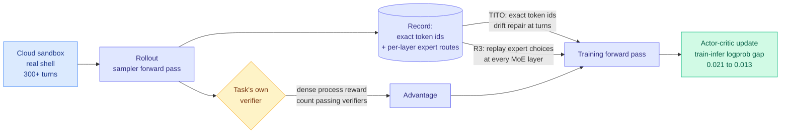

# T1: replaying the sampler's expert routes is what makes MoE agent RL stable

**Source:** HuggingFace Daily Papers · [Paper](https://arxiv.org/abs/2609.11042) · [raw](../../raw/huggingface/2026-09-10-t1-terminal-agent-reinforcement-learning-for-long-horizon-ta.md)

## TL;DR

T1 is a 122B mixture-of-experts model (MoE: each token routes through a small subset of specialized sub-networks) trained with reinforcement learning to operate a **real shell in a cloud sandbox for 300+ tool-call turns per task**, rewarded by executing each task's own verifier. On Terminal-Bench 2.1 it takes the base model from **43.8% to 64.0%**; on Long-Horizon Terminal Bench it reaches 27.9% and beats GPT-5.4 and GLM-5.1. The headline number is agentic, but the load-bearing contribution is an infrastructure one. Long-horizon RL on an MoE model breaks because the trajectory you *sampled* and the trajectory you *train on* are not the same computation: tokenizer round-trips drift at turn boundaries, and the router picks different experts during the training forward pass than it did during rollout. T1's two fixes are **TITO** (train on the exact sampled token identifiers, with drift repair at turn boundaries) and **R3, rollout routing replay** (record the sampler's per-token expert choices at every MoE layer and replay them during training). Together they cut the training-to-inference log-probability difference from **0.021 to 0.013** with exactly zero token drift in the loss region.

## The mechanism

## Key points

- **Rollout routing replay is the transferable idea.** In a dense model, replaying the sampled tokens is enough to reproduce the forward pass. In an MoE model it is not, because routing is a discrete decision that can flip under a slightly different numerical path, and a flipped route means a different subnetwork computed the logprob you are now differentiating. Recording routes as part of the trajectory turns the MoE into a deterministic function of the recorded trace. Any lab doing RL on a sparse model needs this, and most have presumably rediscovered it privately.
- **The 0.021 to 0.013 logprob gap is the real result.** Everything else follows from it. A policy-gradient method whose sampled and trained distributions disagree is optimizing a moving target, and long-horizon tasks amplify the disagreement over 300 turns.
- **The reward is a dense process signal, not a terminal one:** score each trajectory by the absolute number of passing verifiers. That gives gradient on partially-correct 300-turn rollouts, which a binary terminal reward would waste entirely.
- **Training corpus is deliberately out of distribution:** isolated seeds and synthesized tasks disjoint from Terminal-Bench 2.1, so the 43.8 to 64.0 gain is capability transfer rather than benchmark fitting. That is the right control and few agent RL papers run it.

## How this relates to prior wiki pages

**It answers, at the infrastructure level, the staleness problem [Online Draft Co-Training (09-09)](../inference-efficiency/2026-09-09-online-draft-co-training-speculative-rl.md) attacked from the other end.** That paper built branch-attention-in-ring-attention to keep a separate speculative draft model synchronized with a policy that is being updated by RL, because a stale drafter silently degrades rollout speed. T1's R3 is the same class of problem, sampler and trainer disagreeing, solved for the router rather than the drafter. The shared lesson is that **RL on modern serving stacks fails at the seams between the inference engine and the training engine**, not in the algorithm.

**It confirms the direction of [Terminal Universe (09-04)](2026-09-04-terminal-universe-trajectories-to-environments.md), which argued that rebuilding executable environments from recorded agent trajectories yields better training signal than imitating the original runs, because a workspace can be re-solved with new tasks while a recording can only be copied.** T1 builds synthesized terminal tasks disjoint from the benchmark and rewards them with per-task verifiers, which is that thesis operationalized at 122B. Two independent results now say **the environment, not the trajectory, is the reusable asset.**

**It composes awkwardly with [Co-Evolving Harnesses (09-10)](2026-09-10-co-evolving-harnesses-on-policy-correction.md), which found that fine-tuning a weak model on a strong expert's complete trajectories under a harness evolved around the weak model regressed performance on all seven enterprise tasks by 4 to 30 points, because imitation destroys model-harness fit.** T1 is pure on-policy RL, so it never imports another model's planning style and sidesteps that failure entirely. Read together, the two papers say: **on-policy signal is compatible with harness evolution; off-policy imitation is not.** That is a cleaner rule than either paper states alone.

**It is also the third entry this week grounding [agent-training-environments.md](agent-training-environments.md) in verifier-executed reward** rather than model-judged reward, which continues the drift away from LLM-as-judge in agentic RL.

## Gaps

No cost accounting. Sandboxed 300-turn rollouts on a 122B MoE are extraordinarily expensive and the paper reports no GPU-hours, no rollout throughput, and no comparison against a smaller model with more rollouts at matched budget. The R3 mechanism requires the inference engine to expose per-layer routing decisions, which most do not, so reproduction depends on infrastructure the paper does not release. And Terminal-Bench 2.1 at 64.0% is still a long way from usable autonomy.

## Industrial implication

The routing-replay trick is the part that will diffuse fastest, because every frontier lab now post-trains sparse models and every one of them hits this. Expect it to appear in open RL frameworks within a quarter, phrased as "deterministic MoE rollout replay." The broader signal is that terminal-operating agents are being trained as a first-class capability rather than emerging from general coding ability, which is consistent with the harness-engineering direction dominating practitioner attention this month.

## Related

- [Agent harness engineering](agent-harness-engineering.md) · [Agent training environments](agent-training-environments.md) · [RL for LLMs](../llms-foundation-models/rl-for-llms.md) · [Tool calling](tool-calling.md)
