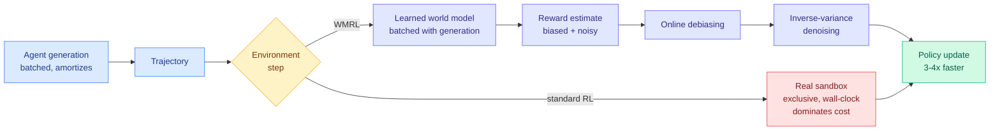

# WMRL: replace the sandbox with a world model and research-agent RL gets 3-4x cheaper

**Source:** HuggingFace Daily Papers · [Paper](https://arxiv.org/abs/2608.12564) · [raw](../../raw/huggingface/2026-09-10-scaling-automatic-research-agents-via-world-models.md)

## TL;DR

Every automatic-research-agent trajectory has two halves that scale completely differently. **Generation** (the agent writing code and reasoning) shares compute across a batch, so it amortizes. **Environment execution** (actually running the experiment) occupies an exclusive sandbox and consumes real machine time, so it does not amortize at all. As trajectories get longer, execution dominates the RL bill and becomes the bottleneck. **World Model RL (WMRL)** removes it: replace the real environment with a learned world model that predicts the outcome. The obvious objection is that the world model is wrong, so its rewards carry bias and noise. WMRL adds two corrections, **Online Debiasing** and **Inverse-Variance Denoising**, and proves that both strictly improve the convergence guarantee. Empirically it accelerates training **3-4x** across task types and agent scales while exceeding standard RL baselines, and the post-trained **4B and 9B agents outperform open-weight agents of 48B and 120B** on held-out benchmarks. It also transfers to post-training embodied vision-language-action policies.

## The mechanism

## Key points

- **The diagnosis is the contribution.** Naming the asymmetry ("generation batches, execution does not") explains why agentic RL cost scales worse than intuition suggests and why longer horizons make it worse superlinearly in practice.
- **Two mitigations, two distinct failure modes.** Online debiasing corrects a systematic offset in the world model's reward; inverse-variance denoising downweights high-variance estimates. Both come with convergence proofs, which is rare for a systems-motivated fix.
- **A 4B agent beating a 120B open-weight agent on held-out tasks is the strongest efficiency claim here**, and it is a training-compute-allocation argument: cheaper environment steps buy more of them, and more RL steps beat more parameters on these tasks.
- **The VLA transfer is a real generality check** and not decorative, since embodied policies have the same expensive-environment problem in a much worse form.

## How this relates to prior wiki pages

**It sits in direct tension with [T1 (09-10)](2026-09-10-t1-terminal-agent-rl.md), which trains a 122B MoE against a real cloud shell for 300+ turns and rewards it with each task's own executable verifier, lifting Terminal-Bench 2.1 from 43.8% to 64.0%.** T1's entire correctness story rests on the environment being real: the verifier executes, so the reward cannot be gamed. WMRL's entire cost story rests on the environment being simulated. **Both landed on HuggingFace the same day and they are opposite bets on the same tradeoff.** The reconciliation the field needs is a measurement of where the world model's reward diverges from the executed verifier's, and neither paper provides it.

**It extends the environment-over-trajectory thesis from [Terminal Universe (09-04)](2026-09-04-terminal-universe-trajectories-to-environments.md), which showed that reconstructing executable workspaces from recorded runs beats imitating those runs, because a workspace can be re-solved and a recording can only be copied.** WMRL goes one step further: do not reconstruct the workspace either, *learn* it. The progression across two weeks is trajectory to environment to learned environment, and each step trades fidelity for throughput.

**It gives a mechanism to the recursive-self-improvement thread on [self-evolving-agents.md](self-evolving-agents.md).** The binding constraint on RSI-style loops has been the cost of the evaluation step, since every candidate improvement must actually be run. A learned world model that is 3-4x cheaper and provably convergent under bias correction is exactly the lever that makes those loops economically plausible, which is a fact worth noting alongside the week's alarm about recursive self-improvement rather than separately from it.

## Gaps

No characterization of where the world model fails. "Imperfect" is handled statistically via bias and variance corrections, but a world model that is confidently wrong about a specific class of experiment produces a correlated error that neither mitigation addresses. Held-out benchmark wins do not establish that the agents learned to do research rather than to satisfy a learned reward. And the 3-4x is a training-time speedup, with the cost of training the world model itself not visibly amortized into the comparison.

## Related

- [Self-evolving agents](self-evolving-agents.md) · [Agent training environments](agent-training-environments.md) · [RL for LLMs](../llms-foundation-models/rl-for-llms.md)
