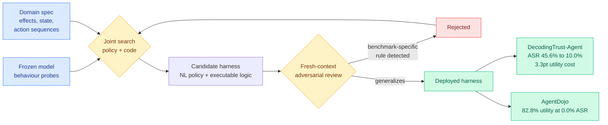

# EvoSafeHarness: Evolving Model- and Domain-Specific Harnesses for Securing Agents

**Source:** HuggingFace Daily Papers, arXiv 2609.05903
**Raw:** [raw/huggingface/2026-09-11-evosafeharness-evolving-model-and-domain-specific-harnesses.md](../../raw/huggingface/2026-09-11-evosafeharness-evolving-model-and-domain-specific-harnesses.md)
**Links:** [arXiv](https://arxiv.org/abs/2609.05903)

## TL;DR

A safety harness is the enforcement layer that sits around a model and blocks bad actions before they reach the world, as opposed to model-level defences baked into the weights. Today every serious harness is written once by experts and then applied across whatever model and whatever domain it is pointed at. EvoSafeHarness's argument is that this is structurally wrong, because **effective protection is deployment-dependent in two independent ways**. Models differ in how much enforcement they can absorb before utility collapses, so a harness strict enough for one over-blocks another. Domains differ in which effects, which state and which action sequences have to be governed, so a policy that transfers across domains misses application-specific safety relations. The system synthesizes a harness for a *frozen* model in a *target* domain by jointly searching a natural-language policy and the executable code that enforces it, guided by observed model behaviour, a domain specification, and fresh-context adversarial review whose job is to reject rules that only work on the benchmark.

## Key results

- **DecodingTrust-Agent:** average attack success rate falls from 45.6% to 10.0% at a 3.3-point utility cost, best score in 14 of 15 cells.
- **AgentDojo:** 82.8% utility at 0.0% attack success rate, which is **twice CaMeL's utility at the same operating point**, and the synthesized harness transfers unchanged to unseen AgentDyn suites.
- **Agent-SafetyBench:** best score for every victim model, with mean attack success rate held below 20% under adaptive PAIR attacks at a refinement budget of 16.
- The analysis separates the two dependencies cleanly: **domain semantics determine which safety relations and trajectory state need governing; model and runtime behaviour determine how and where those relations get enforced.**

## How this relates to prior wiki pages

**The same method, on the same day, against a different objective.** [SoL-Pi (09-11)](2026-09-11-sol-pi-harness-auto-research.md), NVIDIA's open-source release, runs an automated research loop over harness modifications optimizing for **token cost**, and cut usage 45-49% while keeping about 94% of task score. EvoSafeHarness runs a search over policy plus executable code optimizing for **attack success rate at fixed utility**. Neither cites the other. Two groups converging on "search the harness, do not hand-write it," on one day, with different objective functions, is the clearest signal yet that the [agent harness engineering page](agent-harness-engineering.md) should treat harness synthesis as a shipped technique rather than a research direction.

**The adversarial-review step is this wiki's disagreement-as-signal pattern arriving in a safety setting.** The [knowledge distillation page](../inference-efficiency/knowledge-distillation.md) has recorded four instances of the principle that the conflict between two independent signals is the highest-information location in a trajectory, and [Task-CoEvolve (08-25)](2026-08-25-task-coevolve-adaptive-validation-selection.md) applied it to harness evaluation by concentrating validation on tasks where candidate harnesses disagree. EvoSafeHarness uses a *fresh-context* adversarial reviewer specifically to catch rules that fit the benchmark and nothing else, which is the same structure: a second, deliberately uncorrelated judge whose disagreement with the optimizer is treated as evidence of overfitting rather than noise. Fresh context is the mechanism that keeps the two signals independent, and it is the detail most search-based safety work omits.

**It makes the safety-utility frontier a deployment-time artifact.** Prior harness results on this wiki established that a harness transfers across base models. EvoSafeHarness's finding is the complement and is more useful: a *safety* harness should not transfer unchanged, because the enforcement budget a model can absorb is a property of that model. That reframes the standard "our defence generalizes" claim as a weakness rather than a strength.

## Gaps

The frozen-model assumption is load-bearing and unexamined. A harness synthesized against one checkpoint's behaviour is tuned to that checkpoint's failure profile, and models get updated silently behind APIs, so the resynthesis cadence is an operational question with no answer here. The search cost is not reported at all, which is the obvious comparison against a human-written harness that you pay for once. And the adversarial reviewer is itself a model, so the whole frontier is bounded by what that reviewer can imagine attacking, which is exactly the generalization the method claims to buy.

## Research angle

The composition with SoL-Pi is the paper neither group wrote. Both search a harness; one minimizes tokens, one minimizes attack success. Those objectives are in tension in a specific and measurable way, because several of SoL-Pi's four optimizations (ObservationPack indexing tool results, the Evidence-Preserving Reducer handing logs to a cheaper model) put *less* information in front of the enforcing layer. A joint search under both objectives would produce the first measured safety-cost Pareto frontier for agent harnesses, and there is currently not a single published point on that curve.

## Related

- [Agent harness engineering](agent-harness-engineering.md)
- [SoL-Pi: harness auto-research loop (09-11)](2026-09-11-sol-pi-harness-auto-research.md)
- [Task-CoEvolve: adaptive validation selection (08-25)](2026-08-25-task-coevolve-adaptive-validation-selection.md)
- [Self-evolving agents](self-evolving-agents.md)
