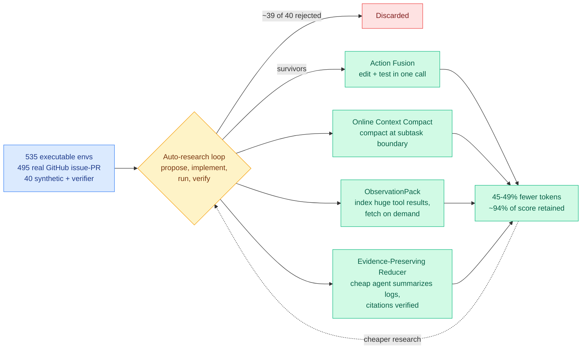

# SoL-Pi: NVIDIA open-sources an auto-research loop that optimizes agent harnesses

**Source:** NVLabs (NVIDIA), MIT-licensed open-source release. Surfaced across the X home feed 2026-09-11, most fully by @MaxForAI
**Raw:** [raw/twitter/feed/2026-09-11-afternoon-120914.json](../../raw/twitter/feed/)
**Links:** [Post](https://x.com/MaxForAI/status/2098050525279478059)

## TL;DR

SoL-Pi (Scaling Auto-Research Loops for Efficient Agent Harnesses) is not a new agent harness. It is an **efficiency layer built on top of an existing one** (Pi), produced by pointing an automated research loop at the question "how should this harness be changed." NVIDIA built 535 executable training environments, 495 of them derived from real GitHub issue-and-pull-request pairs and 40 synthetic tasks with verifiers attached, then let the loop propose harness modifications, implement them, run the experiments and check the results. Roughly **1 idea in 40 survived**. Four did, and together they cut token usage 45% to 49% against stock Pi while retaining about 94% of the average task score, for roughly a one-third cost reduction. Against each model's own native harness the saving is larger: 35% to 64% fewer tokens, 50% to 54% lower cost at list API prices. On GPT-5.6 Sol, SoL-Pi scores higher on EdgeBench than the native Codex harness does.

## The four surviving optimizations

Each is a token-economy decision, and all four are the kind of thing a human harness author would plausibly never bother to test.

1. **Action Fusion.** After editing a file, fold the test or run invocation into the *same* tool call rather than issuing it as a separate one. Each avoided round trip is a full model turn: the accumulated context re-sent, the response decoded, the loop re-entered.
2. **Online Context Compact.** Do not wait for the context window to approach its limit before compacting. Decide at **subtask completion boundaries** whether compaction is worthwhile. Compaction timing becomes a semantic decision rather than a capacity-triggered emergency.
3. **ObservationPack.** Stop re-injecting enormous tool results into the context every turn. Keep an index, retrieve the specific part when it is actually needed.
4. **Evidence-Preserving Reducer.** Hand long logs to a cheaper model for summarization, then **verify each cited piece of evidence individually** against the original. This is the one that distinguishes the release from ordinary log-summarization: cheap summarization of logs is standard and lossy, and the per-citation verification is what makes it safe to act on.

NVIDIA's own name for the direction is **Efficiency for Efficiency**: a cheaper harness makes the auto-research loop cheaper, which buys more experiments per budget, which finds a cheaper harness.

## How this relates to prior wiki pages

**It closes a gap the [harness engineering page](agent-harness-engineering.md) has carried since spring, and opens a sharper one.** That page recorded harness evolution results ([A²E and Evo-Bench, 08-11](2026-08-11-harness-evolution-cluster.md), DarwinX and AutoDesign on 08-14) showing a harness transferring across base models and agent frameworks. Every one of those optimized for *task score*. SoL-Pi optimizes for **tokens at near-constant score**, which is a different objective and, for this reader's purposes, the more useful one. It also reports the search yield honestly, 1 in 40, which is a number the harness-evolution literature has generally not published and which is the single most informative figure for anyone deciding whether to run such a loop themselves.

**Two of the four optimizations are the [KV cache page's](../inference-efficiency/kv-cache.md) open crossover question, answered by search rather than by analysis.** That page recorded two opposed disciplines with no measured boundary between them: append-only prefix protection, which wins where the accumulated context was going to be sent regardless, versus plan-and-compact, which wins where a real share of the history did not need sending. [ContextPipe (09-06)](2026-09-06-contextpipe-database-context-assembly.md) demonstrated the second, cutting total token volume 31% while *lowering* the KV cache-hit ratio, because a token that is never assembled costs nothing at any cache tier. ObservationPack and Online Context Compact are both plan-and-compact moves, and a 45-49% token cut is a larger win than ContextPipe's 31%. The page asked for a crossover sweep across context length and cache-price ratio; SoL-Pi does not publish one, but its search implicitly found the crossover on this task distribution and landed firmly on the compact side.

**And it is the closest thing yet to the standing gap on the [LLM routing page](../ai-routing/llm-routing.md).** That page has flagged for four months that nothing in production routes over harnesses, even though harnesses demonstrably transfer across models, and that the routable unit is the model-harness pair. SoL-Pi still does not route. It *searches*, offline, for one good harness. But the EdgeBench result, where SoL-Pi on GPT-5.6 Sol beats that model's own native Codex harness, is direct evidence that the model-harness pairing is not fixed by the vendor and that the pairing choice is worth real money. That is the empirical precondition a harness router needs.

**Context from the same week.** [EvoSafeHarness (09-11)](2026-09-11-evosafeharness-safety-harness-synthesis.md) landed on HuggingFace the same day and runs the identical structure, an automated search over natural-language policy plus executable code, against a safety objective instead of a cost objective. Two groups, one day, one method, two objectives. The [self-evolving agents page](self-evolving-agents.md) should treat harness search as having crossed from a research pattern into a shipped artifact.

## Gaps

Everything here is reported through a secondary social summary rather than a paper, so the numbers should be held loosely until the repository's own benchmarks are read directly. The 94% score retention is an *average* and no per-task distribution is given, which matters because a token-saving optimization that fails catastrophically on 6% of tasks is a different product from one that loses 6% uniformly. The 535 environments are dominated by GitHub issue-and-PR tasks, so the four optimizations are tuned to software-engineering agent traffic, and Action Fusion in particular assumes an edit-then-test rhythm that does not generalize to research or data-analysis loops. And the Evidence-Preserving Reducer's per-citation verification is itself model calls, so the net saving depends on the cheap model actually being cheap.

## Research angle

The genuinely novel claim buried in this release is the **recursion**: an efficiency gain in the harness compounds into more search per budget, which yields further efficiency gains. That is a measurable claim and nobody has measured it. The experiment is to run the loop for N rounds, feeding each round's harness back as the substrate for the next, and plot cost-per-accepted-idea against round number. If it falls, the Efficiency-for-Efficiency framing is real and this is the first concrete self-improvement loop in this wiki that operates on infrastructure rather than on weights. If it plateaus after one round, the four optimizations were simply the low-hanging fruit and the framing is marketing.

## Related

- [Agent harness engineering](agent-harness-engineering.md)
- [Self-evolving agents](self-evolving-agents.md)
- [EvoSafeHarness (09-11)](2026-09-11-evosafeharness-safety-harness-synthesis.md)
- [ContextPipe: database-style context assembly (09-06)](2026-09-06-contextpipe-database-context-assembly.md)
- [KV Cache](../inference-efficiency/kv-cache.md)
