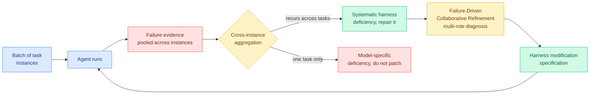

# Ecdysis: Efficient and Effective Training of Runtime Harnesses for LLM Agents

**Source:** arXiv [2609.11677](https://arxiv.org/abs/2609.11677) · surfaced via [@dair_ai](https://x.com/dair_ai) on the X home feed
**Authors:** Ruiqing Yue, Yu Cui, Zhuoyu Sun, Sicheng Pan, Xianhong Xue, Tingyu Li
**Raw:** [X feed capture](../../raw/twitter/feed/2026-09-12-morning.md)

## TL;DR

Self-evolving harnesses (the execution scaffold around a model: the loop, the tools, the context policy, the retry logic) are usually improved by iterative search, where you run the agent, watch it fail, patch the harness, and repeat. That is slow, because every candidate needs repeated agent runs, and it overfits, because each individual failure gets patched as though it were a harness bug. Ecdysis's diagnosis is that **an observed failure can be the model's fault or the harness's fault, and nobody was distinguishing them**. It aggregates failures across a *batch* of task instances, looks for patterns that recur across tasks, and repairs only those. Result: **1.84x faster harness training** and **18.56% better reasoning accuracy** in the resulting harness.

## The core idea, stated plainly

Existing harness-evolution methods treat every failure as evidence. Ecdysis treats a failure as **ambiguous** evidence, and the ambiguity has a specific shape: did the harness fail to give the model what it needed, or did the model simply not do the thing it was given? Patching the first is a durable improvement. Patching the second is what the paper calls "unnecessary model-specific accommodation," and it is exactly how a harness accumulates rules that stop making sense the moment you change models.

The mechanism that resolves the ambiguity is **batch-level cross-instance failure aggregation**. If a failure mode shows up once, on one task, it is probably the model. If it shows up across many unrelated tasks, something structural in the harness is causing it. That is a cheap and correct-feeling signal, and it also happens to be why the method is faster: you are diagnosing a batch in one analysis pass rather than running a search iteration per failure.

On top of that sits **Failure-Driven Collaborative Refinement**, a multi-role diagnosis step that turns aggregated failure evidence into an explicit harness modification specification and iterates on the specification rather than on the code directly.

## How this relates to the rest of the wiki

**It gives a name and a mechanism to the failure mode the [agent harness engineering page](agent-harness-engineering.md) recorded on 09-08 as "catastrophic remembering."** That entry covered a study of 247,694 instructions across 1,867 GitHub repositories finding that `CLAUDE.md` and `AGENTS.md` files exhibit a **ratchet**: a bug appears, someone appends "never do this again," and over time nobody remembers why a rule exists so nobody dares delete it. The page named the concrete gap as **a missing admission criterion**, because nothing was measuring whether a stored instruction is still load-bearing. **Ecdysis is the first result on this wiki that proposes one.** Its criterion is recurrence across independent tasks, and it is applied at write time rather than as a later cleanup. That is the right place to apply it, and it is a direct answer to a question that page left open four days ago.

**It sharpens, and partly contradicts, the two automated harness searches from [09-11](2026-09-11-sol-pi-harness-auto-research.md).** NVIDIA's SoL-Pi and [EvoSafeHarness (09-11)](2026-09-11-evosafeharness-safety-harness-synthesis.md) both ran automated search over harness space, and [Co-Evolving Harnesses and Models (09-10)](2026-09-10-co-evolving-harnesses-on-policy-correction.md) from Salesforce argued the harness and the model should be optimized jointly. **Ecdysis says the joint framing is where the overfitting comes from.** If you co-evolve, you cannot tell a harness repair from a model accommodation, because the whole point is that both move. Ecdysis deliberately holds the model fixed and spends its effort separating the two sources of failure. These are not compatible design philosophies, and the crossover experiment is straightforward: run Ecdysis-trained harnesses and co-evolved harnesses on a **held-out model swap**. Ecdysis predicts its harnesses transfer and co-evolved ones do not. Nobody has run it.

**It is the efficiency face of a theme the reader's saved reading has been tracking all quarter.** The private curation trail's largest theme is loop/harness/graph engineering at 13 saves, well ahead of inference and KV cache at 7. Ecdysis is where those two themes meet: it is a harness paper whose headline number is a **training-cost** reduction, not a capability gain. [Ben Lorica's "the loop is an asset" essay (09-09)](2026-09-09-loop-as-asset-bounded-self-improvement.md) made the deflationary version of this argument in prose, that the first payoff of self-improvement is cheaper AI rather than smarter AI. **Ecdysis is the measured version: 1.84x on the training bill, with the accuracy gain as the secondary result.**

## Gaps

The 18.56% accuracy improvement has no stated baseline family, so it is unclear whether the comparison is against a naive search method or against the strongest published harness-evolution system. More importantly, **the central claim, that Ecdysis-repaired harnesses generalize better to unseen tasks, is argued from the mechanism rather than demonstrated on a held-out distribution shift**. Cross-task recurrence is a heuristic for "systematic," not a proof of it, and a failure mode can recur across many tasks because the *model* has a consistent weakness, which is precisely the case Ecdysis claims to exclude. That is the ablation the paper needs and does not appear to have.

## Industrial implication

Harness evolution is currently expensive enough that only labs do it. Cutting the training cost by nearly half moves it into reach for application teams who are already maintaining a harness by hand and appending to it forever. The more consequential effect is the discipline rather than the speed: **a rule that only earns its place by recurring across independent tasks is a rule you can justify deleting**, which is the first credible brake on the instruction ratchet. Expect this to show up not as a research artifact but as a linting pass over agent instruction files, which is a much easier thing to ship than a search loop.

**Related:** [agent harness engineering](agent-harness-engineering.md) · [self-evolving agents](self-evolving-agents.md) · [Co-Evolving Harnesses and Models (09-10)](2026-09-10-co-evolving-harnesses-on-policy-correction.md) · [SoL-Pi (09-11)](2026-09-11-sol-pi-harness-auto-research.md) · [EvoSafeHarness (09-11)](2026-09-11-evosafeharness-safety-harness-synthesis.md)
