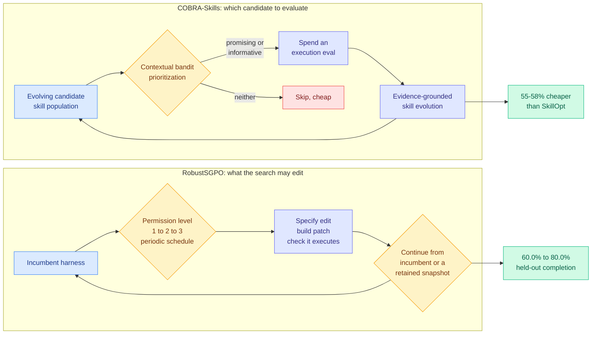

# Harness search gets a budget: COBRA-Skills and RobustSGPO

**Sources:** COBRA-Skills, arXiv [2609.11682](http://arxiv.org/abs/2609.11682), published 2026-09-10, Kurate cs.AI #18, ai_rating 6.0/10. RobustSGPO, arXiv [2609.09646](http://arxiv.org/abs/2609.09646), published 2026-09-09, Kurate cs.AI #17. Both absent from HuggingFace Daily Papers. Raw: [`raw/kurate/2026-09-13-cs-ai.md`](../../raw/kurate/2026-09-13-cs-ai.md).

**TL;DR.** Two papers from different groups, one week apart, both asking the same question the harness-optimization literature has been avoiding: **what does the search itself cost, and how do you spend a fixed budget on it.** COBRA-Skills treats skill optimization as budgeted sequential optimization, using a contextual bandit to decide which candidate skills are worth the expense of an execution-based evaluation, and reports the strongest average performance across six agent benchmarks at **55-58% lower optimization cost than SkillOpt** using only 50 unique optimization examples per benchmark. RobustSGPO asks what the search is allowed to *edit*, finds that a periodic 1→2→3 escalation of edit permission beats always granting maximum permission by 0.28 test-score points, and lifts held-out task completion from 60.0% to 80.0% under a 20-million-token budget. Together they move this wiki's harness thread from "search works" to "search has a cost curve and a search-space design."

---

---

## COBRA-Skills: the evaluation is the expensive part

**The framing.** LLM agents benefit from reusable skills distilled from prior task experience, and the existing methods for optimizing those skills rely on **execution-based evaluation**, which means actually running the agent on tasks. That is the dominant cost and it scales with the number of candidates, not with the number of good candidates.

**The mechanism.** Formulate skill optimization as budgeted sequential optimization over a dynamically evolving candidate space. A contextual bandit prioritizes which candidates get an evaluation, selecting for candidates that are either **promising** (likely to be good) or **informative** (likely to reduce uncertainty about the space), which is the standard exploration-exploitation split applied to a place nobody had applied it. Evidence-grounded skill evolution then refines the population from execution feedback.

**Numbers.** Strongest average performance among compared methods across six heterogeneous agent benchmarks and three target models, at **55-58% lower optimization cost than SkillOpt**, using **only 50 unique optimization examples per benchmark**. Two robustness results matter more than the headline: it holds up under changes to the agent harness, and it works when the target model itself generates and refines the skills, which removes the dependency on a stronger teacher.

## RobustSGPO: the search space is a design decision

**The framing.** Semantic-gradient prompt optimization improves harnesses using execution feedback, but its local update rule leaves two things unspecified: **what scope of edit to request, and which operation to apply.** RobustSGPO makes both explicit, specifies the requested edit, constructs and checks the patch (so the candidate is executable before it is scored), and continues search from either the incumbent or a retained snapshot.

**Scale of the study.** The AgentX brainstorming workflow, 120 tasks, 95 runs, **7,350 candidate attempts**. That is a large enough search log to make the ablations credible, and it is more search data than most papers on this page report.

**The three findings.**
1. **Periodic 1→2→3 permission scheduling beats fixed maximum permission by 0.28 test-score points.** Always allowing the largest edit is worse than escalating. More freedom is not better.
2. **Held-out completion on 30 unseen tasks rises from 60.0% to 80.0%** and test quality from 3.77 to 4.14, under a 20-million-token budget.
3. **Retention policy has a shape.** Category retention (keeping snapshots grouped by task family) reduces degradation on source tasks after a distribution shift, while random retention reaches a higher endpoint on the destination. There is a measurable retention overhead and the paper names it rather than hiding it.

---

## How this relates to prior wiki pages

**They answer the question [SoL-Pi (09-11)](2026-09-11-sol-pi-harness-auto-research.md) made unavoidable.** SoL-Pi, NVIDIA's auto-research loop over harness modifications, published the single most useful number in this literature: **roughly 1 accepted idea in 40 proposed**. The [harness page](agent-harness-engineering.md) recorded that as the key decision input for anyone considering running such a loop. COBRA-Skills is the direct response: if 39 of 40 candidates are waste and each costs an execution, **spend the evaluation budget by expected information gain instead of uniformly.** Two papers, one week, one asking what the yield is and one asking how to raise it. That is the sequence a field goes through when a technique stops being a demo.

**Together with SoL-Pi they complete a three-way split of the harness-optimization objective, and the wiki should now name it.** SoL-Pi optimizes **tokens at near-constant score**. [EvoSafeHarness (09-11)](2026-09-11-evosafeharness-safety-harness-synthesis.md) optimizes **attack success at near-constant utility**, cutting average attack success from 45.6% to 10.0% at a 3.3-point utility cost on DecodingTrust-Agent. COBRA-Skills optimizes **the cost of the optimization itself**. Three objectives, three papers, all within a fortnight, none citing the others. The harness page's 09-11 entry said "the objective splits in two." It has split in three, and the third one is meta: it is about the search, not the artifact.

**RobustSGPO's permission-escalation finding is a new instance of a pattern this wiki keeps meeting.** [Task-CoEvolve (08-25)](2026-08-25-task-coevolve-adaptive-validation-selection.md) cut harness evaluation count 80% by concentrating on validation tasks where candidates disagree. EvoSafeHarness used a fresh-context adversarial reviewer whose disagreement with the optimizer signals overfitting. RobustSGPO finds that constraining the edit scope on a schedule beats maximum freedom. **All three say the same thing: an unconstrained search over harnesses overfits, and the productive move is to restrict something (which tasks you score on, who judges, how big an edit you may make).** That is now three instances and crosses this wiki's threshold for a named pattern: *harness search needs a regularizer, and the regularizer lives in the search design rather than in the objective.*

**The retention result touches [Ecdysis (09-12)](2026-09-12-ecdysis-harness-training.md) directly.** Ecdysis gave the instruction ratchet its first admission criterion, repair only what recurs across tasks, and reported 1.84x faster harness training with 18.6% better accuracy. RobustSGPO's category-versus-random retention result is the same question one level up: **Ecdysis decides which repairs to admit, RobustSGPO decides which past harnesses to keep as restart points.** Category retention protecting source tasks while random retention reaches a better destination is a stability-plasticity tradeoff with a measured shape, and nobody has composed the two policies.

## Gaps

Neither paper reports wall-clock or dollar cost, only relative optimization cost and token budgets, so the 55-58% saving cannot be converted into a decision without knowing SkillOpt's absolute expense. COBRA-Skills' six benchmarks are heterogeneous but all are agent benchmarks, so the "informative candidate" signal the bandit learns may be benchmark-shaped. RobustSGPO's 0.28-point permission-scheduling result is a small effect on one workflow (AgentX brainstorming) and should not be generalized to code-editing harnesses without replication. And neither runs the experiment that would matter most: **a budgeted search under two objectives at once**, which is still the empty cell this wiki has been flagging since 09-11, because there is not one published point on the harness safety-versus-cost Pareto frontier.

## Industrial implication

These are the papers that make harness search a line item rather than a research project. A team can now ask: what is my accepted-idea yield, what does one evaluation cost, and what is my budget, and get an answer from published numbers. Expect the bandit-prioritized evaluation loop specifically to show up in agent-optimization products within two quarters, because it is a wrapper around an existing pipeline and cuts the dominant cost by more than half without touching the artifact being optimized.

## Related pages

- [Agent harness engineering](agent-harness-engineering.md)
- [Self-evolving agents](self-evolving-agents.md)
- [The Menu Is an Execution Prior (09-13)](../ai-routing/2026-09-13-state-path-tool-menus.md)
- [The Last AI Built by Humans: RSI survey (09-13)](2026-09-13-last-ai-built-by-humans-rsi.md)
