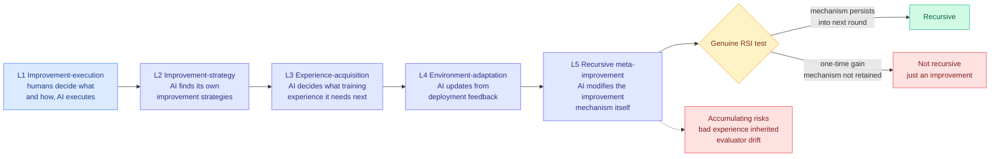

# The Last AI Built by Humans: Toward Genuine Recursive Self-Improvement

**Source:** arXiv [2609.11873](https://arxiv.org/abs/2609.11873), published 2026-09-10. Surfaced via the X home feed on 2026-09-13 through two independent Chinese-language explainer threads ([@Xudong07452910](https://x.com/Xudong07452910/status/2098671122886635863), [@Kay2289123](https://x.com/Kay2289123/status/2098655849723760769)) and an endorsement from [@omarsar0](https://x.com/omarsar0/status/2098712516737343884). Not on HuggingFace Daily Papers, not on this week's Kurate leaderboards. Raw: [`raw/twitter/feed/2026-09-13-afternoon-121448-ranked.json`](../../raw/twitter/feed/).

**TL;DR.** A survey and roadmap for recursive self-improvement (RSI), defined as an AI system turning experience and feedback into **persistent** changes that improve both its capabilities and the process by which it makes future improvements. The paper's useful contribution is a definitional bar, not a technique: it separates a one-time performance gain from genuine recursion, and it stakes the difference on whether **the new improvement mechanism survives into the next round and produces a stronger successor under comparable budget and independent evaluation.** It also introduces the Headroom-Closed Index (HCI) to characterize what current LLMs are actually short of, and it lays out five levels of autonomy. This matters today because a frontier lab CEO cited RSI as one of two reasons the industry should slow down, and this is the clearest available statement of what would have to be true for that citation to be measurable.

---

---

## What it claims

**Five levels of autonomy, ordered by how many R&D decisions the system takes over.** At the bottom, humans decide what to change and how, and the AI executes. Then the AI starts finding its own improvement strategies. Then it decides what training experience the next round needs. Then it updates continuously from deployment feedback. At the top, **L5, it modifies the improvement mechanism itself**: redesigning its own search strategy, its evaluator, and how the next generation of candidates gets produced and filtered.

**The distinction the paper exists to draw.** A one-time performance gain does not demonstrate recursive evolution. Two conditions have to hold. The new improvement mechanism must be **retained** and participate in the next round. And under comparable budget with independent evaluation, it must actually produce a stronger successor. This is a falsifiability criterion, and it is the reason this survey is worth a summary page when most surveys are not.

**The Headroom-Closed Index** is introduced up front as a diagnostic on existing LLMs, characterizing how much of the available improvement on a task a system has actually closed. The paper uses it to argue current models are not at the frontier of their own achievable performance, which is the precondition for self-improvement having anything to work with.

**Scenario-dependence is the practical finding.** Scientific discovery, embodied intelligence and software engineering have different requirements and different development speeds. Software engineering is the fast lane because the verification signal is nearly free (compile it, run the tests) and the artifact being improved is text. Embodied intelligence is the slow lane because every improvement round costs physical time.

**Risks accumulate through the same channel that capabilities do.** Bad experience gets inherited by the next round. An evaluator the system modified is an evaluator it can drift.

---

## How this relates to prior wiki pages

**It supplies the missing definition for a pattern the [self-evolving agents page](self-evolving-agents.md) and the [harness engineering page](agent-harness-engineering.md) have been accumulating instances of for a month without a bar to judge them against.** The harness page records a near-complete ladder of real systems: [A²E and Evo-Bench (08-11)](2026-08-11-harness-evolution-cluster.md) searching over harnesses, [DarwinX and AutoDesign (08-14)](agent-harness-engineering.md) optimizing them against task performance, [Ecdysis (09-12)](2026-09-12-ecdysis-harness-training.md) repairing only failures that recur across tasks, and [NVIDIA's SoL-Pi (09-11)](2026-09-11-sol-pi-harness-auto-research.md) running an auto-research loop over harness modifications that accepted roughly 1 idea in 40 and cut tokens 45-49% at about 94% of task score. **On this paper's ladder every one of them sits at level 2 or 3.** None modifies its own improvement mechanism, and none reports whether an improved mechanism was retained into a subsequent round.

**That makes SoL-Pi's unmeasured claim the single most important open experiment in this area, and this paper names why.** NVIDIA calls its direction *Efficiency for Efficiency*: a cheaper harness makes the research loop cheaper, buying more experiments per budget, finding a cheaper harness. The harness page already flagged that "the recursion is claimed but not measured" and specified the test (iterate N rounds, feed each round's harness back as the next round's substrate, plot cost-per-accepted-idea against round number). **This paper independently arrives at the same criterion from the survey side.** Two sources, different directions, same falsifiable test, and still nobody has run it.

**It directly constrains the day's biggest industry claim.** [Amodei's pacing essay (09-13)](../ai-industry/2026-09-13-pacing-the-frontier.md) names RSI accelerating "since roughly this summer" as one of two triggers for slowing the industry down. Under this paper's bar, "AI is helping build the next generation of AI" is a level-1 or level-2 observation and is not evidence of recursion. **The gap between the claim and the criterion is the story.** It is entirely possible the labs have internal measurements that clear the bar; none is public, and ramez's widely-shared objection on the same day ("both the blog post and the essay cite each other rather than data") lands precisely here.

**The [MemRL](https://arxiv.org/abs/2601.03192) pairing surfaced alongside it is the level-3 instance done without weights.** MemRL evolves via reinforcement learning on episodic memory, decoupling stable reasoning from plastic memory with a two-phase retrieval that filters noise and identifies high-utility strategies through environmental feedback, reporting gains on HLE, BigCodeBench, ALFWorld and Lifelong Agent Bench with **no weight updates**. That is the same architectural bet as [Recuris (08-26)](2026-08-26-recuris-experiential-working-memory.md), which split agent memory into verified working memory and experiential memory retrieved by that state, and as Meta's [Organizational Second Brain (09-02)](https://engineering.fb.com/2026/09/02/ml-applications/organizational-second-brain-ai-learns-from-experts/), which compiles expert corrections into verified, regression-tested knowledge updates without retraining. **Three independent systems now locate the persistent-improvement substrate in retrievable text rather than in parameters**, which crosses this wiki's three-instance threshold for naming a pattern.

## Gaps

It is a survey. The HCI is introduced as a diagnostic but the paper is a roadmap rather than an evaluation, so there is no leaderboard of systems scored against the five levels and no system demonstrated to clear the retention criterion. The "preliminary empirical evidence" it draws on is industry practice reported by the practitioners, which is the weakest evidence class available for a claim about whether a self-improvement loop compounds. And the five levels are a taxonomy without an operationalization: nothing in the paper tells you how to classify a given system from its published artifacts.

## Industrial implication

The retention criterion is cheap to adopt and would immediately change how self-improvement results get reported. Any lab claiming RSI can answer one question: did round N+1 use the mechanism round N produced, and was the successor stronger under matched budget and independent evaluation? Expect that question to start appearing in evaluation reports within two quarters, because it is the form the embedded-evaluator proposal would need in order to verify a pacing commitment on the "internal use of AI to improve AI" input that Amodei's essay lists.

## Related pages

- [Self-evolving agents](self-evolving-agents.md)
- [Agent harness engineering](agent-harness-engineering.md)
- [Agent memory](agent-memory.md)
- [We Must Pace the Frontier (09-13)](../ai-industry/2026-09-13-pacing-the-frontier.md)
