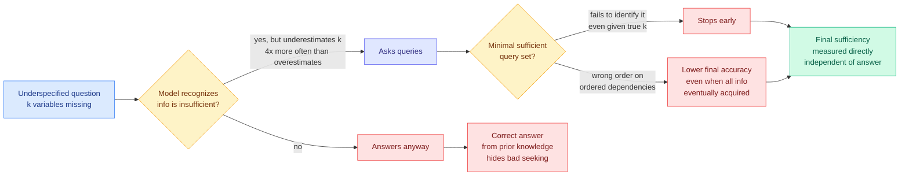

# Do LLMs Know What to Ask and When? MT-INFOSEEK and multi-turn information seeking

**Source:** Yepeng Huang, Jiawen Zhang, Michelle Dai, Xiaorui Su, Shanghua Gao, Zi Wang, Marinka Zitnik. Harvard University and Google DeepMind. Surfaced 2026-09-13 via an image attachment on the X home feed ([@rohanpaul_ai](https://x.com/rohanpaul_ai/status/2098966898742349888)); the abstract was read directly from the attached screenshot. Raw: [`raw/twitter/images/2026-09-13/2098966898742349888-0.png`](../../raw/twitter/images/2026-09-13/).

**TL;DR.** When a user's question is underspecified, a capable model should notice its context is insufficient, identify what is missing, ask for it, and answer only once the information determines a unique answer. This paper formalizes that as solving a **k-underspecified constraint satisfaction problem**, where k is the number of variables jointly required to pin the target, so k is a direct measure of how much information is missing. MT-INFOSEEK is the resulting evaluation suite: 5,251 problems and 9,006 task instances across mathematics, logic, biology, medicine and general knowledge. The load-bearing finding is a measurement one. **Models recognize that more information is needed but systematically underestimate how much**, under-predicting the degree of missing information about four times as often as they over-predict it at k = 2 in logic problems, and they often stop asking before they have enough.

---

---

## What it claims

**The formalization is the contribution.** Multi-turn information seeking is modelled as a k-underspecified constraint satisfaction problem. Fixing k makes "how much is missing" an experimental variable rather than a property of an anecdote, which is what lets the paper sweep underspecification and watch performance degrade.

**Three evaluation axes:** what models ask, when they ask it, and how the acquired information affects the final answer.

**The findings, in order of how much they should change practice.**

1. **Performance degrades across models and domains as underspecification increases.** Expected, but now quantified across five domains.
2. **Models recognize that additional information is needed but underestimate how much.** In logical problems at k = 2 they under-predict the degree of missing information roughly **four times as often as they over-predict it**. This is a directional bias, not noise, and its direction is the dangerous one.
3. **They fail to identify a minimal sufficient set of queries, and improve only marginally when given the true k.** Telling the model how much is missing barely helps, which means the failure is in constructing the query set rather than in estimating the budget.
4. **They often stop before acquiring sufficient information.**
5. **On tasks with ordered dependencies, a wrong query order lowers final accuracy even when the model eventually acquires everything it needs.**

**The methodological move that gives the paper its title's sharpness.** The authors measure information seeking directly through **final sufficiency**, recording whether the acquired information determines the target *independent of answer generation*. That separation exposes differences final accuracy does not capture: **a correct answer can hide bad information gathering**, because the model may have guessed or used prior knowledge. Their conclusion is that the ability to seek information over multiple turns is distinct from the ability to generate answers, and **is not measured by current LLM evaluations.**

---

## How this relates to prior wiki pages

**Finding 5 is an independent arrival at the claim the day's routing paper makes.** [The Menu Is an Execution Prior (09-13)](../ai-routing/2026-09-13-state-path-tool-menus.md) shows that a tool menu ranked by request relevance surfaces the final action while omitting or delaying the tools that produce its inputs, and that routing on a dependency-aware **state path** lifts ToolBench online success from 0.737 to 0.898 with the agent unchanged. MT-INFOSEEK finds that on ordered-dependency tasks, **incorrect query order costs accuracy even when all necessary information is eventually acquired**. One paper measures the model failing at ordering; the other fixes it by moving the ordering out of the model and into the retrieval layer. **Two groups, one day, one claim: the model does not reliably sequence prerequisites, so something outside it should.** Neither cites the other and the composition (state-path menus evaluated on MT-INFOSEEK) is the obvious next experiment.

**The final-sufficiency metric belongs on the [agent benchmarks page](agent-benchmarks.md) as an instrument, not just a result.** That page has recorded repeatedly that outcome-only scoring hides process failures, most consequentially in this wiki's running observation that benchmark accuracy does not predict deployment robustness. Final sufficiency is a concrete, cheap, domain-general way to score the process: did the acquired context determine the answer, yes or no, regardless of what the model then said. **It is the rare process metric that does not require a learned judge**, which puts it in the same useful category as execution-based verification.

**It gives the under-asking failure a number, and that failure is a cost problem as much as a quality one.** An agent that stops asking too early produces a confidently wrong answer, and the repair path is a full retry. An agent that asks too much burns tokens. The four-to-one directional bias says production agents are systematically on the expensive-to-repair side, which is the side where the cost shows up as user-visible failure rather than as a token bill.

## Gaps

Read from the abstract only, so no model list, no absolute numbers beyond the four-to-one ratio at k = 2, and no indication of how the five domains differ from one another in the results. The constraint-satisfaction formalization is clean but narrows the scope: real underspecification is often not a matter of missing variables with a unique determined answer, and the paper's framing cannot represent questions where the right move is to propose an interpretation rather than to ask. Whether a harness-level fix (forcing a query-planning step) closes the gap is not tested.

## Industrial implication

Any product where an agent gathers requirements before acting (support triage, medical intake, code-change scoping) is exposed to the under-asking bias, and almost none of them measure it, because their evaluations score the final answer. Adding a final-sufficiency check to an existing eval is cheap and would immediately separate "the model answered correctly" from "the model had enough to answer correctly," which are currently conflated everywhere.

## Related pages

- [Agent benchmarks](agent-benchmarks.md)
- [Tool calling](tool-calling.md)
- [The Menu Is an Execution Prior (09-13)](../ai-routing/2026-09-13-state-path-tool-menus.md)
