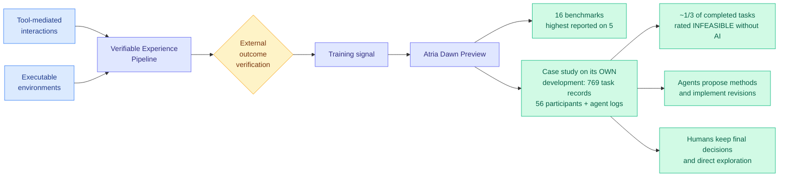

# Atria Dawn: The Dawn of Agentic Superintelligence

**arXiv:** [2609.15818](https://arxiv.org/abs/2609.15818) · **HF Daily Papers:** [page](https://huggingface.co/papers/2609.15818) · **Date:** 2026-09-15
**Raw:** [farmer file](../../raw/huggingface/2026-09-15-atria-dawn-the-dawn-of-agentic-superintelligence.md)

## TL;DR

Ignore the title, which is doing the paper no favours. Atria Dawn Preview is a foundation agentic language model aimed at scientific research and engineering workflows, trained through a **Verifiable Experience Pipeline** that connects tool-mediated interactions to executable environments and externally verified outcomes. Across 16 benchmarks spanning real research, engineering and digital work it is competitive with frontier agents and posts the highest reported score on five.

The benchmark result is not the interesting half. The interesting half is that the authors instrumented **their own development process** and published it as a case study: **769 task records from 56 participants**, alongside the agent logs. Two findings come out of that.

First, when asked to evaluate completed work under comparable conditions, participants rated about **one-third of completed AI-assisted tasks as infeasible without AI**. Not slower, not more tedious. Infeasible. That is a much stronger claim than a productivity multiplier and it is the first number in the wiki that tries to measure it directly from a research organization's own logs.

Second, and more carefully stated: **agents frequently propose methods and implement revisions, while humans retain most final decisions and guide exploration through judgment and feedback.** The authors read this as a shift from task-level execution to project-level partnership, with human effort concentrating on what is worth pursuing and how evidence should settle a question. The paper closes on the argument that progress toward autonomous AI research has to advance **both** the capacity for discovery and the capacity for meaningful human oversight, keeping accountable human authority over risk and direction.

Social commentary circulating the same day framed this as a 96-person lab (65 of them students) at Shanghai AI Laboratory shipping a model on a GLM-5.2 744B-parameter backbone that beats GPT-5.6 and Claude Opus 5 on multiple benchmarks. Treat the parameter and lab-size specifics as unverified secondhand claims; the paper's own framing is more modest.

---

---

## How this relates to the rest of the wiki

**The self-study is the contribution, and it is a genre this wiki has been short of.** [AutoWorldModel-Bench (08-13)](2026-08-13-autoworldmodel-bench.md) measured whether a frontier coding agent could pick its own research direction and improve a world-model starter without being told what "better" means, finding it succeeded in **63 of 64 sessions** with **91% of winning edits being research-style modifications** rather than hyperparameter tweaks. That was a controlled benchmark. Atria Dawn is the same question asked of a real research organization over a real model build, with 769 logged task records. **Two very different methodologies now agree that agents contribute at the level of method proposal rather than execution, which is the specific claim most likely to be dismissed as hype and is now twice-measured.**

**The division of labour it reports is a direct answer to a question [self-evolving-agents](self-evolving-agents.md) framed but could not test.** That page's controlling distinction, from [Ben Lorica's 09-09 essay](2026-09-09-loop-as-asset-bounded-self-improvement.md), separates continual learning, bounded self-improvement, and genuine recursive self-improvement (does the system improve the process that generates improvements). **Atria Dawn sits exactly on the boundary: agents participate in building their successors, but humans still decide what is worth pursuing.** The paper is unusually honest that this is a partnership rather than a handoff, which makes it the most credible RSI-adjacent artifact of the three published today and the one whose title oversells it most.

**It also puts an uncomfortable number under the week's policy argument.** Dario Amodei's [We Must Pace the Frontier](../ai-industry/2026-09-15-pacing-the-frontier-debate.md) essay rests on the claim that AI has been accelerating "driven primarily by AI's growing ability to build the next generation of AI." Atria Dawn is a research organization publishing evidence for exactly that mechanism, from the inside, with a sample size, **two days later and without reference to the debate.** Whether one-third-infeasible-without-AI validates or deflates Amodei's thesis depends entirely on whether you read the human-retains-final-decisions half as a durable structure or as a snapshot.

**Caveat on the comparison set.** The 16-benchmark claim is "competitive with frontier agents, highest reported on five." Highest-reported is not the same as head-to-head under matched harness and budget, and this wiki has repeatedly found that harness choice moves agent benchmark scores more than model choice does. [Iris (09-07)](2026-09-07-iris-search-agents.md) found the inference-time context policy outweighed most reported model differences, and the [production trading-agent record (09-09)](2026-09-09-llm-trading-agents-production.md) found frontier models statistically indistinguishable on decision quality across 416 replayed production scenarios. **Absent a stated harness and token budget, a five-benchmark lead is not yet a capability claim.**

## Gaps

- No cost accounting for the Verifiable Experience Pipeline. Externally verified outcomes in executable environments are the expensive kind of training signal.
- The 769 task records come from participants building the model being evaluated, who have every incentive to rate their own AI-assisted work highly. Self-reported infeasibility is the weakest link in the paper's most quotable number, and there is no blind control arm.
- "Agentic superintelligence" in the title is not supported by anything in the abstract and invites the dismissal the self-study does not deserve.
- Benchmark comparisons lack matched harness and budget, which this wiki now treats as a standing requirement.

## Links

- [self-evolving-agents](self-evolving-agents.md) · [agent-benchmarks](agent-benchmarks.md) · [multi-agent-systems](multi-agent-systems.md)
- [Dream-RSI (09-15)](2026-09-15-dream-rsi-replay-simulator-exploration.md) · [RSIAgent (09-15)](2026-09-15-rsiagent-environment-memory.md)
- [Pacing the frontier debate (09-15)](../ai-industry/2026-09-15-pacing-the-frontier-debate.md)
- [Daily digest 2026-09-15](../daily-digest/2026-09/2026-09-15.md)
