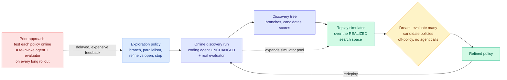

# Dream-RSI: Recursive Self-Improvement through Evolving Worlds

**arXiv:** [2609.14858](https://arxiv.org/abs/2609.14858) · **HF Daily Papers:** [page](https://huggingface.co/papers/2609.14858) · **Date:** 2026-09-15
**Authors:** Tong Zheng, Xidong Wu, Zheng Zhang, Zhankui He, Benjamin Coleman, Wang-Cheng Kang, Heng Huang and others (Google, Google DeepMind, University of Maryland, University of Virginia)
**Raw:** [farmer file](../../raw/huggingface/2026-09-15-dream-rsi-recursive-self-improvement-through-evolving-worlds.md)

## TL;DR

Discovery agents (AlphaEvolve, OpenEvolve and the evolutionary-coding-agent line) generate a candidate, run it, score it, and use the result to generate the next one. Almost all the work on them improves the **candidates**. Dream-RSI moves one level up and improves the **exploration policy**: which branch to expand, how many to run in parallel, whether to refine an existing candidate or open a new direction, and when to stop.

The reason nobody does this is a cost problem with a specific shape. You cannot judge an exploration policy from one action; you have to watch it across a long rollout of hundreds or thousands of generate-and-evaluate cycles. So feedback on a meta-policy is **delayed and expensive**, and the meta-search space is **large**. Testing candidate policies directly means re-invoking the coding agent and the evaluator every time, which is exactly the bill you were trying to reduce.

Dream-RSI's move is to notice that you already paid for the answer. A completed discovery run leaves behind a **discovery tree**: every branch that was expanded, every candidate that was generated, every score that came back. That history can be replayed as a **simulator over the realized search space**. Run a candidate exploration policy inside the replay simulator and you get immediate, off-policy feedback on how it would have navigated the territory you have already mapped, at no model-invocation cost. Refine the policy there, redeploy it online to drive real discovery, and the new run expands the simulator pool for the next round. That is the self-improving loop, and the underlying coding agent is never touched: the orchestration layer sits above it and makes exploration explicit and programmable.

The evaluation spans **algorithm engineering, mathematical optimization, and GPU kernel engineering**, reporting competitive or improved discovery quality while substantially reducing discovery cost in several settings.

---

---

## How this relates to the rest of the wiki

**Dream-RSI is the first entry on [self-evolving-agents](self-evolving-agents.md) whose primary claim is a cost reduction rather than a capability gain, which is the discipline that page has been demanding for a month.** The standing caveat there, recorded on 09-04, is that Environment Evolution was "the ninth consecutive result in this cluster to omit the cost of its own mechanism." Dream-RSI's entire mechanism *is* a way to make the loop cheaper, and the replay simulator is the cheapest possible form of the bounded training trial [BCIT (09-04)](2026-09-04-bcit-conditional-experience-transfer.md) proposed (buy current-state evidence with a small real trial before authorizing an update). Dream-RSI buys that evidence with **zero** real trials by replaying trials already purchased.

**It proposes a fifth explanation for the Evo-Bench plateau, and it is the first one with an obvious intervention.** That page lists four hypotheses for why autonomous harness evolution saturates after a few cycles: [Mendel Gödel Machine (08-12)](2026-08-12-mendel-godel-machine.md)'s single-trajectory variance (edits mostly correct noise), [AutoWorldModel-Bench (08-13)](2026-08-13-autoworldmodel-bench.md)'s evidence that the limit is self-editing *evidence* rather than research ability, Environment Evolution's curriculum starvation (as the agent improves, failures dry up exactly when the signal is needed), and BCIT's stale-precondition waste. **Dream-RSI implies a fifth: the loop plateaus because each cycle can only afford a handful of policy candidates, so the meta-search is under-sampled rather than exhausted.** If replaying history buys a hundred candidate evaluations for the price of none, the saturation point should move. The paper does not run Evo-Bench, and that is the cheap discriminating experiment.

**The sharpest limit is one the paper's own framing implies.** A replay simulator is built from the **realized** search space, so it can only score a policy on territory some earlier policy already visited. A policy whose advantage is that it explores where nothing has gone is exactly the policy the simulator cannot reward. That is a structural conservatism, and it is the meta-level version of the curriculum-starvation problem Environment Evolution identified at the object level: **the loop conditions on its own history and therefore keeps finding refinements of what it already does.** Whether dreaming escapes that or deepens it is the paper's central unanswered question.

**Its GPU-kernel-engineering evaluation domain makes it the sixth entry in the [gpu-kernels](../hardware/gpu-kernels.md) agentic-optimization cluster**, after [AccelOpt (04-20)](../inference-efficiency/2026-04-20-accelopt-gpu-kernel-optimization.md) (Trainium peak-throughput utilization 49% to 61% at 26x lower cost than Claude Sonnet 4), [JAXBench (08-03)](../hardware/2026-08-03-jaxbench-tpu-kernel-optimization.md) (curated TPU docs took Gemini 3 Flash from 5.8% to 37.3% per-sample correctness) and [MaxKernel (09-07)](../hardware/2026-09-07-maxkernel-agentic-tpu-kernels.md) (three autonomy operating points over a shared sub-agent pool, matching expert hand-tuned baselines). **What is new is the level: those four optimize a kernel, Dream-RSI optimizes the strategy for searching kernel space.** And it arrives the same day as a DeepSeek kernel engineer's widely-shared essay estimating six to twelve months until AI-written kernels match his own, which is that cluster's research claim stated as a practitioner's career forecast. See [the essay summary](../hardware/2026-09-15-deepseek-kernel-engineer-rsi-essay.md).

## Gaps

- No numbers in the abstract. "Competitive or improved discovery quality while substantially reducing discovery cost **in several settings**" is a hedge, and the hedge is doing work: the honest reading is that it does not win everywhere.
- The orchestration layer's own cost is unreported, which is the caveat this cluster has now earned ten times running. Dreaming is cheaper than online evaluation but it is not free, and a method whose thesis is cost owes a full accounting including the simulator build.
- No second-order demonstration. Like [NeoHorse-1 (09-09)](../ai-routing/2026-09-09-neohorse-1-routing-harness-rsi.md), this is labelled recursive self-improvement but shows one loop closing, not the improvement rate itself improving. By the vocabulary [Ben Lorica's essay (09-09)](2026-09-09-loop-as-asset-bounded-self-improvement.md) gave this page, it is **bounded self-improvement**, not RSI.
- The replay simulator's fidelity is the whole load-bearing assumption and the abstract does not say how it is validated. A policy that looks good in replay and bad online would be the most informative negative result available, and it is not reported.

## Links

- [self-evolving-agents](self-evolving-agents.md) · [agent-harness-engineering](agent-harness-engineering.md) · [gpu-kernels](../hardware/gpu-kernels.md)
- [RSIAgent (09-15)](2026-09-15-rsiagent-environment-memory.md) · [Atria Dawn (09-15)](2026-09-15-atria-dawn-agentic-research-model.md)
- [Daily digest 2026-09-15](../daily-digest/2026-09/2026-09-15.md)
