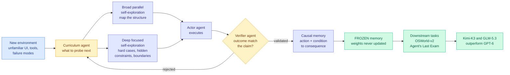

# RSIAgent: Autonomous Exploration for Recursive Self-improvement in New Environments

**arXiv:** [2609.15364](https://arxiv.org/abs/2609.15364) · **HF Daily Papers:** [page](https://huggingface.co/papers/2609.15364) · **Date:** 2026-09-15
**Authors:** Sibo Zhu, Shicheng Fan, Xinyue Wang, Wenyi Wu, Kun Zhou, Biwei Huang (Aether AI, with UC San Diego and UI Chicago affiliations)
**Raw:** [farmer file](../../raw/huggingface/2026-09-15-rsiagent-autonomous-exploration-for-recursive-self.md)

## TL;DR

A computer-use agent dropped into unfamiliar software does not know that application's interface conventions, its tool quirks, or the specific ways it fails. RSIAgent's claim is that the agent can find all of that out by itself, before any task, and that the resulting knowledge is worth more than a model upgrade.

The system is **training-free**: no weight updates, no human demonstrations, no task labels during exploration. Three roles divide the work. A **curriculum** agent decides what to probe next, an **actor** executes in the environment, and a **verifier** independently checks whether the outcome was what the actor claims. What gets retained is not a transcript but **reusable causal relationships between actions, conditions and consequences**, which is the part that makes the memory transferable rather than episodic. Exploration runs **broad-then-deep**: parallel broad self-exploration to map the environment's overall structure, then focused deep exploration to find hard cases, hidden constraints, boundary conditions and causal dependencies the broad pass missed.

The memory is then **frozen** and reused directly on downstream tasks with no parameter updates. On OSWorld-v2 and Agent's Last Exam, that frozen memory lifts **Kimi-K3 and GLM-5.3 past frontier closed-source models including GPT-6**. Two open models beating a frontier closed model on the strength of an environment-exploration artifact is the headline, and it is a statement about where capability currently sits.

---

---

## How this relates to the rest of the wiki

**RSIAgent is the strongest instance yet of the discipline [self-evolving-agents](self-evolving-agents.md) settled on after 09-09: the more autonomy the loop has, the more of the evaluation must sit outside its reach.** The verifier is a separate agent, and validation happens before anything enters memory. That is the same write-time gating [Procedural Graphs (09-09)](2026-09-09-procedural-graphs.md) used (commit only edits that preserve or improve held-out validation performance) and the same admission criterion [Ecdysis (09-12)](2026-09-12-ecdysis-harness-training.md) supplied for harnesses (repair only what recurs across unrelated tasks). Three papers in a week gating writes rather than cleaning up afterwards. **That threshold is crossed: validation-at-write-time is now the field's default, not a proposal.**

**It also answers, partially, the question that page has carried since 07-27 about whether a self-expanding store reaches new territory or refines what it already covers.** [SkillZip (08-12)](2026-08-12-skillzip-skill-compression.md) found the answer for skill libraries was duplication, evidence for saturation. RSIAgent's broad-then-deep schedule is a direct architectural response: the broad pass is explicitly for coverage and the deep pass explicitly for the boundary cases a coverage-seeking pass would skip. **Nobody has plotted the coverage curve for this design either**, and RSIAgent is the first system whose structure would make that plot meaningful, since its two phases have different coverage objectives by construction.

**The frozen-memory result is a cost claim the paper does not frame as one.** Every alternative route to this capability (more supervised data, RL, human demonstrations, a bigger model) is paid per model and repaid on every model change. A frozen environment memory is paid once **per environment** and reused across models, which is why the same artifact lifts both Kimi-K3 and GLM-5.3. That is the same portability result [agent-harness-engineering](agent-harness-engineering.md) has recorded four times (AI4AI strong-to-weak transfer, AutoDesign across seven code-agent-model configurations, Meta-Harness across five held-out frontier models, WikiSkill across model families), now extended to environment knowledge. **The boundary that page states, harness structure is portable and harness evidence is not, holds here: causal action-condition-consequence rules are structure.**

**The open-beats-closed framing deserves scepticism of a specific kind.** GPT-6 is being compared without the same memory. The honest question is what GPT-6 scores *with* RSIAgent's frozen memory attached, and the paper reportedly does not run it. If the memory helps GPT-6 as much, this is a strong result about environment exploration and a weak one about open models. If it does not, that is a much more interesting finding about where frontier models' remaining advantage lives, and it deserves its own paper.

## Gaps

- No exploration cost. Broad parallel exploration plus deep exploration plus an independent verifier on every outcome is a large number of model calls paid before a single user task is served. A method whose selling point is that it avoids training owes the comparison in dollars against a fine-tune.
- Frozen memory cannot track a changing environment. Software updates, and the paper's own premise is that interface conventions are what the model lacks. Staleness is the exact failure [BCIT (09-04)](2026-09-04-bcit-conditional-experience-transfer.md) named as conditional experience transfer: a stored rule is a claim with preconditions that can expire.
- "Recursive self-improvement" is again the wrong label for what is shown. This is one exploration pass producing one memory. There is no second iteration in which the exploration process itself improves, so by the [Lorica vocabulary (09-09)](2026-09-09-loop-as-asset-bounded-self-improvement.md) it is bounded self-improvement.
- The prose memory is on the wrong side of the [copyable-context trilemma (08-03)](../responsible-ai/2026-08-03-copyable-context-safety-trilemma.md), and an autonomously-built environment memory is a larger attack surface than a hand-written one, since nothing human ever reads it.

## Links

- [self-evolving-agents](self-evolving-agents.md) · [agent-memory](agent-memory.md) · [gui-agents](gui-agents.md)
- [Dream-RSI (09-15)](2026-09-15-dream-rsi-replay-simulator-exploration.md) · [Atria Dawn (09-15)](2026-09-15-atria-dawn-agentic-research-model.md)
- [Daily digest 2026-09-15](../daily-digest/2026-09/2026-09-15.md)
