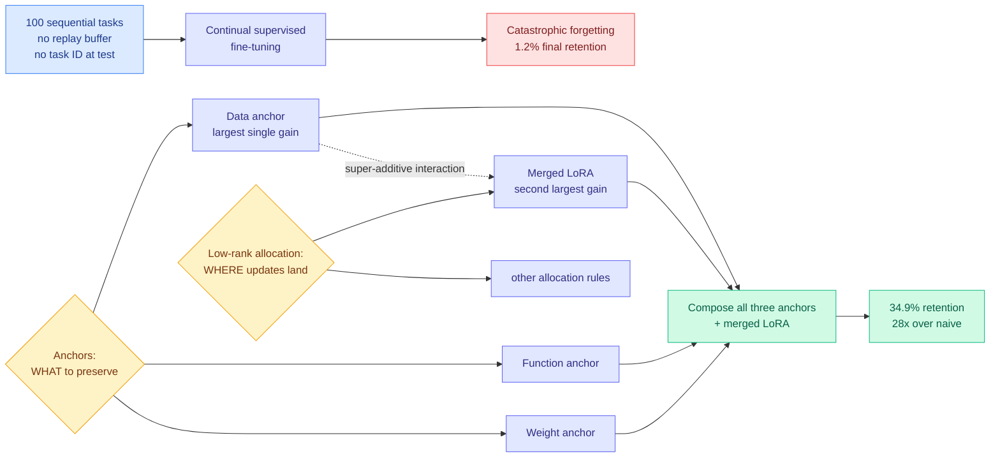

# Continual Learning Mechanisms Compose for Long-Horizon Memorization

**Date ingested:** 2026-09-16
**Source:** HuggingFace Daily Papers · [arXiv 2609.06986](https://arxiv.org/abs/2609.06986)
**Raw:** [raw/huggingface/2026-09-16-continual-learning-mechanisms-compose-for-long-horizon.md](../../raw/huggingface/2026-09-16-continual-learning-mechanisms-compose-for-long-horizon.md)
**Authors:** Zheyuan Zhang, Alvin Zhang, Daniel Khashabi, Tianmin Shu (Johns Hopkins)

## TL;DR

Teach a language model 100 things one after another, never letting it revisit earlier examples and never telling it at test time which task a question belongs to, and naive sequential fine-tuning retains **1.2%** of what it learned. No single continual-learning mechanism fixes this at that horizon. The paper's claim is that mechanisms which address *different sources* of forgetting compose super-additively, and the composed best method reaches **34.9% retention, a 28-fold improvement**. The two dimensions that matter are **anchors** (what each update should preserve) and **low-rank allocation** (where successive updates are stored).

## Design space

## What it does

**The setting is new and deliberately harsh.** Long-horizon memorization: 100 query-answer tasks learned through continual supervised fine-tuning, with no retained earlier examples and no task identifier at inference. Existing continual-learning benchmarks for language models usually measure transfer across heterogeneous downstream tasks or adaptation to a shifting corpus. This one measures pure retention of specific associations across many updates, which is the setting an agent that has to remember what it learned last Tuesday actually lives in.

**The organizing hypothesis is compositionality.** Regularization, replay and parameter isolation each attack a different source of forgetting. If that is true, combining them should beat any one. The paper organizes the space along two axes, **anchors** (data, function, weight, meaning what prior information each update should preserve) and **low-rank allocation rules** (how successive LoRA updates are placed and merged), and then searches it properly rather than trying a few combinations.

**The search method is worth stealing.** Three distinct 100-task memorization datasets are constructed, **task-level successive halving** is used to search the combinatorial design space, and a **factorial experiment** measures individual and interaction effects separately. That last part is what lets the paper say "data anchor and merged LoRA interact super-additively on all three datasets" rather than just "this combination was best."

## Results

- Naive sequential fine-tuning: **1.2%** average final retention across 100 tasks.
- Best composed method (all three anchors plus merged LoRA): **34.9%**, a **28-fold** improvement, and top-3 on all three datasets.
- **Data anchor and merged LoRA give the largest individual gains and interact super-additively on all three datasets.** The interaction is the headline, not the ranking.
- No single mechanism maintains strong retention at this horizon, which is the negative result that justifies the whole framing.

## How this relates to prior wiki pages

**It puts a hard floor under the [agent memory page](agent-memory.md)'s weight-based branch.** That page has repeatedly found that the unsolved half of agent memory is deletion and decay, not storage, and that most shipped systems handle memory as retrieval over an external store rather than as changes to weights. This paper is the weight-based alternative measured honestly at length, and **34.9% is the number to quote when anyone claims continual fine-tuning is a solved substitute for retrieval.** It is a 28x improvement over a baseline that retained essentially nothing, which is both impressive as engineering and damning as a deployment story.

**It lands the same week the field was arguing the opposite direction.** On 09-15 the social feed carried a widely-shared five-layer agent memory architecture claiming large token savings from external episodic and semantic stores, and a continual-learning framing that "an apprentice develops expertise on the job." A practitioner observation circulating today from [@ManlingLi_](https://x.com/ManlingLi_) is sharper and cuts against both: **human testers got faster with practice while agents generally slowed down as their memory notes grew.** This paper is the parametric-memory counterpart to that observation. Accumulating into weights degrades; accumulating into notes slows down. Neither direction is currently free.

**It is directly relevant to [parametric context internalization](../inference-efficiency/parametric-context-internalization.md)**, the thread asking when it is cheaper to bake context into weights than to pay for it in the prompt on every call. The economic case for internalization depends on the knowledge staying put. A 34.9% retention ceiling after 100 updates means the internalized knowledge has a half-life, and any cost model that amortizes a training run over future inference needs to carry that decay term. **Nobody in the wiki's internalization thread has priced retention decay, and this paper supplies the first number to price it with.**

**And it connects to [self-evolving agents](self-evolving-agents.md) and the recursive-self-improvement cluster.** Every RSI proposal assumes improvements persist. [The Last AI Built by Humans (09-13)](2026-09-13-last-ai-built-by-humans-rsi.md), the survey that introduced the Headroom-Closed Index and a five-level autonomy roadmap, defines genuine recursion as turning experience into persistent changes that improve the process of future improvement. This paper measures persistence directly and finds it fragile, which makes it a quiet falsifier sitting under that roadmap's first rung.

## Gaps

- 34.9% is a large relative gain and a low absolute number. The paper does not say what retention level would make continual fine-tuning deployable, and 65% forgetting is not obviously usable.
- The tasks are query-answer memorization, which is the easiest thing to measure and the least like what an agent actually needs to retain (procedures, preferences, failure modes).
- Three synthetic datasets built by the authors. No transfer test to a naturally-occurring sequence of updates.
- The search used successive halving over a combinatorial space, so the reported best is the best found, not the best possible, and the cost of the search itself is not compared against simply retaining a replay buffer.
- No model scale sweep in the abstract. Whether the 28x holds on a larger backbone, where the weights have more capacity to absorb 100 tasks without interference, is the obvious next question.

## Industrial implication

The practical reading is a negative one and it is useful: if you are choosing between an external memory store and continual fine-tuning for an agent that accumulates knowledge over months, the fine-tuning path currently tops out near a third retention at 100 updates even with the best known composition. That is not a reason to abandon it, it is a reason to treat weight updates as a **compaction layer** under a retrieval store rather than a replacement for one. The composition recipe itself (three anchors plus merged LoRA) is cheap to adopt because every part of it already exists in standard LoRA tooling, so the 28x is available to anyone doing continual fine-tuning today at roughly the cost of reading the paper.
