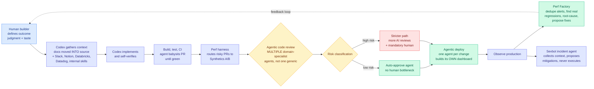

# Inside OpenAI's agentic software factory

**Date ingested:** 2026-09-16
**Source:** The Pragmatic Engineer (Gergely Orosz), 2026-09-15 · [article](https://newsletter.pragmaticengineer.com/p/openai-software-factory)
**Raw:** [raw/rss/2026-09-15-pragmatic-engineer-inside-openai-s-agentic-software-factory.md](../../raw/rss/2026-09-15-pragmatic-engineer-inside-openai-s-agentic-software-factory.md)
**Interviewed:** seven OpenAI engineering leaders including Venkat Venkataramani (VP Eng, Applied Infra), Sulman Choudhry (Head of Eng, ChatGPT), Andrew Ambrosino (Lead, Desktop), Joe Gershenson (Lead, Core Agent), Akshay Nathan (Eng Lead, Productivity)

## TL;DR

This is the first detailed on-the-record account of a frontier lab running its entire company through one agent harness. Every OpenAI employee, engineer or not, works through Codex and ChatGPT Work. Non-engineering organizations (finance, recruiting, legal) went from roughly **0% to 90% Codex usage in four months**, with no mandate. The consequence engineering leadership describes is not a productivity number but an infrastructure crisis: **pull requests per engineer are growing like a hockey stick and some systems are seeing roughly 10x more load in about six months**, growth that would normally take two to three years. The most transferable detail is the pipeline itself, and in particular the loops that close back on production.

## The pipeline

## The details worth keeping

**Adoption was pulled, not pushed.** Non-engineers reached roughly 40% adoption during the window when the Codex app still showed code on screen and was actively hostile to them. What drove it was the ability to do longer, more complex work, not ease of use. Usage then jumped from 60% to 90% between April and May, which Ambrosino attributes to the harness getting better at **long-running tasks**. His observation is specific and counterintuitive: people spend days on a single thread, and being good at long tasks made people do **fewer** things in parallel, because a long-running agent spins off its own sub-agents and shrinks the surface area a human has to manage.

**Context engineering is a filesystem decision.** OpenAI moved all its documentation **inside the source code** so agents can reach it. New engineers are told to ask Codex during onboarding because it holds more context than any person does.

**Domain-specialist review agents, not one generic reviewer.** Orosz records his own skepticism here, that telling an agent it is a cloud infrastructure specialist should not change its output, and then resolves it correctly: all Codex agents have full access to OpenAI's code and docs, so the specialist framing is about **which slice of that context a limited window gets spent on**. That is a context-budget argument, not a persona argument, and it is the right way to read every "multi-agent reviewer" claim.

**Risk-classified routing of changes.** Low-risk PRs go to an auto-approval agent; high-risk ones invoke more AI reviews and a mandatory human. Compliance escalation is itself automated.

**Per-change agents that build their own dashboards.** A deploy agent reads the codebase, finds where a feature flag lives, decides which signals indicate success and failure, **builds its own monitoring dashboard**, and watches it. The stated long-term goal is a per-change autonomous SRE.

**Two closed loops feed production back into development.** Perf Factory sifts alerts and dashboards, dedupes, identifies real latency regressions, root-causes them and proposes fixes. Sevbot handles incidents, collects context, determines possible mitigations but **never executes any**, and answers questions in the Slack channel.

**The bottleneck moved to Apple and Google.** Native mobile deployment now gates iteration, because every app update goes through manual store review taking hours or days, while the code takes minutes. Choudhry's framing: if software can be written in minutes, waiting days to get it onto a phone starts to look absurd. Eighteen years after the App Store launched, this is unchanged.

## How this relates to prior wiki pages

**It is the industrial validation of the [agent harness engineering page](agent-harness-engineering.md)'s core claim, at the largest scale anyone has reported.** That page has argued since its creation that the harness, not the model, is where most of the performance lives, on evidence from research: [the Stanford and MIT harness-gap work (08-25)](2026-08-25-meta-harness-code-space-optimization.md) showing measured performance depends as much on surrounding system code as on the model, [SoL-Pi (09-11)](2026-09-11-sol-pi-harness-auto-research.md) beating a model's own native Codex harness on EdgeBench, and [harness evolution results (08-11)](2026-08-11-harness-evolution-cluster.md) showing harnesses transfer across base models. OpenAI's account is that same claim as an operating fact: **the company runs on the harness, and a minor harness outage is reported by colleagues before automated alerting catches it.**

**"Harness efficiency is critical in software factories" is the sentence to carry forward.** It is the first time a frontier lab has named harness efficiency as an infrastructure concern rather than a product feature, and it lands in the same week as [Elo-per-token (09-15)](../inference-efficiency/2026-09-15-elo-per-token-agent-test-time-scaling.md), which measured the budget at which an agent's marginal token stops beating an independent sample, and [SoL-Pi's 45-49% token reduction at ~94% of task score](2026-09-11-sol-pi-harness-auto-research.md). Three sources in eight days, one from a research group, one from NVIDIA, one from OpenAI's own infrastructure org, all saying the harness has a cost curve that can be optimized separately from the model.

**It closes yesterday's organizational-infrastructure thread.** On 09-15 Y Combinator open-sourced QM, the multi-agent harness it runs its own company on, with the underlying model swappable between Pi, OpenCode, Codex and Claude Code. Today OpenAI describes the same pattern from the other end: total dependence on **one** harness with the model fixed. **Two organizations, opposite bets on which layer to standardize.** YC standardized the harness and kept the model swappable; OpenAI standardized both. That is a testable divergence and the [harness page](agent-harness-engineering.md) should track which one generalizes.

**And it is the mechanism behind an industry story the wiki has been reporting as a business item.** [The Information reported (09-15)](https://www.theinformation.com/articles/developers-find-ways-use-claude-code-without-anthropic-models) that developers are proxying Claude Code to non-Anthropic models to save cost, and that Anthropic shut down an account for it. The reason that arbitrage exists is exactly what Orosz documents: the harness carries the value, the model is a supplier, and once a user knows that, the substitution is obvious. **OpenAI's internal answer is to make the harness so deeply wired into internal systems that it cannot be separated from the model. That is a moat built out of integration rather than capability.**

## Gaps

- Every number is OpenAI's, reported through a friendly interview, with no external verification. "10x load increase" is real infrastructure pain and also the most flattering possible framing of it.
- **No quality data.** More PRs per engineer says nothing about defect rate, revert rate, or incident frequency, and the piece does not ask.
- The internal Codex is explicitly described as far more advanced than the external one because it is wired into every OpenAI system. That makes the adoption curve a poor guide for anyone else.
- Selection effect on the workforce: OpenAI employees are unusually motivated to use OpenAI tooling, and unlimited token budgets are not a condition anyone else operates under.
- Sevbot never executes mitigations and on-call is not gone, which is the honest limit on the autonomy story, but the piece does not report how often Sevbot's proposed mitigation was wrong.

## Industrial implication

The piece is a roadmap for what engineering organizations will attempt next, and the specific items are copyable: move documentation into the repository so agents can read it, classify changes by risk and auto-approve the low tier, give each deploy its own monitoring agent, and run a continuous loop that turns production regressions back into PRs. The bottleneck prediction is the sharper one. If code generation is no longer the constraint, the constraints become **CI/CD throughput, review capacity, and any externally-gated release path**. App store review is the extreme case and it is not fixable by the industry doing the generating. Expect pressure on remote-activation architectures, feature flags and server-driven UI to rise sharply, for reasons that have nothing to do with AI except that AI broke the thing upstream of it.
