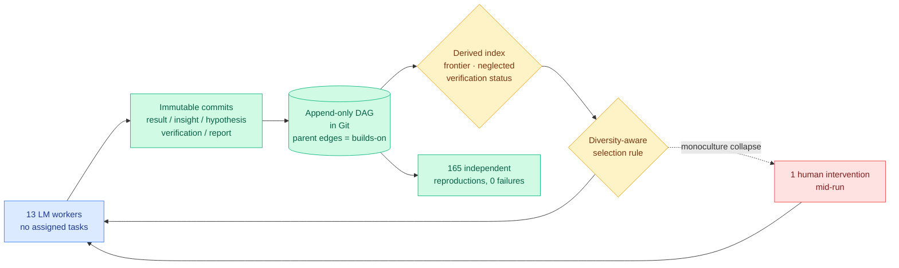

# Agora: Git as shared memory for collective AutoResearch

**Source:** HuggingFace Daily Papers · [arXiv 2609.18094](https://arxiv.org/abs/2609.18094) · [raw](../../raw/huggingface/2026-09-17-agora-git-as-shared-memory-for-collective-autoresearch.md)

## TL;DR

Autonomous research loops can already improve a training setup unattended, but running several of them in parallel does not multiply discovery. Each session starts from nothing, so more agents mostly means more duplicated search. Agora's answer is to give the agents a shared memory with a specific shape: **an append-only directed acyclic graph stored in Git**, where every result, insight, hypothesis, verification and report is an immutable commit whose parent edges record what it builds on. Because a claim is a commit, anybody can check it out and rerun it. A derived index exposes the research frontier, the neglected branches, and each claim's verification status, and a diversity-aware selection rule stops the community collapsing onto whichever worker is currently winning. The paper reports one sustained run rather than a benchmark: **13 language-model workers, nearly 12 days, no assigned tasks and no central planner**, given 141 pretrained donor models and a frozen 119.6M-parameter attention-SSM hybrid whose dimensions match no donor, asked to initialize the target **without training data and without gradient updates**. They published **1,703 contributions** and drove the evaluator from **3.39 to 1.899 bits per byte, closing 62% of the gap to a trained GPT-2 124M**. The winning recipe's ancestry spans **145 commits across 15 accounts**, and **165 independent reproductions were posted, none of which failed**.

## Architecture

## Key findings

- **The commit is the unit of research memory, and that buys reproducibility for free.** Because each claim is a checkout-able commit with explicit parents, verification is a mechanical operation rather than a social one. 165 reproductions with zero failures is the strongest evidence in the paper, and it is a property of the data structure, not of the agents.
- **Monoculture is the default failure, and the paper is honest that a human fixed it once.** The diversity-aware selection rule was not sufficient; a single mid-run human intervention pulled the community out of a collapsed state. Every self-directed multi-agent result in this wiki that claims emergent diversity should be read against that admission.
- **The discovered recipe is itself an efficiency result.** The winning method compresses the donor models' next-token statistics into the target's embedding and output head, then adds a short-range context signal through **sparse edits** to the attention, feed-forward and state-space blocks. That is weight transfer between architecturally mismatched models with no gradients and no data, closing 62% of the gap to a trained baseline.
- **The authors decline to claim the headline.** They explicitly state what the trace does and does not establish, and name the controlled comparison that would settle it: does shared research state improve discovery **per unit of compute**? They did not run it.

## How this relates to what the wiki already knows

**It is the clearest counterexample so far to the append-only memory rule this wiki has been converging on, and it is a counterexample by agreement rather than by contradiction.** [The agent-harness page's 09-06 entry](agent-harness-engineering.md) recorded the append-only rule meeting its first counterexample, and [MEMENTO's non-destructive conflict handling](agent-memory.md) argued that agent memory should never overwrite. Agora takes append-only to its logical end: the memory is literally a Git DAG where nothing is ever mutated. **The interesting part is what it had to add to make append-only work at scale, which is a derived index.** An append-only store with 1,703 entries is unusable without a view that says where the frontier is and what is unverified. That is the piece every agent-memory design in this wiki is missing: they all specify the write policy and leave the read policy implicit.

**The self-improvement claim should be read against the wiki's running scepticism, and it survives better than most.** [The Last AI Built by Humans (09-13)](2026-09-13-last-ai-built-by-humans-rsi.md) and [the DeepSeek kernel engineer's essay (09-15)](../hardware/2026-09-15-deepseek-kernel-engineer-rsi-essay.md) both argued that recursive self-improvement claims collapse when you ask for a second iteration showing the improvement rate itself improving. [NeoHorse-1 (09-09)](../ai-routing/2026-09-09-neohorse-1-routing-harness-rsi.md), which turns routing telemetry into training data, was recorded here as bounded self-improvement for exactly that reason. Agora does not claim recursion at all. It claims that **shared state converts parallel agents from redundant into additive**, which is a much weaker and much more checkable claim, and the 145-commit ancestry across 15 accounts is direct evidence for it.

**The gradient-free weight transfer result deserves its own attention and the paper buries it.** Initializing a 119.6M attention-SSM hybrid from 141 architecturally mismatched donors, with no training data and no gradient steps, reaching 1.899 bits per byte, is a compression and knowledge-transfer result that belongs next to [the distillation literature](../inference-efficiency/knowledge-distillation.md). Every distillation method in this wiki assumes gradients. This one moves capability through **statistics of the output distribution plus sparse structural edits**, which is closer to [the directional-decomposition framing (09-16)](../inference-efficiency/2026-09-16-directional-decomposition-compression-error.md) that splits every weight update into a component along the hidden state and a component across it.

## Gaps

One run, one problem, no control. The paper says so itself. Without a matched-compute comparison against 13 independent workers with no shared state, the headline is an existence proof rather than a measurement, and the single human intervention means the run is not fully autonomous either. The evaluator is bits per byte on a small model, so "62% of the gap to GPT-2 124M" is a narrow target. And 13 workers is small enough that the diversity dynamics may not resemble what happens at 100.

## Research angle

The missing control is stated in the paper and is cheap to run, so its absence after publication would be informative. The more interesting question is whether the derived index can be learned rather than hand-specified: frontier, neglected branch, and verification status are three heuristics over a DAG, and the selection policy over them is exactly a bandit problem with a diversity constraint. [COBRA-Skills (09-13)](2026-09-13-cobra-skills-robustsgpo-harness-search.md) already showed that bandit-prioritized evaluation cuts the dominant cost of a harness search by 55-58% without touching the artifact. The same machinery applies directly to choosing which Agora branch a worker should extend.

## Related

- [self-evolving-agents.md](self-evolving-agents.md) · [agent-memory.md](agent-memory.md) · [multi-agent-systems.md](multi-agent-systems.md)
- [The Last AI Built by Humans (09-13)](2026-09-13-last-ai-built-by-humans-rsi.md)
- [RSIAgent: environment memory (09-15)](2026-09-15-rsiagent-environment-memory.md)
- [DREAM: replay simulator exploration (09-15)](2026-09-15-dream-rsi-replay-simulator-exploration.md)
