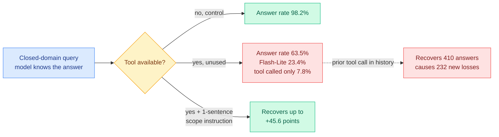

# When Tools Get in the Way: an unused tool suppresses answers the model already knows

**Source:** X home feed via [@dair_ai](https://x.com/dair_ai/status/2100077223252512956) · [arXiv 2609.14157](https://arxiv.org/abs/2609.14157) · [DAIR.AI summary](https://academy.dair.ai/papers/when-tools-get-in-the-way-the-effect-of-unnecessary-tool-availability-on-llm-ans-2609.14157)
**Authors:** Saanvi Paturi, Arsen Kenzhebayev, Arham Sethi, Vyas Raina, Ivaxi Sheth, Vatsal Raina (Spark AI Research)

## TL;DR

Adding a tool to an assistant's toolbelt is treated as strictly non-negative: if the tool is not needed, the model will not call it. This paper shows that is false, and the effect is enormous. The benchmark is **500 query pairs across 10 domains**, where each pair contains one query that genuinely needs the domain tool and one closed-domain query the model can answer from its own knowledge, with a tool-unavailable control for every closed-domain query. Across six models, the pooled answer rate on the closed-domain queries **falls from 98.2% without the tool to 63.5% with it merely available**. Gemini 2.5 Flash-Lite falls from **99.4% to 23.4% while calling the tool in only 7.8% of trials**, which is the sentence that makes the result unambiguous: the damage comes from the tool being **present**, not from it being used. The fix is embarrassingly cheap. A **one-sentence scope-aware system instruction** saying what the tool is for recovers **up to 45.6 percentage points**.

## Mechanism

## Key findings

- **Presence, not invocation, is the cause.** The Flash-Lite case pins it: a 76-point drop with a 7.8% call rate cannot be explained by the tool returning bad results. The tool description in context changes what the model believes it is permitted or expected to answer.
- **Conversation history cuts both ways.** A preceding tool interaction recovers **410 of the 1,056 lost answers** and causes **232 new losses**, and the sign differs by model, so there is no general rule about whether prior tool use helps.
- **The mitigation is a scope statement, not a capability change.** One sentence describing what the tool is for recovers up to 45.6 points, at some cost to tool use where the tool genuinely is needed. That trade is the actual design decision.
- **Controls are properly matched.** Every closed-domain query has a tool-unavailable control, which is what makes this a measurement rather than an observation.

## How this relates to what the wiki already knows

**This is the second result in five days saying that the tool menu is an active context variable rather than a passive capability list, and the first to price it.** [State-path tool menus (09-13)](../ai-routing/2026-09-13-state-path-tool-menus.md) argued that which tools are visible at a given point is a routing decision with consequences. That was an architectural argument. This is the measurement behind it, and the measurement is far larger than the architectural argument implied: **the cost of a tool you never call is up to 76 points of answer rate.**

**It gives [Gavel (09-16)](../ai-routing/2026-09-16-gavel-native-skill-routing-frozen-llm.md) a second, independent justification that Gavel itself does not claim.** Gavel reads skill-selection signal out of a frozen model's intermediate activations and scores a whole skill library with **zero skill text in the context**, beating progressive disclosure (the Claude Code and Codex pattern of revealing tool descriptions as needed) by up to 13.4 points. Gavel's stated motivation is context cost and accuracy of selection. This paper supplies a different and stronger one: **every tool description you put in the context has a suppression cost on unrelated questions, so keeping the library out of context is worth something even when the context window is not the binding constraint.** That reframes activation-based skill routing from a compression technique into a behavioural-hygiene technique.

**It is also a direct counterexample to how MCP-style tool ecosystems are being sold.** The pitch for a large tool registry is that more connected tools strictly increase what an assistant can do. On this evidence, an assistant with fifty registered tools is paying an answer-suppression tax on every query outside all fifty scopes, and nobody measures that. The [tool-calling page](tool-calling.md) has catalogued failure modes of tools that are called; this is the first entry about the cost of tools that are not.

**The one-sentence fix belongs next to the cheapest known defenses in the wiki.** [Mind Viruses (08-13)](../responsible-ai/2026-08-13-mind-viruses-multi-agent-contagion.md) found that a brief warning in the system prompt confers near-total immunity to multi-agent idea contagion. Two unrelated failure modes, both fixed by one sentence of scope or warning text. That is a pattern worth naming: **several of the sharpest LLM behavioural failures are under-specification failures, and the field keeps finding them expensive to discover and trivial to fix.**

## Gaps

Six models and ten domains, all with a single domain tool per pair. Production assistants carry dozens of tools at once, and nothing here says whether the suppression compounds, saturates, or interacts. The recovery instruction's cost to genuine tool use is acknowledged but not quantified as a frontier, so a practitioner cannot yet choose a point on it. And the mechanism is unexplained: the paper establishes that presence causes suppression without saying whether it is a deference behaviour learned in post-training, a distributional shift from the tool schema in context, or something else. That distinction decides whether the fix is a prompt or a training-data change.

## Related

- [tool-calling.md](tool-calling.md) · [agent-harness-engineering.md](agent-harness-engineering.md)
- [State-path tool menus (09-13)](../ai-routing/2026-09-13-state-path-tool-menus.md)
- [Gavel: native skill routing from a frozen LLM (09-16)](../ai-routing/2026-09-16-gavel-native-skill-routing-frozen-llm.md)
- [VAKRA: tool-use failure modes (04-16)](2026-04-16-vakra-agent-reasoning-failure-modes.md)
