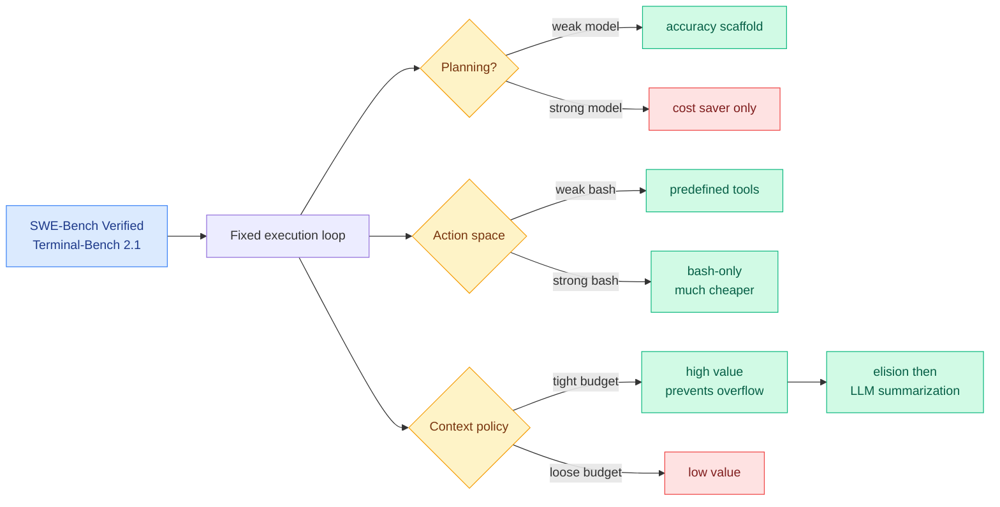

# Harness design gets its first component-level ablation, and three of the four findings are conditional

**Source:** HuggingFace Daily Papers, 2026-09-18 · [arXiv 2609.20804](https://arxiv.org/abs/2609.20804) · [raw](../../raw/huggingface/2026-09-18-an-empirical-study-of-harness-design-for-coding-agents.md)
**Authors:** Run-Ze Fan, Zihao Zhang, Simin Ma, Yebowen Hu, Shouju Wang, Kaiqiang Song, Fei Liu, Hamed Zamani, Xiaoyang Wang (UMass Amherst, Emory, UNC Charlotte, Zoom)

## TL;DR

Every prior harness comparison on this wiki has compared *whole systems*, so a difference between OpenHands and SWE-Agent could come from the planner, the tools, the context policy, or an interaction among them. This paper fixes the execution loop and varies exactly three components: **planning, action space, and context management**. It runs **176 matched settings** across four models on SWE-Bench Verified and Terminal-Bench 2.1, spanning five context-management strategies and four context-window budgets. The result that matters: **three of the four headline findings are conditional on the model or the budget, not universal.** Harness design is not a set of best practices; it is a function of which model you are running and how much context you are willing to pay for.

## The four findings

**1. Context management is worth most when the budget is tight, and almost all of its value is failure avoidance.** Not better reasoning, not better retrieval. **Preventing context-overflow failures**, where the agent runs out of window before it edits the right file or verifies its fix. That reframes context management from a quality technique into a reliability technique, which is a different engineering budget.

**2. Rule-based elision staged before LLM-based summarization is the strongest strategy, and recoverability is dead weight.** Cheap deterministic deletion first, expensive model-based compression only on what survives. The negative result is the more useful half: **making elided content recoverable adds machinery that models rarely use and yields no accuracy gain.** Every harness that has built a restore-from-archive path has built something the model does not reach for.

**3. Planning changes role as the model improves.** For weaker models it is an accuracy scaffold that stops premature termination. For stronger models it is **a cost saver with little accuracy change**: the model already holds the structure, and the plan mostly prevents redundant actions. Same component, two entirely different justifications.

**4. Predefined tools are a crutch for weak bash proficiency.** Models that are good at bash operate effectively on a bash-only interface and do so at **substantially lower cost**, especially on command-line-centric tasks. Wrapping bash in typed tools is a tax you pay for models that need it.

The trajectory-level analysis is what makes these mechanistic rather than correlational: **context management extends trajectories without changing agent behaviour, planning changes where trajectories stop, and the action space changes the granularity at which code gets written.** Three components, three distinct causal signatures.

## How this relates to prior wiki pages

**It is the ablation [agent-harness-engineering.md](agent-harness-engineering.md) has been asking for since the page was created.** The page's thesis, restated in four registers during the week of 09-14 and confirmed as an operating fact by a frontier lab on 09-16, is that agent performance is harness-bound rather than model-bound. That thesis was built almost entirely from whole-system comparisons and practitioner reports. **This is the first study on the page that isolates components with the loop held fixed**, and it does not overturn the thesis. It qualifies it: the harness matters, and *which part* of the harness matters depends on the model.

**Finding 3 puts a number-free but falsifiable shape on the page's model-versus-harness question.** If planning converts from accuracy scaffold to cost saver as models improve, then **the harness does not become less important as models get better, it becomes differently important**: its job migrates from capability compensation to cost control. That is a more defensible version of the harness thesis than the one the page has been carrying, and it predicts that harness research will keep producing value after models stop needing scaffolding.

**Finding 2 contradicts the direction most compaction work has taken.** [ContextPipe (09-06)](2026-09-06-contextpipe-database-context-assembly.md), which treats context assembly as relational query execution with a cache-aware optimizer choosing the prompt's byte layout, carries eight compaction lifecycle tiers including recoverable ones. This paper says recoverability earns nothing. Those are not strictly contradictory (ContextPipe's optimizer chooses layout for cache reasons, not for recall) but **the burden has shifted onto anyone shipping a restore path to show the model actually uses it.**

**It pairs with [SoL-Pi (09-18)](2026-09-18-sol-pi-recursive-harness-research-loops.md) as the two halves of the same question, arriving on the same day.** SoL-Pi searches automatically for harness improvements across many environments and reports four surviving mechanisms spanning action execution, context compaction, observation handling and delegated reading, cutting token traffic 44.7 to 49.0 percent. This paper hand-ablates three components and explains *why* each one works. **Automated search found compaction and action execution independently valuable; manual ablation found the same two are the ones whose value is conditional.** Two methods, overlapping answers, and the manual study supplies the mechanism the search cannot.

## Gaps

Four models and two benchmarks, both software-engineering. Nothing here says whether the conditional structure transfers to non-coding agents, where the action space is not bash-shaped. The context-management comparison is five strategies, which does not include retrieval-based or external-memory approaches, so "elision then summarization wins" is a win within a narrow field. **No cost numbers in dollars**, only relative claims, which makes finding 4's "substantially lower cost" hard to act on. And the study varies components one at a time against a fixed loop, so the interactions it explicitly set out to disentangle are also the interactions it cannot measure.

## Industrial implication

The immediately actionable finding is number 4, and it is an argument against the direction most agent frameworks have gone. **If your model is bash-capable, every typed tool you wrap around the shell is cost you are paying for nothing.** The tool-definition layer that frameworks compete on is a compatibility shim for weaker models. Second, finding 1 says context management should be budgeted and evaluated as reliability engineering, so the right metric is overflow-failure rate rather than accuracy delta. Third, and most consequential for anyone maintaining a harness across model upgrades: **three of four components change their optimal setting when you swap the model underneath.** A harness tuned for last quarter's model is misconfigured for this quarter's, and nobody currently re-runs that tuning on upgrade.

## Related pages

- [agent-harness-engineering.md](agent-harness-engineering.md)
- [SoL-Pi (09-18)](2026-09-18-sol-pi-recursive-harness-research-loops.md)
- [agent-benchmarks.md](agent-benchmarks.md)
- [tool-calling.md](tool-calling.md)
